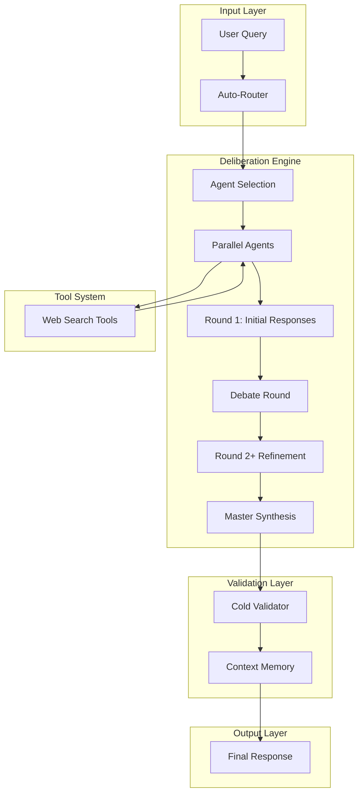

# 🏛️ AI Council Architecture

## Overview

AI Council is a production-grade multi-agent deliberation engine that orchestrates diverse AI perspectives to produce high-fidelity, consensus-driven responses. The system combines parallel processing, iterative debate, and independent validation to minimize hallucinations and maximize reasoning quality.

---

## System Components



---

## Component Architecture

### 🧠 Router Component
**Location**: `src/lib/router.ts`

**Purpose**: Automatic query classification and optimal archetype selection

**Key Functions**:
- `classifyQuery()`: Keyword and heuristic-based classification
- `getAutoArchetypes()`: Maps query types to diverse archetype sets
- **Scoring System**: Confidence calculation with fallback handling

**Flow**:
1. Analyze query for type indicators (factual, analytical, creative, etc.)
2. Calculate confidence scores for each type
3. Select top-scoring type if confidence > 0.4
4. Map to 2-4 diverse archetypes
5. Return classification result for council composition

---

### 🏛️ Council Deliberation Engine
**Location**: `src/lib/council.ts`, `src/lib/deliberationPhases.ts`

**Purpose**: Multi-agent reasoning with iterative refinement

**Key Functions**:
- `deliberate()`: Main orchestration generator
- `gatherOpinions()`: Parallel agent response collection
- `conductPeerReview()`: Anonymized ranking and critique
- `conductDebateRound()`: Multi-round refinement with anti-convergence
- `synthesizeVerdict()`: Master model synthesis
- `evaluateConsensus()`: Consensus detection and early halt

**Flow**:
1. **Round 1**: Agents provide initial structured responses
2. **Debate Round**: Agents critique peers and refine answers
3. **Peer Review**: Anonymized ranking of refined responses
4. **Consensus Check**: Evaluate agreement levels, halt if threshold met
5. **Synthesis**: Master model integrates all perspectives

---

### 🛡️ Cold Validator
**Location**: `src/lib/deliberationPhases.ts:synthesizeVerdict()`

**Purpose**: Independent validation of final synthesis

**Key Functions**:
- Independent model instance with zero prior context
- 5-point validation: factual errors, unsupported claims, logical inconsistencies, overconfidence, missing considerations
- Strict fallback: Returns `valid: false` on failures

**Validation Criteria**:
- Factual inaccuracies or hallucinations
- Unsupported claims without evidence
- Logical inconsistencies
- Overconfidence or misleading tone
- Missing critical considerations

---

### 🧠 Tool System
**Location**: `src/lib/tools/`, `src/lib/providers.ts`

**Purpose**: Automatic tool invocation and result integration

**Key Functions**:
- `web_search()`: SERP integration with automatic decision logic
- Tool decision prompts: "factual verification → use web_search"
- Result injection: Tool outputs added to agent context
- Failure handling: Graceful fallback when tools fail

---

### 💾 Memory System
**Location**: `src/services/conversationService.ts`, `prisma/schema.prisma`

**Purpose**: Persistent context management and retrieval

**Key Functions**:
- Vector embeddings via pgvector
- Similarity search for relevant past discussions
- Conversation storage and retrieval
- Context summarization for memory efficiency

---

## Data Flow

### Request Processing
```
User Query
    ↓
Router Classification
    ↓
Archetype Selection
    ↓
Parallel Agent Calls (with tool access)
    ↓
Debate Refinement (multi-round)
    ↓
Master Synthesis
    ↓
Cold Validation
    ↓
Memory Update
    ↓
Final Response
```

### SSE Event Stream
```
event: status          // Round updates, quorum checks
event: opinion          // Agent responses (round number)
event: opinion          // Refined opinions (round 1.5)
event: peer_review      // Anonymized rankings and critiques
event: scored           // Deterministic scoring results
event: validator_result // Independent validation outcome
event: verdict_chunk     // Streaming synthesis
event: done             // Final response with metadata
```

---

## Decision Layers

### 1. Router Decision Layer
- **Input**: Raw user query
- **Process**: Keyword scoring + heuristic analysis
- **Output**: Query type + optimal archetype set
- **Fallback**: Default balanced council if confidence < 0.4

### 2. Agent Decision Layer
- **Input**: Query + archetype assignment
- **Process**: Parallel reasoning with tool access
- **Output**: Structured JSON responses (answer, reasoning, key_points, confidence)
- **Constraints**: 8-second timeout, quorum requirements

### 3. Debate Decision Layer
- **Input**: Original responses + peer summaries
- **Process**: Critical evaluation with anti-convergence safeguards
- **Output**: Refined answers with updated confidence
- **Features**: Concise peer summaries (120 chars max), confidence-based updates

### 4. Validation Decision Layer
- **Input**: Final synthesis only
- **Process**: Independent zero-context validation
- **Output**: Boolean validity + issue list + confidence
- **Fallback**: `valid: false` on failures (never silent approval)

### 5. Synthesis Decision Layer
- **Input**: Full debate history + refined opinions
- **Process**: Master model integration with confidence weighting
- **Output**: Cohesive final verdict
- **Optimization**: Prioritizes high-confidence, well-reasoned contributions

---

## Technology Stack

### Backend Services
- **Node.js/Express**: API layer and SSE streaming
- **TypeScript**: Type safety and interfaces
- **Prisma**: Database ORM and migrations
- **PostgreSQL**: Primary data storage
- **pgvector**: Vector similarity search
- **Redis**: Session caching and state management

### Provider Integration
- **Universal Adapter**: OpenAI, Anthropic, Google, local models
- **Tool Framework**: Extensible tool system
- **Error Mapping**: Graceful failure handling
- **Streaming**: Real-time word-by-word delivery

### Frontend Integration
- **React/Vite**: Modern UI framework
- **Server-Sent Events**: Real-time deliberation updates
- **Component Architecture**: Modular, type-safe components

---

## Performance Characteristics

### Concurrency
- **Parallel Processing**: All agents respond simultaneously
- **Non-blocking**: Streaming responses via independent SSE channels
- **Timeout Management**: 8s per agent, 10s for debate rounds

### Reliability
- **Quorum Logic**: Minimum 50% valid responses required
- **Graceful Degradation**: Fallbacks for provider failures
- **Error Isolation**: Individual agent failures don't affect others

### Scalability
- **Horizontal Scaling**: Multiple provider instances
- **Load Balancing**: Provider rotation and health checks
- **Caching Strategy**: Redis for session state, pgvector for persistence

---

## Security & Privacy

### Data Protection
- **AES-256 Encryption**: API keys at rest
- **CSP Headers**: XSS protection
- **Zod Validation**: Strict input schema validation
- **PII Detection**: Pre-scan sensitive information

### Access Control
- **JWT Authentication**: Secure session management
- **Rate Limiting**: Per-user quota enforcement
- **Audit Logging**: Complete request/response tracking

---

## Quality Assurance

### Validation Layers
- **Schema Validation**: Structured output enforcement
- **Cross-Validation**: Independent model verification
- **Consensus Metrics**: Deterministic agreement scoring
- **Benchmark Testing**: Automated quality measurement

### Error Handling
- **Provider Fallbacks**: Automatic failover
- **Timeout Management**: Configurable per-operation limits
- **Retry Logic**: Exponential backoff with jitter
- **Circuit Breakers**: Automatic failure detection
