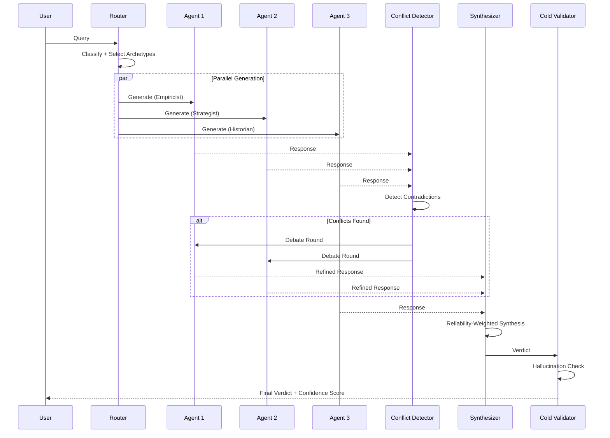
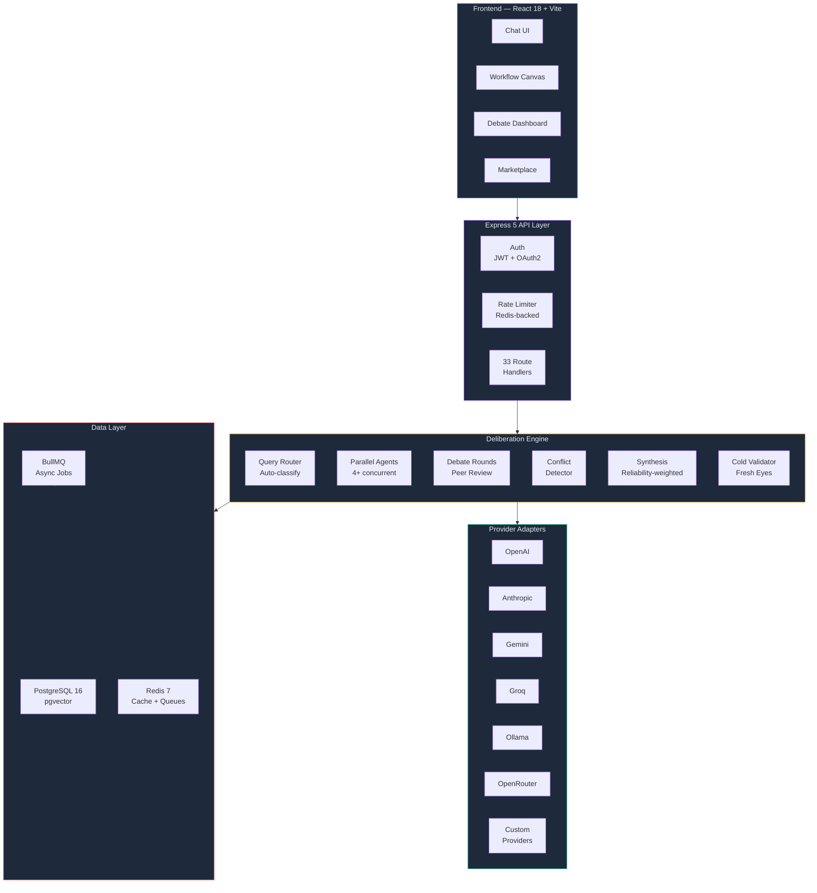
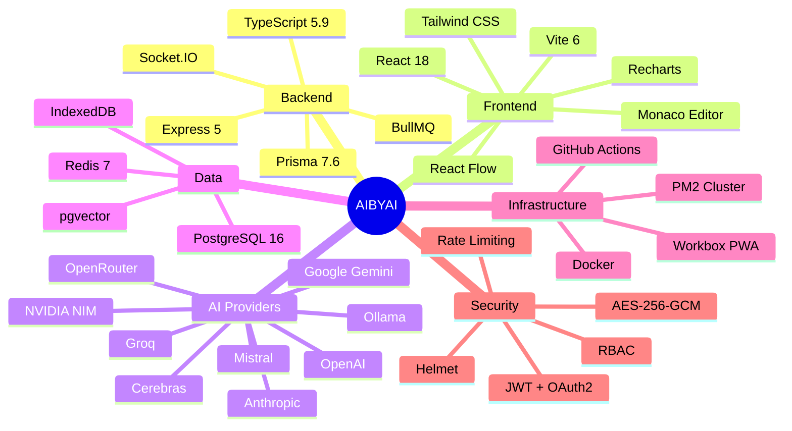

<div align="center">

# AIBYAI

### Multimodal Multi-Agent Deliberative Intelligence Platform

[](https://www.typescriptlang.org/)
[](https://react.dev/)
[](https://expressjs.com/)
[](https://www.postgresql.org/)
[](https://redis.io/)
[](https://www.docker.com/)
[](./LICENSE)

<br />

**4+ AI agents debate, critique, and synthesize answers through structured deliberation — producing mathematically validated consensus instead of single-model guesswork.**

[Quick Start](#-quick-start) · [How It Works](#-how-it-works) · [Features](#-features) · [Documentation](./docs/DOCUMENTATION.md) · [Roadmap](./ROADMAP.md)

</div>

---

## Why AIBYAI?

Single-model AI gives you one perspective. AIBYAI gives you a **council**.

| | Single Model | AIBYAI Council |
|---|---|---|
| **Perspectives** | 1 | 4+ concurrent agents |
| **Quality Check** | None | Peer review + cold validation |
| **Scoring** | Trust the output | Deterministic ML scoring |
| **Bias Detection** | Hope for the best | Cross-agent contradiction detection |
| **Confidence** | Unknown | Mathematical consensus metric |

---

## How It Works



The pipeline scores each agent using `0.6 × Agreement + 0.4 × PeerRanking`, targets `≥ 0.85` consensus (cosine similarity), and weights synthesis by model reliability scores tracked across sessions.

---

## Architecture



---

## Features

### Multi-Agent Deliberation
4+ AI agents with distinct archetypes (Empiricist, Strategist, Historian, Architect, Skeptic) debate in structured rounds with peer review, adversarial critique, and deterministic consensus scoring. A cold validator independently checks the final verdict for hallucinations.

### 9 LLM Provider Adapters
Unified interface for OpenAI, Anthropic, Gemini, Groq, Ollama (local), OpenRouter, Mistral, Cerebras, and NVIDIA NIM. Add custom providers via UI — zero code changes.

### RAG Knowledge Bases
pgvector embeddings, hybrid search (vector + BM25), document chunking, and multi-format ingestion (PDF, DOCX, XLSX, CSV, TXT, images). Attach knowledge bases to conversations for grounded responses.

### Visual Workflow Engine
Drag-and-drop builder with React Flow — 10+ node types (LLM, Tool, Condition, Loop, HTTP, Code, Human Gate). Server-side execution with real-time streaming.

### Deep Research Mode
Autonomous multi-step research: breaks queries into sub-questions, searches the web, scrapes sources, synthesizes answers, and produces cited reports. Async via BullMQ.

### Code Sandbox
Isolated execution — JavaScript in `isolated-vm` (V8 isolate), Python in subprocess with timeout. Artifacts auto-detected from AI responses.

### Community Marketplace
Publish and install prompts, workflows, personas, and tools. Star ratings, reviews, download tracking, one-click import.

### User Skills Framework
Write Python functions that become tools during council deliberation. Sandboxed execution, dynamic registration.

### Observability + LLMOps
Execution tracing with LangFuse export, model reliability scoring, analytics dashboard, per-query cost tracking with color-coded tiers.

### GitHub Intelligence
Index repositories into the vector store. Code snippets are injected into council context for code-aware conversations.

### 3-Layer Memory
Active context, auto-generated session summaries, and long-term vector memory with compaction. Pluggable backends (pgvector, Qdrant, GetZep).

### Auth + RBAC + Sharing
JWT + OAuth2 (Google, GitHub), role-based access control, shareable conversations with expiry, admin dashboard.

### PWA + Offline
Workbox service worker, IndexedDB conversation caching, NetworkFirst API strategy.

---

## Tech Stack



**178 backend files · 57 frontend files · 39 database models · 33 API routes · 9 LLM providers**

---

## Quick Start

```bash
git clone https://github.com/Yash-Awasthi/aibyai.git
cd aibyai

npm install
cd frontend && npm install && cd ..

cp .env.example .env
# Add DATABASE_URL, JWT_SECRET, and at least one AI provider key

npx prisma generate && npx prisma migrate dev --name init
npm run dev:all
```

Open **http://localhost:5173**

### Or with Docker

```bash
docker compose up -d
# → http://localhost:3000
```

> **Full setup guide, all environment variables, and API reference:** [docs/DOCUMENTATION.md](./docs/DOCUMENTATION.md)

---

## Example

```bash
curl -X POST http://localhost:3000/api/ask \
  -H "Content-Type: application/json" \
  -H "Authorization: Bearer <token>" \
  -d '{"question": "Microservices vs monolith?", "mode": "auto", "rounds": 2}'
```

Returns an SSE stream: `opinion` → `peer_review` → `scored` → `done` (verdict + confidence score)

> **Full API reference with all 33 endpoints:** [docs/DOCUMENTATION.md](./docs/DOCUMENTATION.md#api-reference)

---

## Documentation

| Document | Description |
|---|---|
| **[Documentation](./docs/DOCUMENTATION.md)** | Setup, env vars, API reference, project structure, deployment, security |
| **[API Reference](./docs/API.md)** | Detailed endpoint documentation |
| **[Roadmap](./ROADMAP.md)** | Future plans — testing, collaboration, plugins, scaling |

---

## License

[ISC](./LICENSE) — Yash Awasthi

---

<div align="center">

**Built with deliberation, not hallucination.**

[Report a Bug](https://github.com/Yash-Awasthi/aibyai/issues) · [Request a Feature](https://github.com/Yash-Awasthi/aibyai/issues)

</div>
