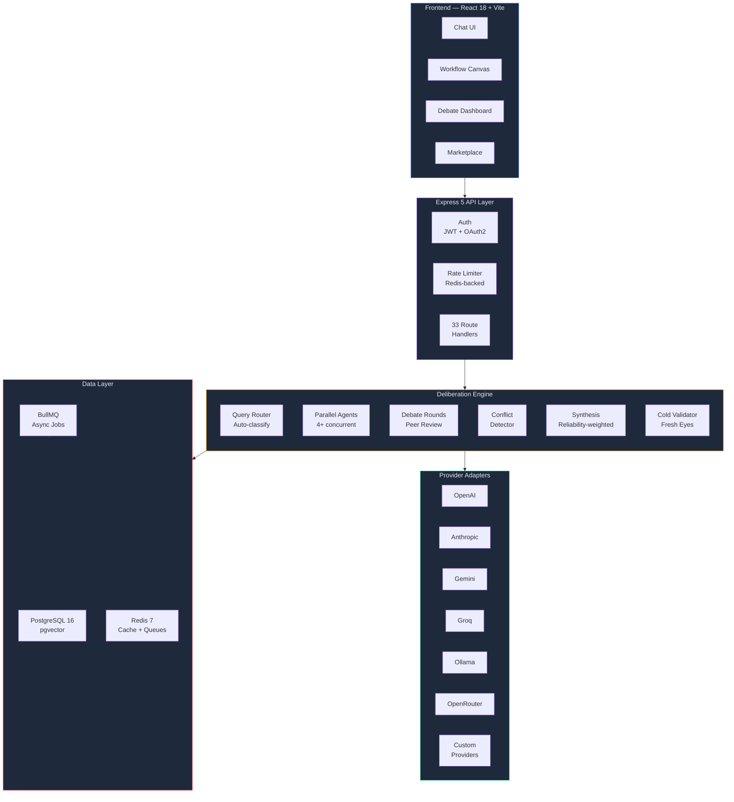
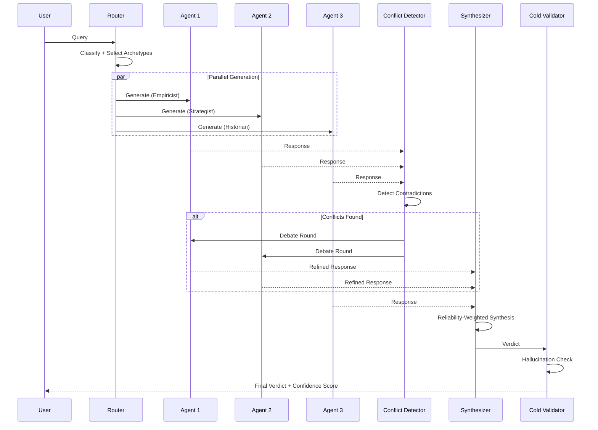
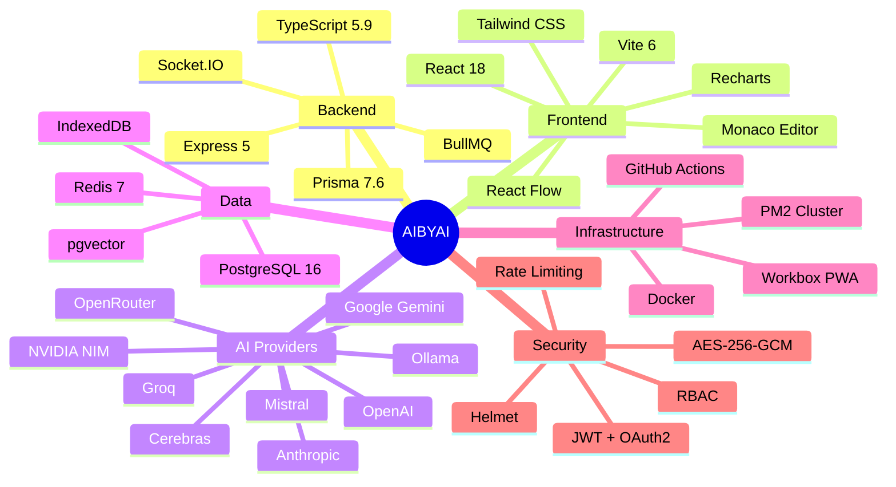
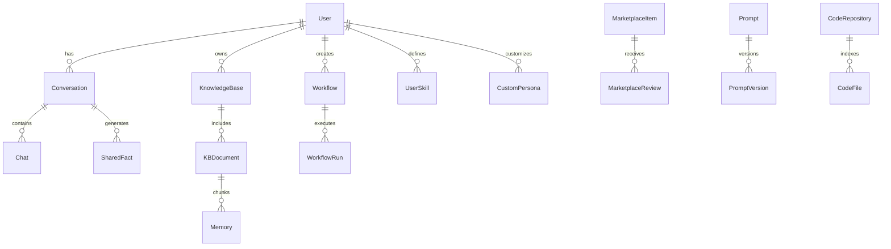

<div align="center">

# AIBYAI

### Multimodal Multi-Agent Deliberative Intelligence Platform

[](https://www.typescriptlang.org/)
[](https://react.dev/)
[](https://expressjs.com/)
[](https://www.postgresql.org/)
[](https://redis.io/)
[](https://www.docker.com/)
[](./LICENSE)

<br />

**4+ AI agents debate, critique, and synthesize answers through structured deliberation — producing mathematically validated consensus instead of single-model guesswork.**

[Getting Started](#-getting-started) · [Architecture](#-architecture) · [Features](#-features) · [API Reference](#-api-reference) · [Deployment](#-deployment) · [Roadmap](./ROADMAP.md)

</div>

---

## Why AIBYAI?

Single-model AI gives you one perspective. AIBYAI gives you a **council**.

| | Single Model | AIBYAI Council |
|---|---|---|
| **Perspectives** | 1 | 4+ concurrent agents |
| **Quality Check** | None | Peer review + cold validation |
| **Scoring** | Trust the output | Deterministic ML scoring |
| **Bias Detection** | Hope for the best | Cross-agent contradiction detection |
| **Confidence** | Unknown | Mathematical consensus metric (cosine similarity) |

The system runs a full deliberation pipeline: parallel opinion gathering, structured peer review, multi-round debate, conflict detection, reliability-weighted synthesis, and independent cold validation — all streamed to the UI in real-time.

---

## Architecture



---

## Deliberation Pipeline

Every query goes through a structured multi-phase pipeline that guarantees quality through redundancy and adversarial critique.



### Scoring Formula

```
Final Score = 0.6 × Agreement + 0.4 × PeerRanking
Consensus = Average Pairwise Cosine Similarity ≥ 0.85
Reliability = (Agreed / (Agreed + Contradicted + 1)) × 0.7 + (1 - Errors / (Total + 1)) × 0.3
```

---

## Features

### Multi-Agent Deliberation

The core engine orchestrates 4+ AI agents in structured debate with peer review, adversarial critique, and deterministic consensus scoring. Each agent runs a distinct archetype (Empiricist, Strategist, Historian, Architect, Skeptic) with dedicated system prompts and behavioral profiles.

**Key files:** `src/lib/council.ts`, `src/lib/deliberationPhases.ts`, `src/agents/orchestrator.ts`

### 9 LLM Provider Adapters

Unified adapter interface supporting OpenAI, Anthropic, Google Gemini, Groq, Ollama (local), OpenRouter, Mistral, Cerebras, and NVIDIA NIM. Custom providers can be added via UI through the EMOF (Extensible Model Onboarding Framework) — zero code changes required.

**Key files:** `src/adapters/`, `src/routes/customProviders.ts`

### RAG Knowledge Bases

Full retrieval-augmented generation pipeline with pgvector embeddings, hybrid search (vector + BM25 keyword), document chunking, and multi-format ingestion (PDF, DOCX, XLSX, CSV, TXT, images). Users create knowledge bases and attach them to conversations for context-aware responses.

**Key files:** `src/services/vectorStore.service.ts`, `src/services/ingestion.service.ts`, `src/routes/kb.ts`

### Visual Workflow Engine

Drag-and-drop workflow builder powered by React Flow with 10+ node types (LLM, Tool, Condition, Loop, HTTP, Code, Human Gate, Template, Merge, Split). Workflows execute server-side with real-time progress streaming.

**Key files:** `src/workflow/executor.ts`, `src/workflow/nodes/`, `frontend/src/views/WorkflowEditorView.tsx`

### Deep Research Mode

Multi-step autonomous research: the system breaks queries into sub-questions, searches the web (Tavily/SerpAPI), scrapes and analyzes sources, synthesizes per-question answers, and produces a comprehensive research report with citations. All processed asynchronously via BullMQ.

**Key files:** `src/services/research.service.ts`, `src/routes/research.ts`

### Code Sandbox

Isolated code execution for AI-generated artifacts. JavaScript runs in `isolated-vm` (V8 isolate with memory limits), Python runs in subprocess with timeout. Artifacts are auto-detected from AI responses and stored for versioning.

**Key files:** `src/sandbox/jsSandbox.ts`, `src/sandbox/pythonSandbox.ts`, `src/services/artifacts.service.ts`

### Community Marketplace

Publish and install prompts, workflows, personas, and tools. Full CRUD with star ratings, reviews, download tracking, and one-click install that imports items directly into the user's account.

**Key files:** `src/routes/marketplace.ts`, `frontend/src/views/MarketplaceView.tsx`

### User Skills Framework

Users write Python functions that become callable tools during council deliberation. Skills are executed in a sandboxed subprocess and registered dynamically in the tool registry.

**Key files:** `src/lib/tools/skillExecutor.ts`, `src/routes/skills.ts`

### Observability + LLMOps

Execution tracing with optional LangFuse export, model reliability scoring (agreement/contradiction tracking), performance analytics dashboard, and per-query cost tracking with color-coded tiers.

**Key files:** `src/observability/tracer.ts`, `src/services/reliability.service.ts`, `src/routes/analytics.ts`

### GitHub Intelligence

Index GitHub repositories into the vector store for code-aware conversations. The system fetches repo contents via Octokit, embeds source files, and injects relevant code snippets into council context when a repo is attached to a chat.

**Key files:** `src/services/repoIngestion.service.ts`, `src/services/repoSearch.service.ts`

### Memory Architecture

Three-layer memory system: active context (recent messages), session summaries (auto-generated), and long-term vector memory (pgvector with compaction). Supports distributed backends — users can plug in Qdrant, GetZep, or local pgvector.

**Key files:** `src/services/memoryCompaction.service.ts`, `src/services/memoryRouter.service.ts`, `src/lib/memoryCrons.ts`

### Auth + RBAC + Sharing

JWT authentication with OAuth2 (Google, GitHub), role-based access control (admin/member/viewer), shareable conversations with expiry tokens, and a full admin dashboard for user management.

**Key files:** `src/auth/`, `src/middleware/rbac.ts`, `src/routes/share.ts`, `src/routes/admin.ts`

### PWA + Offline Support

Progressive Web App with Workbox service worker, offline conversation caching via IndexedDB, and NetworkFirst strategy for API requests with CacheFirst for static assets.

**Key files:** `frontend/src/components/OfflineIndicator.tsx`, `frontend/vite.config.ts`

---

## Tech Stack



| Layer | Technologies |
|---|---|
| **Runtime** | Node.js 20, TypeScript 5.9 (strict) |
| **API** | Express 5, Socket.IO, SSE streaming |
| **Database** | PostgreSQL 16 + pgvector, Prisma 7.6 (39 models) |
| **Cache & Queue** | Redis 7, BullMQ, IORedis |
| **Frontend** | React 18, Vite 6, Tailwind CSS, React Flow, Monaco Editor, Recharts |
| **AI** | OpenAI, Anthropic, Gemini, Groq, Ollama, OpenRouter, Mistral, Cerebras, NVIDIA |
| **Documents** | pdf-parse, mammoth, SheetJS, PapaParse |
| **Search** | Tavily, SerpAPI, Playwright (JS-rendered pages) |
| **Sandbox** | isolated-vm (JS), child_process (Python) |
| **Auth** | JWT, bcrypt, Passport (Google OAuth2, GitHub OAuth2) |
| **Security** | Helmet, express-rate-limit, rate-limit-redis, AES-256-GCM |
| **Observability** | Pino, pino-http, LangFuse (optional), custom tracer |
| **Infra** | Docker, docker-compose, PM2 cluster, GitHub Actions CI |

---

## Getting Started

### Prerequisites

- **Node.js** >= 20.0.0
- **PostgreSQL** 16 with [pgvector](https://github.com/pgvector/pgvector) extension
- **Redis** 7+
- At least one AI provider API key (OpenAI, Anthropic, or Google)

### Quick Start

```bash
# Clone the repository
git clone https://github.com/Yash-Awasthi/aibyai.git
cd aibyai

# Install dependencies
npm install
cd frontend && npm install && cd ..

# Configure environment
cp .env.example .env
# Edit .env — add your API keys and database URL

# Initialize database
npx prisma generate
npx prisma migrate dev --name init

# Start development server
npm run dev:all
```

Open **http://localhost:5173** in your browser.

### Docker

```bash
# Start everything (app + PostgreSQL + Redis)
docker compose up -d

# The app will be available at http://localhost:3000
```

### Environment Variables

<details>
<summary><b>Required</b></summary>

| Variable | Description |
|---|---|
| `DATABASE_URL` | PostgreSQL connection string |
| `JWT_SECRET` | JWT signing key (min 16 chars) |
| `MASTER_ENCRYPTION_KEY` | AES-256 encryption key (min 32 chars) |

</details>

<details>
<summary><b>AI Providers (at least one required)</b></summary>

| Variable | Provider |
|---|---|
| `OPENAI_API_KEY` | OpenAI (GPT-4o, GPT-5) |
| `ANTHROPIC_API_KEY` | Anthropic (Claude 3.5, Claude 4) |
| `GOOGLE_API_KEY` | Google (Gemini 2.x) |
| `GROQ_API_KEY` | Groq (Llama, Mixtral) |
| `OPENROUTER_API_KEY` | OpenRouter (multi-model) |
| `MISTRAL_API_KEY` | Mistral API |
| `CEREBRAS_API_KEY` | Cerebras |
| `NVIDIA_API_KEY` | NVIDIA NIM |
| `OLLAMA_BASE_URL` | Ollama local (default: `http://localhost:11434`) |

</details>

<details>
<summary><b>Optional Services</b></summary>

| Variable | Description |
|---|---|
| `REDIS_URL` | Redis URL (default: `redis://localhost:6379`) |
| `TAVILY_API_KEY` | Web search (Tavily) |
| `SERP_API_KEY` | Web search (SerpAPI) |
| `LANGFUSE_SECRET_KEY` | LangFuse observability |
| `LANGFUSE_PUBLIC_KEY` | LangFuse public key |
| `GOOGLE_CLIENT_ID` | Google OAuth2 |
| `GOOGLE_CLIENT_SECRET` | Google OAuth2 |
| `GITHUB_CLIENT_ID` | GitHub OAuth2 |
| `GITHUB_CLIENT_SECRET` | GitHub OAuth2 |

</details>

---

## API Reference

### Core Endpoints

```
POST /api/ask                    # Council deliberation (SSE stream)
GET  /api/history/:id            # Conversation history
POST /api/research               # Start deep research job
GET  /api/research/:id           # Research job status + report
```

### Knowledge & RAG

```
POST /api/kb                     # Create knowledge base
POST /api/kb/:id/documents       # Add document to KB
POST /api/uploads                # Upload files (PDF, DOCX, XLSX, CSV, images)
GET  /api/repos                  # List indexed repositories
POST /api/repos/github           # Index a GitHub repository
```

### Workflows & Prompts

```
GET  /api/workflows              # List workflows
POST /api/workflows/:id/run      # Execute workflow
GET  /api/prompts                # List prompt templates
POST /api/prompts/test           # Test a prompt
```

### Marketplace & Skills

```
GET  /api/marketplace            # Browse marketplace items
POST /api/marketplace/:id/install # Install item
GET  /api/skills                 # List user skills
POST /api/sandbox/execute        # Run code in sandbox
```

### Analytics & Observability

```
GET  /api/analytics/overview     # Usage analytics
GET  /api/traces                 # Execution traces
GET  /api/queue/stats            # Job queue statistics
GET  /health                     # System health check
```

### Example Request

```bash
curl -X POST http://localhost:3000/api/ask \
  -H "Content-Type: application/json" \
  -H "Authorization: Bearer <token>" \
  -d '{
    "question": "What are the trade-offs of microservices vs monolith?",
    "mode": "auto",
    "rounds": 2
  }'
```

**Response** (SSE stream):
```
event: status
data: {"message": "Routing query..."}

event: opinion
data: {"name": "Empiricist", "opinion": "...", "confidence": 0.85}

event: peer_review
data: {"round": 1, "reviews": [...]}

event: scored
data: {"opinions": [...], "scores": [...]}

event: done
data: {"verdict": "...", "confidence": 0.91, "opinions": [...]}
```

---

## Project Structure

```
aibyai/
├── src/
│   ├── adapters/          # 8 LLM provider adapters + registry
│   ├── agents/            # Orchestrator, conflict detector, message bus, personas
│   ├── auth/              # OAuth2 strategies (Google, GitHub)
│   ├── config/            # Zod-validated environment schema
│   ├── lib/               # Core engine (council, scoring, deliberation, tools, cache)
│   ├── middleware/         # Auth, RBAC, rate limiting, validation, error handling
│   ├── observability/     # Tracer + LangFuse integration
│   ├── processors/        # Document processors (PDF, DOCX, XLSX, CSV, images)
│   ├── queue/             # BullMQ queues + workers
│   ├── routes/            # 33 Express route handlers
│   ├── sandbox/           # JS (isolated-vm) + Python sandbox
│   ├── services/          # 16 service modules (RAG, memory, research, repos)
│   └── workflow/          # Workflow executor + 10 node handlers
├── frontend/
│   ├── src/
│   │   ├── components/    # 19 React components + workflow node UIs
│   │   ├── views/         # 13 page views
│   │   ├── hooks/         # Custom React hooks
│   │   ├── context/       # Auth + state context
│   │   └── types/         # TypeScript definitions
│   └── vite.config.ts     # Vite + PWA config
├── prisma/
│   └── schema.prisma      # 39 database models
├── docker-compose.yml     # PostgreSQL + Redis + App
├── Dockerfile             # Multi-stage production build
├── ecosystem.config.cjs   # PM2 cluster mode
└── .github/workflows/     # CI pipeline
```

**By the numbers:** 178 backend files, 57 frontend files, 39 database models, 33 API routes, 9 LLM providers.

---

## Deployment

### Docker Compose (Recommended)

```bash
docker compose up -d
```

Starts PostgreSQL 16 (pgvector), Redis 7, and the application. Database migrations run automatically on boot.

### PM2 Cluster

```bash
npm run build
pm2 start ecosystem.config.cjs --env production
```

Runs the server in cluster mode across all CPU cores with 512MB memory limit per worker.

### Manual

```bash
npm run build
npx prisma migrate deploy
NODE_ENV=production node dist/index.js
```

---

## Database Schema



---

## Contributing

```bash
# Run linting
npm run lint

# Run type checking
npm run typecheck

# Run tests
npm test

# Run benchmarks
npm run benchmark
```

The CI pipeline runs lint, typecheck, tests, and build on every push to `main` and `sidecamel`.

---

## License

[ISC](./LICENSE) — Yash Awasthi

---

<div align="center">

**Built with deliberation, not hallucination.**

[Report a Bug](https://github.com/Yash-Awasthi/aibyai/issues) · [Request a Feature](https://github.com/Yash-Awasthi/aibyai/issues)

</div>
