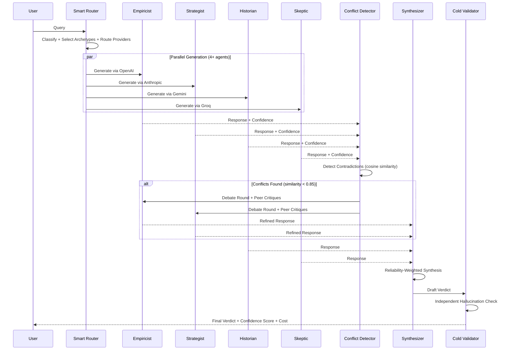
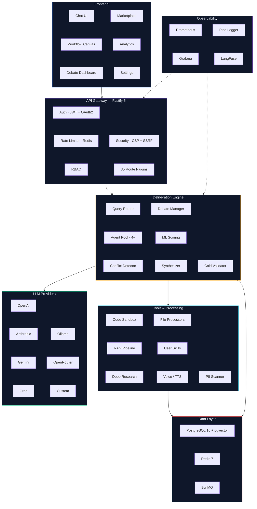

<div align="center">

# AIBYAI

### Multimodal Multi-Agent Deliberative Intelligence Platform

[](https://www.typescriptlang.org/)
[](https://react.dev/)
[](https://fastify.dev/)
[](https://www.postgresql.org/)
[](https://redis.io/)
[](https://www.docker.com/)
[](./LICENSE)

<br />

**4+ AI agents debate, critique, and synthesize answers through structured deliberation — producing mathematically validated consensus instead of single-model guesswork.**

[Quick Start](#-quick-start) · [Architecture](#-architecture) · [Features](#-features) · [Documentation](./docs/DOCUMENTATION.md) · [Roadmap](./ROADMAP.md)

</div>

---

## Why AIBYAI?

Single-model AI gives you one perspective. AIBYAI gives you a **council**.

| | Single Model | AIBYAI Council |
|---|---|---|
| **Perspectives** | 1 | 4+ concurrent agents |
| **Quality Check** | None | Peer review + cold validation |
| **Scoring** | Trust the output | Deterministic ML scoring |
| **Bias Detection** | Hope for the best | Cross-agent contradiction detection |
| **Confidence** | Unknown | Mathematical consensus metric |
| **Failover** | Provider goes down, you're down | 7 providers with automatic fallover |
| **Cost Control** | Pay whatever the model costs | Smart routing, per-query cost tracking |

---

## How It Works



**Scoring formula:** `0.6 * Agreement + 0.4 * PeerRanking`
**Consensus target:** `>= 0.85` cosine similarity
**Synthesis weights:** Model reliability scores tracked across sessions

---

## Architecture



---

## Features

### Multi-Agent Deliberation
4+ AI agents with distinct archetypes (Empiricist, Strategist, Historian, Architect, Skeptic) debate in structured rounds with peer review, adversarial critique, and deterministic consensus scoring. A cold validator independently checks the final verdict for hallucinations.

### 7 LLM Provider Adapters
Unified interface for OpenAI, Anthropic, Gemini, Groq, Ollama (local), OpenRouter, and custom providers. All calls go through a circuit breaker with automatic failover. Request timeouts, SSRF validation, and tool-call depth limiting on every adapter. Add custom providers via UI — zero code changes.

### RAG Knowledge Bases
pgvector embeddings with HNSW indexes and hybrid search (vector similarity + BM25 text ranking). Document chunking with multi-format ingestion (PDF, DOCX, XLSX, CSV, TXT, images). Attach knowledge bases to conversations for grounded responses.

### Visual Workflow Engine
Drag-and-drop builder with React Flow — 12 node types (LLM, Tool, Condition, Loop, HTTP, Code, Human Gate, Split, Merge, Template, Input, Output). Server-side execution with real-time SSE streaming. SSRF-protected HTTP nodes. Validated workflow definitions.

### Deep Research Mode
Autonomous multi-step research: breaks queries into sub-questions, searches the web, scrapes sources, synthesizes answers, and produces cited reports. Async via BullMQ with dead-letter queue for failed jobs.

### Code Sandbox
Isolated execution — JavaScript in `isolated-vm` (V8 isolate, 128MB cap), Python in subprocess with ulimit constraints (256MB memory, 10s CPU, 32 processes) and socket-level network blocking. Environment variables filtered to prevent secret leakage. Safe math evaluation — no eval(). Note: Python sandbox uses process-level isolation only; kernel-level namespace isolation (nsjail/bubblewrap) is not yet implemented.

### Community Marketplace
Publish and install prompts, workflows, personas, and tools. Star ratings, reviews, download tracking, one-click import. Foreign key integrity and atomic star toggles.

### Observability + LLMOps
Prometheus metrics with auto-provisioned Grafana dashboards (request latency p50/p95/p99, provider call duration, error rate, token usage per model). Execution tracing with LangFuse export. Model reliability scoring. Per-query cost tracking with color-coded tiers.

### Voice & TTS
Multi-provider TTS with automatic fallback. Speech-to-text input support.

### PII Detection
Server-side PII scanning — emails, phone numbers, SSNs, credit cards, API keys. Risk scoring with configurable enforcement.

### 3-Layer Memory
Active context, auto-generated session summaries, and long-term vector memory with compaction. HNSW-indexed for fast retrieval.

### Auth & Security
JWT access tokens (15 min, HS256-pinned) with rotating httpOnly refresh tokens. argon2id password hashing (OWASP params). OAuth2 (Google, GitHub) with verified email enforcement. Redis-backed distributed rate limiting. RBAC (member/admin). Zod-validated payloads throughout.

### PWA + Offline
Workbox service worker, IndexedDB conversation caching, NetworkFirst API strategy.

---

## Tech Stack

| Layer | Technology | Purpose |
|---|---|---|
| **Runtime** | Node.js 22 LTS, TypeScript 5.9 (strict) | Server + type safety |
| **API** | Fastify 5 | 35 native route plugins, Swagger UI |
| **Frontend** | React 18, Vite 6, Tailwind CSS | SPA with hot reload |
| **Database** | PostgreSQL 16 + pgvector + HNSW | Relational data + vector similarity |
| **Cache / Queues** | Redis 7, BullMQ | Distributed rate limiting, semantic cache, async jobs with DLQ |
| **ORM** | Drizzle ORM | Type-safe SQL, zero abstraction overhead |
| **Realtime** | ws (native WebSocket) | Streaming deliberation events |
| **Auth** | JWT (HS256) + rotating refresh tokens, Passport OAuth2 | Authentication + session management |
| **Encryption** | AES-256-GCM, argon2id | API key vault, password hashing |
| **Observability** | Pino, Prometheus, Grafana, LangFuse | Logging, metrics, dashboards, LLM tracing |
| **Workflow UI** | XYFlow (React Flow) | Visual drag-and-drop builder |
| **Charts** | Apache ECharts | Analytics dashboards (memoized renders) |
| **Sandbox** | isolated-vm, Python subprocess + socket blocking | Secure code execution |
| **Resilience** | Opossum circuit breaker, exponential backoff retry | Provider failover, job retry |
| **Infrastructure** | Docker, GitHub Actions CI, Grafana provisioning | Containerized deployment, monitoring |

### Supported LLM Providers

| Provider | Models | Adapter |
|---|---|---|
| OpenAI | GPT-4o, GPT-4o-mini, o1, o3, o4-mini | Native |
| Anthropic | Claude 3.5 Sonnet, Claude 4, Claude Opus | Native |
| Google | Gemini 2.0 Flash, Gemini 2.5 Pro | Native |
| Groq | LLaMA 3.x, LLaMA 4, Mixtral | Native |
| Ollama | Any local model | Native |
| OpenRouter | Multi-model gateway | Native |
| Custom | Any OpenAI-compatible API | Configurable via UI |

> All adapters include circuit breaker protection, request timeouts, SSRF validation, and tool-call depth limiting.

---

## Quick Start

```bash
git clone https://github.com/Yash-Awasthi/aibyai.git
cd aibyai

npm install
cd frontend && npm install && cd ..

cp .env.example .env
# Add DATABASE_URL, JWT_SECRET, MASTER_ENCRYPTION_KEY, and at least one AI provider key

npx drizzle-kit push
npm run dev:all
```

Open **http://localhost:5173**

### Docker

```bash
docker compose up -d
# → http://localhost:3000
# Grafana dashboards → http://localhost:3001 (auto-provisioned)
```

> **Full setup guide, environment variables, and API reference:** [docs/DOCUMENTATION.md](./docs/DOCUMENTATION.md)

---

## Example

```bash
curl -X POST http://localhost:3000/api/ask \
  -H "Content-Type: application/json" \
  -H "Authorization: Bearer <token>" \
  -d '{"question": "Microservices vs monolith?", "mode": "auto", "rounds": 2}'
```

Returns an SSE stream: `status` → `opinion` → `peer_review` → `scored` → `validator_result` → `metrics` → `done`

> **Full API reference:** [docs/DOCUMENTATION.md](./docs/DOCUMENTATION.md#api-reference) | **Interactive docs:** `/api/docs`

---

## Project Structure

```
aibyai/
├── src/
│   ├── adapters/           # LLM provider adapters (7 providers + registry)
│   ├── auth/               # OAuth strategies (Google, GitHub)
│   ├── config/             # Zod-validated environment config
│   ├── db/schema/          # Drizzle ORM schemas (15 tables, HNSW indexes)
│   ├── lib/                # Core: crypto, breaker, cost, ssrf, tools, scoring
│   ├── middleware/          # Auth, RBAC, rate limiting, CSP, error handling
│   ├── processors/         # File processors (PDF, DOCX, XLSX, CSV, TXT, images)
│   ├── queue/              # BullMQ queues, workers, dead-letter queue
│   ├── router/             # Smart query routing, token estimation, quota tracking
│   ├── routes/             # 35 Fastify route plugins
│   ├── sandbox/            # Code sandboxes (isolated-vm JS, subprocess Python)
│   ├── services/           # Business logic (council, embeddings, research, memory)
│   └── workflow/           # Workflow executor + 12 node handlers
├── frontend/src/
│   ├── components/         # React components (ChatArea, Sidebar, Settings, etc.)
│   ├── context/            # Auth + Theme contexts
│   ├── views/              # Page views (15 views)
│   └── router.tsx          # React Router with 404 catch-all
├── tests/                  # Unit tests (auth, RBAC, rate limiting, SSRF, validation)
├── grafana/                # Auto-provisioned dashboards + datasources
├── docker-compose.yml      # PostgreSQL + Redis + Prometheus + Grafana
├── Dockerfile              # Multi-stage build with HEALTHCHECK
└── .github/workflows/      # CI: lint, typecheck, test, build
```

---

## Security

| Layer | Implementation |
|---|---|
| **Authentication** | JWT (HS256-pinned, 15 min TTL, Zod-validated) + rotating httpOnly refresh tokens + argon2id (OWASP params) |
| **OAuth2** | Google + GitHub with verified email enforcement, cross-provider collision protection |
| **Authorization** | RBAC (member/admin), per-route auth guards, admin-only metrics/stats |
| **Rate Limiting** | Redis-backed distributed: 10/min auth, 60/min API, 10/min sandbox, 20/min voice. In-memory fallback if Redis unavailable |
| **Input Validation** | Zod schemas on all payloads; LIKE wildcard escaping; safe math parser (no eval/Function) |
| **SSRF Protection** | `lib/ssrf.ts` on all outbound HTTP — workflow nodes, tools, adapters, read_webpage |
| **Code Sandbox** | JS: V8 isolate (128MB). Python: ulimit + socket-level network blocking + env filtering. Process-level isolation only — no kernel namespaces. |
| **Encryption** | AES-256-GCM with per-record IV-derived key (via scrypt). Single shared implementation in `lib/crypto.ts`. Key validation at startup |
| **CSP** | Content-Security-Policy with per-request nonces |
| **Resilience** | Circuit breaker on all provider calls, exponential backoff retry, dead-letter queue |
| **Upload Security** | MIME allowlist, size limits, path traversal protection, auth required |

---

## Contributing

1. Fork the repository
2. Create a feature branch: `git checkout -b feature/your-feature`
3. Make your changes and ensure they pass:
   ```bash
   npm run typecheck
   npm run lint
   npm test
   ```
4. Commit with conventional commits: `feat:`, `fix:`, `docs:`, `refactor:`
5. Push and open a pull request

### Development Tips

- **Database changes**: Edit schemas in `src/db/schema/`, then `npm run db:push`
- **New routes**: Create a Fastify plugin in `src/routes/`, register in `src/index.ts`
- **New adapter**: Add to `src/adapters/`, register in `src/adapters/registry.ts`
- **New workflow node**: Add handler in `src/workflow/nodes/`, register in `src/workflow/nodes/index.ts`
- **Frontend**: React components in `frontend/src/components/`, Tailwind for styling

---

## License

[ISC](./LICENSE) — Yash Awasthi

---

<div align="center">

**Built with deliberation, not hallucination.**

[Report a Bug](https://github.com/Yash-Awasthi/aibyai/issues) · [Request a Feature](https://github.com/Yash-Awasthi/aibyai/issues) · [Roadmap](./ROADMAP.md)

</div>
