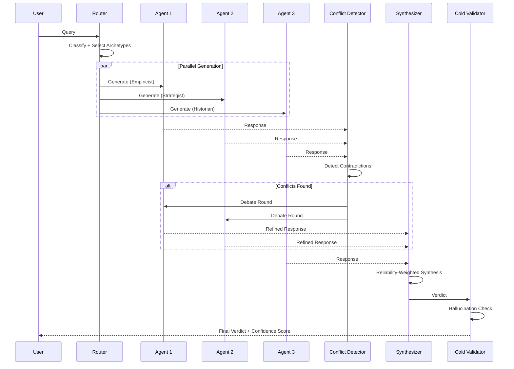
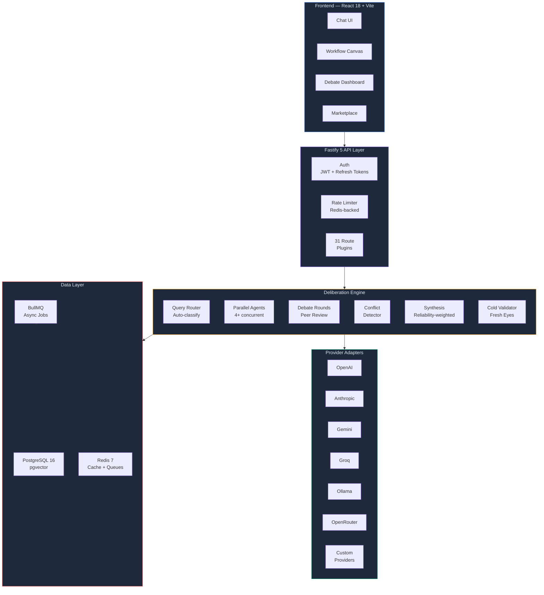

<div align="center">

# AIBYAI

### Multimodal Multi-Agent Deliberative Intelligence Platform

[](https://www.typescriptlang.org/)
[](https://react.dev/)
[](https://fastify.dev/)
[](https://www.postgresql.org/)
[](https://redis.io/)
[](https://www.docker.com/)
[](./LICENSE)

<br />

**4+ AI agents debate, critique, and synthesize answers through structured deliberation — producing mathematically validated consensus instead of single-model guesswork.**

[Quick Start](#-quick-start) · [How It Works](#-how-it-works) · [Features](#-features) · [Documentation](./docs/DOCUMENTATION.md) · [Roadmap](./ROADMAP.md)

</div>

---

## Why AIBYAI?

Single-model AI gives you one perspective. AIBYAI gives you a **council**.

| | Single Model | AIBYAI Council |
|---|---|---|
| **Perspectives** | 1 | 4+ concurrent agents |
| **Quality Check** | None | Peer review + cold validation |
| **Scoring** | Trust the output | Deterministic ML scoring |
| **Bias Detection** | Hope for the best | Cross-agent contradiction detection |
| **Confidence** | Unknown | Mathematical consensus metric |

---

## How It Works



The pipeline scores each agent using `0.6 * Agreement + 0.4 * PeerRanking`, targets `>= 0.85` consensus (cosine similarity), and weights synthesis by model reliability scores tracked across sessions.

---

## Architecture



---

## Features

### Multi-Agent Deliberation
4+ AI agents with distinct archetypes (Empiricist, Strategist, Historian, Architect, Skeptic) debate in structured rounds with peer review, adversarial critique, and deterministic consensus scoring. A cold validator independently checks the final verdict for hallucinations.

### 7 LLM Provider Adapters
Unified interface for OpenAI, Anthropic, Gemini, Groq, Ollama (local), OpenRouter, and custom providers. Add custom providers via UI — zero code changes. Compatible with OpenAI-API-compatible services (Mistral, Cerebras, NVIDIA NIM) through the OpenRouter or Custom adapter. All adapters include request timeouts, SSRF validation, and tool-call depth limiting.

### RAG Knowledge Bases
pgvector embeddings with hybrid search (vector similarity + BM25 text ranking), document chunking, and multi-format ingestion (PDF, DOCX, XLSX, CSV, TXT, images). Attach knowledge bases to conversations for grounded responses.

### Visual Workflow Engine
Drag-and-drop builder with React Flow — 10+ node types (LLM, Tool, Condition, Loop, HTTP, Code, Human Gate). Server-side execution with real-time streaming.

### Deep Research Mode
Autonomous multi-step research: breaks queries into sub-questions, searches the web, scrapes sources, synthesizes answers, and produces cited reports. Async via BullMQ.

### Code Sandbox
Isolated execution — JavaScript in `isolated-vm` (V8 isolate, 128MB memory cap), Python in subprocess with ulimit constraints (256MB memory, 10s CPU, 32 process limit). Environment variables are filtered to prevent secret leakage. Safe math evaluation replaces eval() for expression parsing.

### Community Marketplace
Publish and install prompts, workflows, personas, and tools. Star ratings, reviews, download tracking, one-click import.

### User Skills Framework
Write Python functions that become tools during council deliberation. Sandboxed execution, dynamic registration.

### Observability + LLMOps
Prometheus metrics (latency histograms, provider call duration, queue depth, token usage), execution tracing with LangFuse export, model reliability scoring, analytics dashboard, per-query cost tracking with color-coded tiers.

### API Documentation
Interactive Swagger UI at `/api/docs` with OpenAPI 3.0 spec. All routes annotated with request/response schemas, auth requirements, and examples.

### Voice & Text-to-Speech
Multi-provider TTS with automatic fallback (Xiaomi MiMo → CosyVoice → OpenAI). Speech-to-text input support.

### PII Detection & Redaction
Server-side PII scanning. Detects emails, phone numbers, SSNs, credit cards, API keys. Risk scoring with configurable enforcement.

### GitHub Intelligence
Index repositories into the vector store. Code snippets are injected into council context for code-aware conversations.

### 3-Layer Memory
Active context, auto-generated session summaries, and long-term vector memory with compaction. Pluggable backends (pgvector, Qdrant, GetZep).

### Auth + Security
JWT access tokens (15 min) with rotating refresh tokens (httpOnly cookie), argon2id password hashing (OWASP-recommended), OAuth2 (Google, GitHub), role-based access control, shareable conversations with expiry, admin dashboard.

### PWA + Offline
Workbox service worker, IndexedDB conversation caching, NetworkFirst API strategy.

---

## Tech Stack

| Layer | Technology | Purpose |
|---|---|---|
| **Runtime** | Node.js 22 LTS, TypeScript 5.9 | Server + type safety |
| **API** | Fastify 5 | HTTP layer, 31 native route plugins + Express compat for Swagger UI |
| **Frontend** | React 18, Vite 6, Tailwind CSS | SPA with hot reload |
| **Database** | PostgreSQL 16 + pgvector | Relational data + vector embeddings |
| **Cache / Queues** | Redis 7, BullMQ | Semantic cache, rate limiting, async jobs |
| **ORM** | Drizzle ORM | Type-safe SQL query builder, full SQL control |
| **Realtime** | ws (native WebSocket) | WebSocket streaming for deliberation events |
| **Auth** | JWT + rotating refresh tokens, Passport (Google, GitHub OAuth2) | Authentication + session management |
| **Encryption** | AES-256-GCM, argon2id | API key vault, password hashing (OWASP-compliant) |
| **Observability** | Pino, Prometheus (prom-client), LangFuse (optional) | Structured logging, metrics, LLM tracing |
| **Workflow UI** | XYFlow (React Flow) | Visual drag-and-drop workflow builder |
| **Code Editor** | Monaco Editor | In-browser prompt and code editing |
| **Charts** | Apache ECharts | Analytics and evaluation dashboards |
| **Sandbox** | isolated-vm (128MB cap), Python subprocess (ulimit + network isolation) | Secure code execution (JS + Python) |
| **Infrastructure** | Docker, GitHub Actions CI | Containerized deployment, automated testing |

### Supported LLM Providers

| Provider | Type | Adapter |
|---|---|---|
| OpenAI (GPT-4o, o1, o3) | API | Native |
| Anthropic (Claude 3/4) | API | Native |
| Google (Gemini) | API | Native |
| Groq (LLaMA, Mixtral) | API | Native |
| Ollama | Local | Native |
| OpenRouter | API | Native |
| Custom providers | API | Configurable via UI (EMOF) |

> **OpenAI-compatible services** (Mistral, Cerebras, NVIDIA NIM, etc.) work through the OpenRouter or Custom provider adapter.

---

## Quick Start

```bash
git clone https://github.com/Yash-Awasthi/aibyai.git
cd aibyai

npm install
cd frontend && npm install && cd ..

cp .env.example .env
# Add DATABASE_URL, JWT_SECRET, MASTER_ENCRYPTION_KEY, and at least one AI provider key

npx drizzle-kit push
npm run dev:all
```

Open **http://localhost:5173**

### Or with Docker

```bash
docker compose up -d
# → http://localhost:3000
```

> **Full setup guide, all environment variables, and API reference:** [docs/DOCUMENTATION.md](./docs/DOCUMENTATION.md)

---

## Example

```bash
curl -X POST http://localhost:3000/api/ask \
  -H "Content-Type: application/json" \
  -H "Authorization: Bearer <token>" \
  -d '{"question": "Microservices vs monolith?", "mode": "auto", "rounds": 2}'
```

Returns an SSE stream: `opinion` → `peer_review` → `scored` → `done` (verdict + confidence score)

> **Full API reference with all endpoints:** [docs/DOCUMENTATION.md](./docs/DOCUMENTATION.md#api-reference) | **Interactive docs:** `/api/docs`

---

## Documentation

| Document | Description |
|---|---|
| **[Documentation](./docs/DOCUMENTATION.md)** | Setup, env vars, API reference, project structure, deployment, security |
| **[Roadmap](./ROADMAP.md)** | Future plans — testing, collaboration, plugins, scaling |
| **Interactive API Docs** | Available at `/api/docs` when the server is running |

---

## Project Structure

```
aibyai/
├── src/
│   ├── adapters/           # LLM provider adapters (OpenAI, Anthropic, Gemini, Groq, Ollama, OpenRouter, Custom)
│   ├── auth/               # OAuth strategies (Google, GitHub)
│   ├── config/             # Environment config (Zod-validated)
│   ├── db/schema/          # Drizzle ORM schema definitions (PostgreSQL + pgvector)
│   ├── lib/                # Core libraries (crypto, logger, breaker, cost, tools, swagger)
│   ├── middleware/          # Auth, rate limiting, CSP, error handling, Prometheus metrics
│   ├── processors/         # File processors (PDF, DOCX, XLSX, CSV, TXT, images)
│   ├── queue/              # BullMQ queues and workers (ingestion, research, repo, compaction)
│   ├── router/             # Query routing, token estimation, quota tracking
│   ├── routes/             # Fastify route plugins (31 native plugins)
│   ├── sandbox/            # Code sandboxes (isolated-vm for JS, subprocess for Python)
│   ├── services/           # Business logic (council, embeddings, research, usage, memory)
│   └── workflow/           # Workflow engine (executor, node handlers)
├── frontend/
│   ├── src/
│   │   ├── components/     # React components (ChatArea, Sidebar, MessageList, Settings)
│   │   ├── context/        # React contexts (Auth, Theme)
│   │   ├── views/          # Page views (DebateDashboard, Analytics, WorkflowEditor)
│   │   └── router.tsx      # React Router config
│   └── package.json
├── tests/                  # Vitest test files + benchmarks
├── scripts/                # Shell scripts (run-tests, benchmark)
├── docker-compose.yml      # PostgreSQL + Redis + Prometheus + Grafana
├── Dockerfile              # Multi-stage production build
└── .github/workflows/      # CI pipeline (lint, typecheck, test, build, security-audit)
```

---

## Environment Variables

> **Required** variables for a minimal setup. Full reference: [docs/DOCUMENTATION.md](./docs/DOCUMENTATION.md#environment-variables)

| Variable | Required | Description |
|---|---|---|
| `DATABASE_URL` | Yes | PostgreSQL connection string (with pgvector extension) |
| `REDIS_URL` | Yes | Redis connection string |
| `JWT_SECRET` | Yes | Secret for signing JWT tokens (min 32 chars) |
| `MASTER_ENCRYPTION_KEY` | Yes | AES-256-GCM key for API key vault encryption |
| `PORT` | No | Server port (default: `3000`) |
| `OPENAI_API_KEY` | * | OpenAI API key |
| `ANTHROPIC_API_KEY` | * | Anthropic API key |
| `GOOGLE_GENERATIVE_AI_API_KEY` | * | Google Gemini API key |
| `GROQ_API_KEY` | * | Groq API key |
| `OLLAMA_BASE_URL` | * | Ollama server URL (default: `http://localhost:11434`) |

\* At least one AI provider key is required.

---

## Security

AIBYAI implements defense-in-depth security measures:

| Layer | Implementation |
|---|---|
| **Authentication** | JWT access tokens (15 min TTL, algorithm-pinned) + rotating httpOnly refresh tokens, argon2id password hashing (OWASP params), Zod-validated JWT payloads |
| **OAuth2** | Google + GitHub with verified email enforcement, cross-provider email collision protection |
| **Authorization** | Role-based access control (member/admin), per-route auth guards |
| **Rate Limiting** | In-memory rate limiting: 15/min auth, 60/min API, 10/min sandbox, 20/min voice. Redis-backed limiter recommended for multi-instance deployments |
| **Input Validation** | Zod schemas for JWT payloads and request bodies; LIKE wildcard escaping; safe math parser (no eval) |
| **SSRF Protection** | URL validation on outbound HTTP (workflow nodes, tools, adapters) via `lib/ssrf.ts` |
| **Code Sandbox** | JS: V8 isolate (128MB cap) via isolated-vm. Python: subprocess with ulimit constraints (256MB memory, 10s CPU, 32 processes). Env vars filtered. |
| **Encryption** | AES-256-GCM for API key vault, persistent encryption keys validated at startup |
| **CSP** | Content-Security-Policy with per-request nonces |
| **Upload Security** | MIME type allowlist, file size limits, path traversal protection, authentication required |

---

## Contributing

1. Fork the repository
2. Create a feature branch: `git checkout -b feature/your-feature`
3. Make your changes and ensure they pass:
   ```bash
   npm run typecheck
   npm run lint
   npm test
   ```
4. Commit with conventional commits: `feat:`, `fix:`, `docs:`, `refactor:`
5. Push and open a pull request

### Development Tips

- **Database changes**: Edit schemas in `src/db/schema/`, then run `npm run db:push`
- **New routes**: Create a Fastify plugin in `src/routes/`, register in `src/index.ts`
- **New adapter**: Add to `src/adapters/`, register in `src/adapters/registry.ts`
- **Frontend**: React components in `frontend/src/components/`, Tailwind for styling

---

## License

[ISC](./LICENSE) — Yash Awasthi

---

<div align="center">

**Built with deliberation, not hallucination.**

[Report a Bug](https://github.com/Yash-Awasthi/aibyai/issues) · [Request a Feature](https://github.com/Yash-Awasthi/aibyai/issues)

</div>
