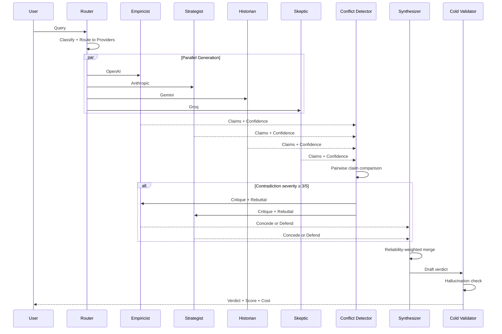
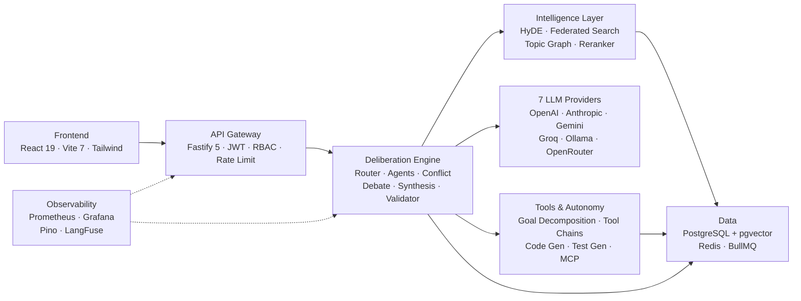

<div align="center">

# AIBYAI

### Multi-Agent Deliberative Intelligence Platform

[](https://www.typescriptlang.org/)
[](https://react.dev/)
[](https://fastify.dev/)
[](https://www.postgresql.org/)
[](https://redis.io/)
[](https://www.docker.com/)
[](./tests/)
[](https://modelcontextprotocol.io/)


<br />

**Instead of trusting one model's best guess, AIBYAI runs a council — 4+ agents argue, critique each other's claims, and produce a scored consensus with a confidence number you can actually trust.**

[Quick Start](#quick-start) · [Architecture](#architecture) · [Features](#features) · [Demo](#demo) · [Documentation](./DOCUMENTATION.md) · [Roadmap](./ROADMAP.md)

</div>

---

## The Problem with Single-Model AI

You ask GPT a question. It sounds confident. But is it right? You have no way to know — there's no second opinion, no peer review, no scoring.

AIBYAI fixes this by making AI models **debate each other**.

| | Single Model | AIBYAI Council |
|---|---|---|
| **Perspectives** | 1 | 4–7 agents running concurrently |
| **Quality Check** | None | Peer critique + cold validation |
| **Scoring** | Trust the output | `0.6 × Agreement + 0.4 × PeerRanking` |
| **Contradictions** | Invisible | Detected, debated, resolved |
| **Confidence** | Unknown | Numeric score with penalty breakdown |
| **Memory** | Stateless | Cross-conversation topic graph, temporal decay, adaptive recall |
| **Provider Lock-in** | One vendor | 12+ providers, automatic failover |
| **Cost Visibility** | Bill at the end | Per-query cost tracking |

---

## How It Works



**What actually happens under the hood:**

1. Each agent generates a response with 3–5 extracted factual claims
2. Claims are compared pairwise — contradictions scored on a 1–5 severity scale
3. Conflicts above severity 3 trigger structured debate (critique → rebuttal → concession tracking)
4. Agents that concede get their reliability score updated across sessions
5. Synthesis uses reliability-weighted merging at temperature 0.3
6. Final confidence: `claimScore × 0.6 + debateScore × 0.3 + diversityBonus × 0.1`
7. Cold validator independently checks the verdict for hallucinations

---

## Architecture



---

## Features

### Multi-Agent Deliberation
The core of AIBYAI. An orchestrator dispatches your query to 4+ agents running on different LLMs — each with a distinct archetype (14 built-in: Architect, Contrarian, Empiricist, Ethicist, Futurist, Pragmatist, Historian, Empath, Outsider, Strategist, Minimalist, Creator, Judge, Devil's Advocate). Agents don't just generate answers in parallel — they **extract claims, detect contradictions pairwise, and argue through structured debate rounds**. Concessions are tracked and fed back into per-model reliability scores that persist across sessions.

### Advanced RAG Pipeline
Five-stage retrieval: **HyDE** generates hypothetical answers to improve recall, **parent-child chunking** (1536/512 chars) retrieves child chunks and enriches with parent context, **federated search** queries KBs + repos + conversations + council facts in parallel, **adaptive k selection** picks result count by query complexity (simple k=3, moderate k=7, complex k=12), and optional **Cohere reranking** reorders results post-retrieval. All stages merge via Reciprocal Rank Fusion.

### Agentic Memory
Three-layer memory with intelligence: active conversation context, auto-generated session summaries, and long-term vector memory with HNSW indexing. **Cross-conversation topic graph** links related discussions through LLM-extracted topics and embedding similarity. **Temporal decay** (14-day half-life) keeps fresh memories relevant while expiring stale one-off facts. **Contradiction resolution** tracks conflicting agent claims with versioned audit trails.

### Agent Specialization
Domain-specific reasoning profiles (legal, medical, financial, engineering) with weighted archetype selection. **Self-improving personas** adjust agent prompts based on performance metrics. **Confidence calibration** flags over/underconfident agents by comparing stated confidence to actual agreement rates. **Dynamic delegation** routes subtasks to the best archetype via keyword matching.

### Autonomous Operations
**Goal decomposition engine** breaks complex objectives into a DAG of subtasks with cycle detection, topological sort, and cascading failure handling. **Tool chains** execute 6 tool types sequentially with output piping between steps. Three pre-built templates: research reports, competitive analysis, data pipelines. **Long-running background agents** handle hours-long tasks with checkpointing, pause/resume, and progress tracking. **Human-in-the-loop gates** provide configurable approval points with 4 gate types (approval, review, confirmation, escalation), multi-approver support, and auto-timeout. **Artifact streaming** delivers real-time intermediate results via EventEmitter pub/sub with SSE formatting and late-join replay.

### Audio/Video Input
**Multi-provider transcription** supports OpenAI Whisper and Google Speech-to-Text with graceful fallback. **Video keyframe extraction** captures frames at configurable intervals with LLM-generated scene descriptions. Transcripts and visual elements are formatted as structured council context for multi-modal deliberation.

### Code Generation & Review
**Full-stack scaffolding** turns natural language into PostgreSQL schemas + Drizzle ORM + API routes + React components. **PR review agent** runs security, performance, and style analysis in parallel with weighted scoring. **Test generation** uses 4 council perspectives (boundary, error, security, usability) for edge case discovery. **Refactoring assistant** detects 10 refactoring types and generates safe diffs with behavior-preservation analysis.

### MCP Integration
**Server mode** exposes AIBYAI as an MCP-compatible tool server (JSON-RPC 2.0) with deliberation, knowledge search, and test generation tools. **Client mode** connects to external MCP servers with tool discovery, caching, and auth header forwarding.

### Plugin SDK & Webhooks
**Custom tool packages** with manifest-driven lifecycle (onLoad/onUnload) and config validation. **Webhook triggers** for 8 event types with retry logic and HMAC-SHA256 signing. **Middleware hooks** at 8 pipeline stages with priority ordering — includes built-in PII redaction, audit logging, and content length guards. **Tool federation** lets users browse, install, and manage MCP ecosystem tools from a registry with search, ratings, and per-user enable/toggle. **Custom workflow nodes** support third-party node types with input/output schema validation and pluggable execution handlers.

### Multi-Modal Council
**Image-aware agents** analyze images and extract elements for council deliberation. **Visual output generation** produces Mermaid diagrams (8 types), chart specs, deliberation mindmaps, and confidence tables. **Cross-modal reasoning** detects contradictions between text and image inputs.

### Real-time Collaboration
**Multi-user deliberation** supports 2–10 users in shared council sessions with role-based participation (moderator, contributor, observer), phase management (open, deliberating, voting, closed), and turn-based speaking. **Live presence** tracks cursor positions, typing indicators, and user activity with heartbeat-based cleanup. **User annotations** let participants highlight and comment on agent responses with threaded replies, reactions, and resolution tracking. **Synthesis voting** adds democratic consensus on top of AI consensus with weighted scoring, quorum thresholds, delegation, and automatic result tallying.

### Smart Provider Routing
Queries are classified by complexity and routed through provider chains. Free tier: Gemini → Groq → OpenRouter → Cerebras → Ollama. Paid tier: OpenAI → Anthropic → Gemini → Mistral. If a provider fails, the circuit breaker (Opossum) trips and traffic shifts to the next in chain — no user-visible downtime.

### Visual Workflow Engine
A drag-and-drop canvas (React Flow) with 12 node types: LLM, Tool, Condition, Loop, HTTP, Code, Human Gate, Split, Merge, Template, Input, Output. Workflows execute server-side with topological ordering. HTTP nodes go through SSRF validation. Human Gate nodes pause execution for up to 5 minutes waiting for user input.

### Deep Research Mode
Autonomous multi-step research: an LLM breaks your query into 3–5 sub-questions, searches the web (Tavily → SerpAPI fallback), scrapes up to 2000 chars per source, synthesizes cited answers per sub-question, then compiles a final Markdown report with executive summary and references.

### Code Sandbox
JavaScript runs in a V8 isolate (isolated-vm, 128MB cap). Python runs in a subprocess with ulimit constraints (256MB memory, 10s CPU, 32 processes), socket-level network blocking, and **seccomp-bpf syscall filtering** that blocks 30+ dangerous syscalls (ptrace, mount, bpf, unshare, kexec, etc.). A safe math evaluator uses a recursive descent parser (no `eval()` or `Function()`).

### Community Marketplace
Publish and install prompts, workflows, personas, and custom tools. Star ratings, reviews, download tracking, one-click import into your workspace.

---

## Tech Stack

| Layer | Technology |
|---|---|
| **Runtime** | Node.js 22+, TypeScript 6.0 (strict) |
| **API** | Fastify 5 — 36 route plugins, Swagger UI |
| **Frontend** | React 19, Vite 7, Tailwind CSS |
| **Database** | PostgreSQL 16 + pgvector + HNSW indexes, Drizzle ORM |
| **Cache / Queues** | Redis 7, BullMQ with dead-letter queue |
| **Realtime** | Native WebSocket (ws) + SSE streaming |
| **Auth** | JWT + Passport OAuth2 (Google, GitHub) |
| **Encryption** | AES-256-GCM (per-record IV), argon2id |
| **Observability** | Pino, Prometheus, Grafana, LangFuse |
| **Sandbox** | isolated-vm (JS), subprocess + ulimit (Python) |
| **Resilience** | Opossum circuit breaker, exponential backoff, DLQ |
| **Intelligence** | HyDE, RRF, Cohere reranker, pgvector HNSW |
| **Protocols** | MCP (server + client), JSON-RPC 2.0 |
| **Infrastructure** | Docker, GitHub Actions CI |

### LLM Providers

| Provider | Models | Notes |
|---|---|---|
| OpenAI | GPT-4o, o1, o3, o4-mini | 500 RPM paid tier |
| Anthropic | Claude 3.5 Sonnet, Claude 4 | 50 RPM paid tier |
| Google | Gemini 2.0 Flash, 2.5 Pro | 15 RPM free tier |
| Groq | LLaMA 3.x, LLaMA 4, Mixtral | 30 RPM free tier |
| Ollama | Any local model | Unlimited, self-hosted |
| OpenRouter | Multi-model gateway | 20 RPM free tier |
| Mistral | Mistral Small, Large | 60 RPM paid tier |
| Cerebras | LLaMA 3.3 70B | 30 RPM free tier |
| NVIDIA | NIM models | OpenAI-compatible |
| Perplexity | Sonar models | Online search-augmented |
| Fireworks | Fast inference | OpenAI-compatible |
| Together | Open-source models | OpenAI-compatible |
| DeepInfra | Open-source models | OpenAI-compatible |
| Azure OpenAI | GPT-4o (Azure-hosted) | OpenAI-compatible |
| Custom | Any OpenAI-compatible API | Configurable via UI |

All adapters include circuit breaker protection, request timeouts, SSRF validation, and tool-call depth limiting.

---

## Demo

> **Live demo coming soon.** To see AIBYAI in action, clone the repo and run locally with `npm run dev`. A hosted demo and video walkthrough are planned — star the repo to get notified.

<!-- TODO: Replace with actual demo URL and video embed when available -->
<!-- [Live Demo](https://demo.aibyai.dev) · [Video Walkthrough](https://youtube.com/watch?v=...) -->

---

## Quick Start

```bash
git clone https://github.com/Yash-Awasthi/aibyai.git
cd aibyai

npm install
cd frontend && npm install && cd ..

cp .env.example .env
# Add DATABASE_URL, JWT_SECRET, MASTER_ENCRYPTION_KEY, and at least one AI provider key

npm run db:push
npm run dev:all
```

Open **http://localhost:5173**

### Docker

```bash
docker compose up -d
# → http://localhost:3000
# Grafana dashboards → http://localhost:3001 (auto-provisioned)
```

> **Full setup guide, environment variables, and API reference:** [DOCUMENTATION.md](./DOCUMENTATION.md)

---

## Example

```bash
curl -X POST http://localhost:3000/api/ask \
  -H "Content-Type: application/json" \
  -H "Authorization: Bearer <token>" \
  -d '{"question": "Microservices vs monolith?", "mode": "auto", "rounds": 2}'
```

Returns an SSE stream: `status` → `opinion` → `peer_review` → `scored` → `validator_result` → `metrics` → `done`

> **Full API reference:** [DOCUMENTATION.md](./DOCUMENTATION.md#api-reference) | **Interactive docs:** `/api/docs`

---

## Project Structure

```
aibyai/
├── src/
│   ├── adapters/           # 12+ LLM provider adapters + registry
│   ├── agents/             # Orchestrator, conflict detector, shared memory
│   ├── auth/               # OAuth strategies (Google, GitHub)
│   ├── config/             # Zod-validated environment config
│   ├── db/schema/          # Drizzle ORM tables + HNSW indexes
│   ├── lib/                # Crypto, circuit breaker, cost tracking, SSRF, scoring
│   ├── middleware/         # Auth, RBAC, rate limiting, CSP, quota, request ID
│   ├── observability/      # OpenTelemetry tracer
│   ├── processors/         # File ingestion (PDF, DOCX, XLSX, CSV, images)
│   ├── queue/              # BullMQ workers + dead-letter queue
│   ├── router/             # Smart routing, token estimation, quota tracking
│   ├── routes/             # 36 Fastify route plugins
│   ├── sandbox/            # V8 isolate (JS) + subprocess (Python) + seccomp-bpf
│   ├── services/           # Council, RAG, memory, reliability, specialization,
│   │                       # goal decomposition, tool chains, code gen, MCP, plugins,
│   │                       # HITL gates, background agents, artifact streaming,
│   │                       # audio/video, tool federation, workflow nodes,
│   │                       # annotations, voting, multi-user, live presence
│   ├── types/              # TypeScript declarations
│   └── workflow/           # Executor + 12 node types (9 dedicated handlers)
├── frontend/src/
│   ├── components/         # React components + 12 workflow node UIs
│   ├── context/            # Auth + Theme contexts
│   ├── hooks/              # Council stream, deliberation, member hooks
│   ├── layouts/            # Root layout
│   ├── views/              # 18 views (Chat, Debate, Workflows, Marketplace, etc.)
│   └── router.tsx          # React Router 7
├── tests/                  # 200+ test files, 2950+ tests
├── grafana/                # Auto-provisioned dashboards
├── scripts/                # Setup, load tests, provider diagnostics
├── .github/workflows/      # CI: lint, typecheck, test, security audit, CodeQL
├── docker-compose.yml      # PostgreSQL + Redis + Prometheus + Grafana
├── Dockerfile              # Multi-stage build with HEALTHCHECK
├── DOCUMENTATION.md        # Complete technical reference
├── SECURITY.md             # Vulnerability reporting & security policy
└── ROADMAP.md              # Remaining development roadmap
```

---

## Security

| Layer | Implementation |
|---|---|
| **Authentication** | JWT (HS256-pinned, 15 min TTL) + rotating httpOnly refresh tokens + argon2id |
| **OAuth2** | Google + GitHub with verified email enforcement |
| **Authorization** | RBAC (member/admin), per-route guards, per-tenant quota enforcement |
| **Rate Limiting** | Redis-backed: 10/min auth, 60/min API, 10/min sandbox, 20/min voice |
| **Input Validation** | Zod on all payloads; safe math parser (no eval); LIKE wildcard escaping |
| **SSRF Protection** | Validated on all outbound HTTP — adapters, tools, workflow nodes |
| **Code Sandbox** | JS: V8 isolate (128MB). Python: ulimit + socket blocking + seccomp-bpf syscall filter. |
| **Encryption** | AES-256-GCM, per-record IV-derived key via scrypt; API keys encrypted server-side |
| **Resilience** | Circuit breaker on provider calls, exponential backoff, dead-letter queue |
| **Headers** | CSP with nonce, request ID correlation, structured error responses |

---

## Contributing

1. Fork the repository
2. Create a feature branch: `git checkout -b feature/your-feature`
3. Make your changes and ensure they pass:
   ```bash
   npm run typecheck
   npm run lint
   npm test
   ```
4. Commit with conventional commits: `feat:`, `fix:`, `docs:`, `refactor:`
5. Push and open a pull request

---

<div align="center">

**Built with deliberation, not hallucination.**

[Report a Bug](https://github.com/Yash-Awasthi/aibyai/issues) · [Request a Feature](https://github.com/Yash-Awasthi/aibyai/issues) · [Roadmap](./ROADMAP.md)

</div>
