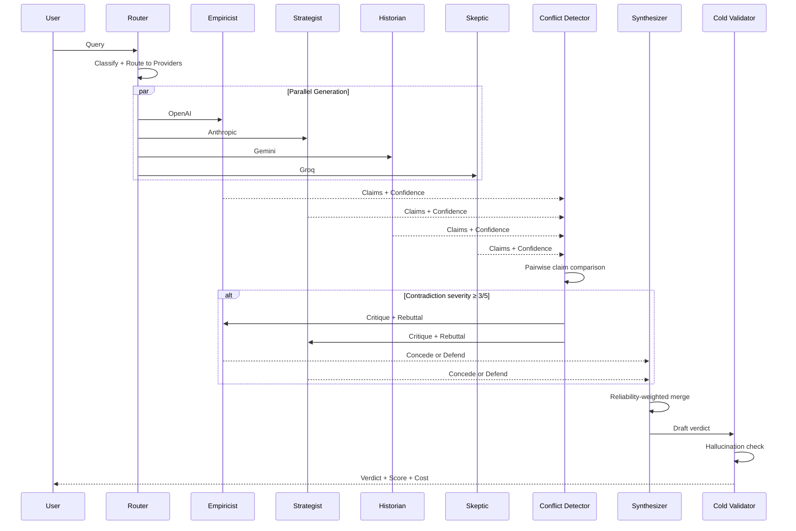
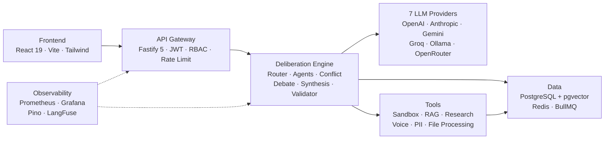

<div align="center">

# AIBYAI

### Multi-Agent Deliberative Intelligence Platform

[](https://www.typescriptlang.org/)
[](https://react.dev/)
[](https://fastify.dev/)
[](https://www.postgresql.org/)
[](https://redis.io/)
[](https://www.docker.com/)
[](./LICENSE)

<br />

**Instead of trusting one model's best guess, AIBYAI runs a council — 4+ agents argue, critique each other's claims, and produce a scored consensus with a confidence number you can actually trust.**

[Quick Start](#-quick-start) · [Architecture](#-architecture) · [Features](#-features) · [Documentation](./DOCUMENTATION.md) · [Roadmap](./ROADMAP.md)

</div>

---

## The Problem with Single-Model AI

You ask GPT a question. It sounds confident. But is it right? You have no way to know — there's no second opinion, no peer review, no scoring.

AIBYAI fixes this by making AI models **debate each other**.

| | Single Model | AIBYAI Council |
|---|---|---|
| **Perspectives** | 1 | 4–7 agents running concurrently |
| **Quality Check** | None | Peer critique + cold validation |
| **Scoring** | Trust the output | `0.6 × Agreement + 0.4 × PeerRanking` |
| **Contradictions** | Invisible | Detected, debated, resolved |
| **Confidence** | Unknown | Numeric score with penalty breakdown |
| **Provider Lock-in** | One vendor | 7 providers, automatic failover |
| **Cost Visibility** | Bill at the end | Per-query cost tracking |

---

## How It Works



**What actually happens under the hood:**

1. Each agent generates a response with 3–5 extracted factual claims
2. Claims are compared pairwise — contradictions scored on a 1–5 severity scale
3. Conflicts above severity 3 trigger structured debate (critique → rebuttal → concession tracking)
4. Agents that concede get their reliability score updated across sessions
5. Synthesis uses reliability-weighted merging at temperature 0.3
6. Final confidence: `claimScore × 0.6 + debateScore × 0.3 + diversityBonus × 0.1`
7. Cold validator independently checks the verdict for hallucinations

---

## Architecture



---

## Features

### Multi-Agent Deliberation
The core of AIBYAI. An orchestrator dispatches your query to 4+ agents running on different LLMs — each with a distinct archetype (Empiricist, Strategist, Historian, Architect, Skeptic). Agents don't just generate answers in parallel — they **extract claims, detect contradictions pairwise, and argue through structured debate rounds**. Concessions are tracked and fed back into per-model reliability scores that persist across sessions.

### Smart Provider Routing
Queries are classified by complexity and routed through provider chains. Free tier: Gemini → Groq → OpenRouter → Cerebras → Ollama. Paid tier: OpenAI → Anthropic → Gemini → Mistral. If a provider fails, the circuit breaker (Opossum) trips and traffic shifts to the next in chain — no user-visible downtime. Every query tracks token usage and cost.

### RAG Knowledge Bases
Upload PDFs, DOCX, XLSX, CSV, or plain text. Documents are chunked, embedded (1536-dim), and stored in PostgreSQL with pgvector HNSW indexes. Retrieval uses hybrid search — vector cosine similarity fused with BM25 keyword ranking via Reciprocal Rank Fusion. Attach a knowledge base to any conversation and agents ground their responses in your data.

### Visual Workflow Engine
A drag-and-drop canvas (React Flow) with 12 node types: LLM, Tool, Condition, Loop, HTTP, Code, Human Gate, Split, Merge, Template, Input, Output. Workflows execute server-side with topological ordering (Kahn's algorithm, cycle detection built in). Results stream back in real-time via SSE. HTTP nodes go through SSRF validation. Human Gate nodes pause execution for up to 5 minutes waiting for user input.

### Deep Research Mode
Autonomous multi-step research: an LLM breaks your query into 3–5 sub-questions, searches the web (Tavily → SerpAPI fallback), scrapes up to 2000 chars per source, synthesizes cited answers per sub-question, then compiles a final Markdown report with executive summary and references. Runs async via BullMQ with dead-letter queue for failures. Events stream live: `plan` → `source_found` → `step_complete` → `report_ready`.

### Code Sandbox
JavaScript runs in a V8 isolate (isolated-vm, 128MB cap). Python runs in a subprocess with ulimit constraints (256MB memory, 10s CPU, 32 processes) and socket-level network blocking. Environment variables are filtered to prevent secret leakage. A safe math evaluator uses a recursive descent parser (no `eval()` or `Function()`) supporting operators, trig functions, and constants. Python sandbox uses process-level isolation only — kernel-level namespace isolation is not yet implemented.

### Community Marketplace
Publish and install prompts, workflows, personas, and custom tools. Star ratings, reviews, download tracking, one-click import into your workspace.

### 3-Layer Memory
Active conversation context, auto-generated session summaries, and long-term vector memory with HNSW indexing. Memories compact over time. Frequently accessed memories stay fresh; stale ones decay.

### Observability
Prometheus metrics (request latency p50/p95/p99, provider call duration, error rates, token usage per model) with auto-provisioned Grafana dashboards. Structured logging via Pino. LLM trace export to LangFuse. Per-query cost tracking with color-coded tiers.

### Auth & Security
JWT access tokens (15 min TTL, HS256-pinned) with rotating httpOnly refresh tokens. argon2id password hashing (OWASP parameters). OAuth2 via Google and GitHub with verified email enforcement. Redis-backed distributed rate limiting (10/min auth, 60/min API, 10/min sandbox). AES-256-GCM encryption with per-record IV-derived keys. Zod validation on every payload. SSRF protection on all outbound HTTP.

### Voice, PII, PWA
Multi-provider TTS with automatic fallback and STT input. Server-side PII scanning (emails, SSNs, credit cards, API keys) with risk scoring. Workbox service worker with IndexedDB conversation caching for offline support.

---

## Tech Stack

| Layer | Technology |
|---|---|
| **Runtime** | Node.js 22, TypeScript 6.0 (strict) |
| **API** | Fastify 5 — 35 route plugins, Swagger UI |
| **Frontend** | React 19, Vite 6, Tailwind CSS |
| **Database** | PostgreSQL 16 + pgvector + HNSW indexes, Drizzle ORM |
| **Cache / Queues** | Redis 7, BullMQ with dead-letter queue |
| **Realtime** | Native WebSocket (ws) + SSE streaming |
| **Auth** | JWT + Passport OAuth2 (Google, GitHub) |
| **Encryption** | AES-256-GCM (per-record IV), argon2id |
| **Observability** | Pino, Prometheus, Grafana, LangFuse |
| **Sandbox** | isolated-vm (JS), subprocess + ulimit (Python) |
| **Resilience** | Opossum circuit breaker, exponential backoff, DLQ |
| **Infrastructure** | Docker, GitHub Actions CI |

### LLM Providers

| Provider | Models | Notes |
|---|---|---|
| OpenAI | GPT-4o, o1, o3, o4-mini | 500 RPM paid tier |
| Anthropic | Claude 3.5 Sonnet, Claude 4 | 50 RPM paid tier |
| Google | Gemini 2.0 Flash, 2.5 Pro | 15 RPM free tier |
| Groq | LLaMA 3.x, LLaMA 4, Mixtral | 30 RPM free tier |
| Ollama | Any local model | Unlimited, self-hosted |
| OpenRouter | Multi-model gateway | 20 RPM free tier |
| Custom | Any OpenAI-compatible API | Configurable via UI |

All adapters include circuit breaker protection, request timeouts, SSRF validation, and tool-call depth limiting.

---

## Quick Start

```bash
git clone https://github.com/Yash-Awasthi/aibyai.git
cd aibyai

npm install
cd frontend && npm install && cd ..

cp .env.example .env
# Add DATABASE_URL, JWT_SECRET, MASTER_ENCRYPTION_KEY, and at least one AI provider key

npx drizzle-kit push
npm run dev:all
```

Open **http://localhost:5173**

### Docker

```bash
docker compose up -d
# → http://localhost:3000
# Grafana dashboards → http://localhost:3001 (auto-provisioned)
```

> **Full setup guide, environment variables, and API reference:** [DOCUMENTATION.md](./DOCUMENTATION.md)

---

## Example

```bash
curl -X POST http://localhost:3000/api/ask \
  -H "Content-Type: application/json" \
  -H "Authorization: Bearer <token>" \
  -d '{"question": "Microservices vs monolith?", "mode": "auto", "rounds": 2}'
```

Returns an SSE stream: `status` → `opinion` → `peer_review` → `scored` → `validator_result` → `metrics` → `done`

> **Full API reference:** [DOCUMENTATION.md](./DOCUMENTATION.md#api-reference) | **Interactive docs:** `/api/docs`

---

## Project Structure

```
aibyai/
├── src/
│   ├── adapters/           # 7 LLM provider adapters + registry
│   ├── agents/             # Orchestrator, conflict detector, shared memory
│   ├── auth/               # OAuth strategies (Google, GitHub)
│   ├── config/             # Zod-validated environment config
│   ├── db/schema/          # 13 Drizzle ORM tables, HNSW indexes
│   ├── lib/                # Crypto, circuit breaker, cost tracking, SSRF, scoring
│   ├── middleware/         # Auth, RBAC, rate limiting, CSP, quota, request ID, error handling
│   ├── observability/      # OpenTelemetry tracer
│   ├── processors/         # File ingestion (PDF, DOCX, XLSX, CSV, images)
│   ├── queue/              # BullMQ workers + dead-letter queue
│   ├── router/             # Smart routing, token estimation, quota tracking
│   ├── routes/             # 35 Fastify route plugins
│   ├── sandbox/            # V8 isolate (JS) + subprocess (Python)
│   ├── services/           # Council, research, embeddings, memory, reliability
│   ├── types/              # TypeScript declarations
│   └── workflow/           # Executor + 9 node type handlers
├── frontend/src/
│   ├── components/         # React components + 12 workflow node UIs
│   ├── context/            # Auth + Theme contexts
│   ├── hooks/              # Council stream, deliberation, member hooks
│   ├── layouts/            # Root layout
│   ├── views/              # 13 views (Chat, Debate, Workflows, Marketplace, etc.)
│   └── router.tsx          # React Router 7
├── tests/                  # 166 test files (86%+ coverage)
├── grafana/                # Auto-provisioned dashboards
├── scripts/                # Setup, load tests, provider diagnostics
├── .github/workflows/      # CI: lint, typecheck, test, security audit, CodeQL
├── docker-compose.yml      # PostgreSQL + Redis + Prometheus + Grafana
├── Dockerfile              # Multi-stage build with HEALTHCHECK
├── DOCUMENTATION.md        # Complete technical reference
├── SECURITY.md             # Vulnerability reporting & security policy
└── ROADMAP.md              # Future development roadmap
```

---

## Security

| Layer | Implementation |
|---|---|
| **Authentication** | JWT (HS256-pinned, 15 min TTL) + rotating httpOnly refresh tokens + argon2id |
| **OAuth2** | Google + GitHub with verified email enforcement |
| **Authorization** | RBAC (member/admin), per-route guards, per-tenant quota enforcement |
| **Rate Limiting** | Redis-backed: 10/min auth, 60/min API, 10/min sandbox, 20/min voice |
| **Input Validation** | Zod on all payloads; safe math parser (no eval); LIKE wildcard escaping |
| **SSRF Protection** | Validated on all outbound HTTP — adapters, tools, workflow nodes |
| **Code Sandbox** | JS: V8 isolate (128MB). Python: ulimit + socket blocking. Process-level only. |
| **Encryption** | AES-256-GCM, per-record IV-derived key via scrypt; API keys encrypted server-side |
| **Resilience** | Circuit breaker on provider calls, exponential backoff, dead-letter queue |
| **Headers** | CSP with nonce, request ID correlation, structured error responses |

---

## Contributing

1. Fork the repository
2. Create a feature branch: `git checkout -b feature/your-feature`
3. Make your changes and ensure they pass:
   ```bash
   npm run typecheck
   npm run lint
   npm test
   ```
4. Commit with conventional commits: `feat:`, `fix:`, `docs:`, `refactor:`
5. Push and open a pull request

---

## License

[ISC](./LICENSE) — Yash Awasthi

---

<div align="center">

**Built with deliberation, not hallucination.**

[Report a Bug](https://github.com/Yash-Awasthi/aibyai/issues) · [Request a Feature](https://github.com/Yash-Awasthi/aibyai/issues) · [Roadmap](./ROADMAP.md)

</div>
