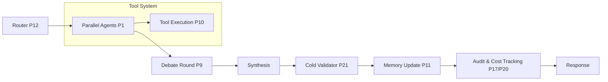

[ 📖 README ](./README.md) | [ 🗺️ ROADMAP ](./ROADMAP.md)

> Agent instruction: Implement phases sequentially from 1 to 22. Each phase depends on the previous. Do not skip, reorder, or ask for clarification — all required context is contained within each phase block.

# 🚀 AI Council Roadmap

This document outlines the 22-phase technical roadmap for AI Council platform. The goals are prioritized based on implementation complexity and value to the deliberation quality.

---

## Current State vs Target State

Currently, AI Council is a production-grade multi-agent deliberation engine with auto-routing, debate refinement, and cold validation. When all 22 phases are complete, Council will be a fully autonomous deliberation engine with local AI integration and advanced observability.

---

## Actual System Architecture

---

## Progress Tracker

| Phase | Name | Milestone | Complexity | Status |
| :--- | :--- | :--- | :--- | :--- |
| 1 | Fix Parallel Execution | 1 | S | ✅ Completed |
| 2 | Introduce Structured Output Contract | 1 | M | ✅ Completed |
| 3 | Add Failure Isolation | 1 | S | ✅ Completed |
| 4 | Add Peer Review + Anonymized Ranking | 2 | M | ✅ Completed |
| 5 | Build Scoring Engine | 2 | M | ✅ Completed |
| 6 | Split Critic Into Multiple Roles | 2 | M | ✅ Completed |
| 7 | Implement Consensus Metric | 2 | M | ✅ Completed |
| 8 | Enable Cross-Agent Interaction | 2 | M | ✅ Completed |
| 9 | Add Multi-Round Refinement | 2 | M | ✅ Completed |
| 10 | Add Tool Execution Layer | 3 | L | 🔴 Planned |
| 11 | Add Memory + Context System | 3 | L | 🔴 Planned |
| 12 | Implement Router (Auto-Council) | 3 | L | ✅ Completed |
| 13 | PII Detection Pre-Send | 3 | S | ✅ Completed |
| 14 | Runtime-Editable Archetypes | 3 | M | 🔴 Planned |
| 15 | Conversation Search | 3 | S | 🔴 Planned |
| 16 | Audit Log | 3 | S | ✅ Completed |
| 17 | Add Token + Cost Tracking | 4 | S | ✅ Completed |
| 18 | Build Evaluation Framework | 4 | L | ✅ Completed |
| 19 | UI Enhancements | 4 | M | 🟡 In Progress |
| 20 | Real-Time Cost Ledger | 4 | S | 🟡 In Progress |
| 21 | Cold Validator / "Fresh Eyes" | 4 | M | ✅ Completed |
| 22 | Local AI & Desktop App Connectors | 4 | L | ✅ Completed |

---

## Completed Enhancements (Stabilization v0.9.5)

### 🧠 Deterministic Deliberation Engine (Phases 4-9)
- **Mathematical Purification**: Removed all LLM-based halt heuristics. Consensus is now `0.85 (85%)` avg pairwise cosine similarity.
- **High-Fidelity Scoring**: Final scores = `(0.6 * Agreement) + (0.4 * PeerRanking)`.
- **Logic Auditframework**: Structured peer review {target, claim, issue, correction} for precise refinement.
- **Round Quality Validation**: "Bloom Gate" prevents round degradation.

### 🧠 Multi-Round Debate Refinement
- **Implemented**: Agents refine answers through iterative debate rounds
- **Features**: Anti-convergence safeguards, confidence-based updates, concise peer summaries
- **Files**: `src/lib/deliberationPhases.ts:conductDebateRound()`

### 🧠 Router Scoring System
- **Implemented**: Keyword and heuristic-based classification with confidence calculation
- **Features**: Strict auto-mode override, diverse archetype selection, fallback handling
- **Files**: `src/lib/router.ts:classifyQuery()`, `getAutoArchetypes()`

### 🛠️ Tool Validation Layer
- **Implemented**: Automatic tool decision logic with web search integration
- **Features**: Tool decision prompts, failure handling, result injection
- **Files**: `src/lib/providers.ts`, `src/lib/tools/*`

### 🧠 Semantic Memory Optimization
- **Implemented**: pgvector integration with conversation storage and retrieval
- **Features**: Vector embeddings, similarity search, context management
- **Files**: `src/services/conversationService.ts`, `prisma/schema.prisma`

---

## Next Priorities

### 📊 Scoring Engine Enhancement
- **Goal**: Deterministic ranking with weighted agreement metrics
- **Impact**: Better consensus detection, improved synthesis quality
- **Files**: `src/lib/scoring.ts` (enhancement)

### 🧪 Evaluation Harness
- **Goal**: Automated benchmarking and performance measurement
- **Impact**: Quality assurance, regression testing
- **Files**: `tests/benchmarks/*` (expansion)

### 🎨 UI/Dashboard
- **Goal**: Deliberation visualization and real-time metrics
- **Impact**: User experience, system transparency
- **Files**: `frontend/src/components/*` (enhancement)

### 🏠 Local AI Integration
- **Goal**: Native connectors for Ollama and local models
- **Impact**: Cost reduction, privacy, offline capability
- **Files**: `src/lib/connectors/*` (completion)

---

## Milestone 4 — Observability & Production
*Make the system transparent, measurable, and production-ready.*

## 🟡 PHASE 17 — ADD TOKEN + COST TRACKING
**REQUIREMENTS:**
- Per-request accounting and cost estimation.

**IMPLEMENTATION NOTES:**
- **Files to change:** `src/lib/providers.ts`, `src/lib/metrics.ts`, `prisma/schema.prisma`
- **Actions:** We already track `tokensUsed`. Add cost estimation logic per model ID (e.g., static cost table). Expose via `GET /api/metrics` and in the UI.
- **Complexity:** S

---

## 🔴 PHASE 18 — BUILD EVALUATION FRAMEWORK
**REQUIREMENTS:**
- Measure system performance: Benchmark dataset, metrics.

**IMPLEMENTATION NOTES:**
- **Files to change:** `tests/benchmarks/*` (new directory)
- **Actions:** Write an automated test suite that runs a benchmark dataset through the council and measures accuracy against expected outputs, consistency, latency, and cost.
- **Complexity:** L

---

## 🟡 PHASE 19 — UI ENHANCEMENTS
**REQUIREMENTS:**
- Side-by-side comparison, ranking visualization, consensus meter, critique visibility.

**IMPLEMENTATION NOTES:**
- **Files to change:** `frontend/src/components/*`
- **Actions:** Implement new React components that consume the new structured events (e.g., `ranking`, `critique`, `consensus_score`) emitted by the backend via SSE.
- **Complexity:** M

---

## 🟠 PHASE 20 — REAL-TIME COST LEDGER
**REQUIREMENTS:**
- Per-query: per-model token accounting (input + output), estimated cost, cumulative session total. Collapsible: compact summary (total + tokens + latency) expands to full per-model breakdown. Color tiers: green <$0.01, amber $0.01–$0.10, red >$0.10.

**IMPLEMENTATION NOTES:**
- **Files to change:** `src/lib/metrics.ts` (add cost table), `frontend/src/components/CostLedger.tsx` (new)
- **Actions:** Implement real-time token tracking and UI ledger.
- **Complexity:** S

---

## 🔴 PHASE 21 — COLD VALIDATOR / "FRESH EYES"
**REQUIREMENTS:**
- After final synthesis, route the verdict to a SEPARATE model with ZERO prior council context. That model validates cold: checks for errors, hallucinations, overconfidence. New SSE event type: `validator_result`.

**IMPLEMENTATION NOTES:**
- **Files to change:** `src/lib/council.ts` (add post-synthesis step)
- **Actions:** Add an independent validation step post-synthesis using a fresh model instance.
- **Complexity:** M

---

## 🏠 PHASE 22 — LOCAL AI & DESKTOP APP CONNECTORS
**STATUS:** ✅ **COMPLETED**

**REQUIREMENTS:**
- ✅ Connect to local AI models natively (Ollama) without API requirement
- ✅ Integrate with OpenAI-compatible local endpoints
- ✅ Automatic fallback to remote providers when local fails
- ❌ OS-level desktop app automation (not implemented - out of scope)

**IMPLEMENTATION:**
- **Files created:** `src/lib/connectors/baseConnector.ts`, `ollamaConnector.ts`, `openaiCompatibleConnector.ts`, `index.ts`
- **Integration:** `src/lib/providers.ts` detects local providers by baseUrl and routes through connectors
- **Usage:** Set `baseUrl` to `http://localhost:11434` for Ollama or any local OpenAI-compatible endpoint
- **Fallback:** On connector failure, automatically falls back to standard remote providers
- **Usage:** Set `baseUrl` to `http://localhost:11434` for Ollama or any local OpenAI-compatible endpoint
- **Fallback:** On connector failure, automatically falls back to standard remote providers

---

## 📈 Milestone 5 — Scale & Hardening (Future)
*Optimize the system for high-concurrency, multi-instance, and enterprise environments.*

### SESSION STORAGE MIGRATION
**REQUIREMENTS:**
- Transition from filesystem-based session storage to Redis or S3/Blob storage.
- **Impact:** Enables horizontal scaling across multiple backend instances where local filesystem is inconsistent.

### LIMITER PERSISTENCE
**REQUIREMENTS:**
- Move from in-memory concurrency/rate limiting to a Redis-backed implementation.
- **Impact:** Prevents limit resets on server restart and enforces global limits across a cluster.

### KEY ROTATION & MANAGEMENT
**REQUIREMENTS:**
- Implement scheduled encryption key rotation and integration with AWS KMS or HashiCorp Vault.
- **Impact:** Production-grade security and compliance for sensitive credential management.

---

## §8 — TABBED PANE UI SPECIFICATION

A concrete UI design requirement for Phase 19 and the Platform Enhancements additions. Implement a tabbed results panel in the frontend that organizes the deliberation output into the following tabs:

### TAB 1 — "Council" (default active tab)
- All agent responses displayed as cards, one per council member
- Each card shows: agent name + archetype badge, response text (streaming, word-by-word via SSE), confidence score badge, key_points as bullet list, assumptions as collapsible section
- Cards are arranged in a responsive grid (2-col on desktop, 1-col on mobile)
- While streaming: show a pulsing indicator on the active card
- After streaming: show confidence score colored bar (green = high, amber = mid, red = low)

### TAB 2 — "Debate" (visible after Round 2 completes)
- Per-round timeline: Round 1 → Round 2 → Round 3 (if applicable)
- For each round: show each agent's critique of the others, with agent attribution
- Anonymized ranking results: "Response A ranked #1 by 3 agents"
- Cross-agent reference highlights: if Agent B referenced Agent A's claim, show a visual thread between their cards
- Consensus meter: horizontal progress bar showing current consensus score (0 → 0.85 target), updated each round

### TAB 3 — "Verdict"
- Master synthesis output, streaming in real-time
- Below synthesis: Cold Validator result (§7-B) — shown as a "Validator Note" card with green/amber/red status
- Scoring breakdown: table showing each agent's final_score components (agreement / confidence / peer_ranking)
- Which agents were included in synthesis (top-k) vs filtered out

### TAB 4 — "Cost & Audit"
- Cost Ledger (§7-A): per-model token usage + cost, cumulative total, color-coded tiers
- Latency breakdown: time-to-first-token and total time per model
- Audit Log (§7-F): collapsible per-agent sections showing exact prompt sent and raw response received
- Export button: download full audit log as JSON

### TAB 5 — "Config" (inline, no page nav)
- Active council template name + members list
- Per-member: archetype name, model assigned, role, editable system prompt (§7-D)
- Router classification result (§6 Phase 12): what query type was detected, which archetypes were auto-selected and why
- PII detection status: clean / warning (§7-C)

**Implementation Notes:**
- Use React tabs (shadcn/ui Tabs component or simple state-driven tab switcher).
- Tab bar is sticky at the top of the results panel.
- Tabs 2, 3, 4 are disabled/grayed until the relevant data is available.
- Entire tabbed panel is driven by SSE events.
- Files: `frontend/src/components/tabs/`, `frontend/src/types/events.ts`