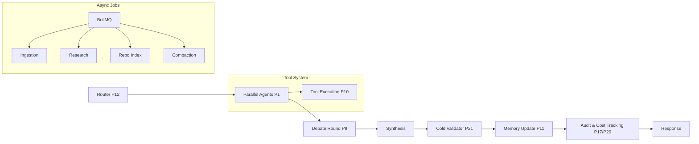

[ 📖 README ](./README.md) | [ 🗺️ ROADMAP ](./ROADMAP.md)

# 🚀 AI Council Roadmap

This document outlines the 22-phase technical roadmap for the AI Council platform, plus the 12-tier Master Execution Plan. Updated 2026-04-11 after full codebase audit.

---

## Current State

AIBYAI is a **production-grade** multimodal multi-agent deliberation engine. All 22 original roadmap phases and all 12 Master Execution Plan tiers are **implemented**. The system includes:

- Multi-agent council deliberation with peer review, debate rounds, and cold validation
- 8+ LLM provider adapters (OpenAI, Anthropic, Gemini, Groq, Ollama, OpenRouter, custom)
- Full RAG pipeline (pgvector, hybrid search, knowledge bases, document processing)
- Workflow engine with visual canvas (React Flow, 10+ node types)
- Deep research mode with multi-step web search and synthesis
- Code sandbox (JS via isolated-vm, Python via subprocess)
- Community marketplace (prompts, workflows, personas, tools)
- User skills framework (Python functions as callable tools)
- Observability (tracer, LangFuse integration, analytics dashboard)
- Model reliability scoring (agreement/contradiction tracking)
- GitHub intelligence engine (repo ingestion, code-aware chat)
- BullMQ async job queues (ingestion, research, repo, compaction)
- OAuth2 (Google, GitHub), RBAC, sharing/collaboration
- Memory system (3-layer context, compaction, distributed backends)
- PWA with offline support (IndexedDB caching)
- Docker + docker-compose, PM2 cluster mode, GitHub Actions CI

---

## Actual System Architecture

---

## Phase Progress Tracker (Original 22 Phases)

| Phase | Name | Milestone | Complexity | Status |
| :--- | :--- | :--- | :--- | :--- |
| 1 | Fix Parallel Execution | 1 | S | ✅ Completed |
| 2 | Introduce Structured Output Contract | 1 | M | ✅ Completed |
| 3 | Add Failure Isolation | 1 | S | ✅ Completed |
| 4 | Add Peer Review + Anonymized Ranking | 2 | M | ✅ Completed |
| 5 | Build Scoring Engine | 2 | M | ✅ Completed |
| 6 | Split Critic Into Multiple Roles | 2 | M | ✅ Completed |
| 7 | Implement Consensus Metric | 2 | M | ✅ Completed |
| 8 | Enable Cross-Agent Interaction | 2 | M | ✅ Completed |
| 9 | Add Multi-Round Refinement | 2 | M | ✅ Completed |
| 10 | Add Tool Execution Layer | 3 | L | ✅ Completed |
| 11 | Add Memory + Context System | 3 | L | ✅ Completed |
| 12 | Implement Router (Auto-Council) | 3 | L | ✅ Completed |
| 13 | PII Detection Pre-Send | 3 | S | ✅ Completed |
| 14 | Runtime-Editable Archetypes | 3 | M | ✅ Completed |
| 15 | Conversation Search | 3 | S | ✅ Completed |
| 16 | Audit Log | 3 | S | ✅ Completed |
| 17 | Add Token + Cost Tracking | 4 | S | ✅ Completed |
| 18 | Build Evaluation Framework | 4 | L | ✅ Completed |
| 19 | UI Enhancements | 4 | M | ✅ Completed |
| 20 | Real-Time Cost Ledger | 4 | S | ✅ Completed |
| 21 | Cold Validator / "Fresh Eyes" | 4 | M | ✅ Completed |
| 22 | Local AI & Desktop App Connectors | 4 | L | ✅ Completed |

---

## Master Execution Plan — Tier Progress

| Tier | Name | Status |
| :--- | :--- | :--- |
| 0 | Repo Audit + Foundation Hardening | ✅ Completed |
| 1 | Provider Power + Unified Adapter | ✅ Completed |
| 2 | Multimodal Input Layer | ✅ Completed |
| 3 | RAG Brain | ✅ Completed |
| 4 | Deep Research + Artifacts | ✅ Completed |
| 5 | Workflow Engine | ✅ Completed |
| 6 | Multi-Agent Upgrade | ✅ Completed |
| 7 | Deep Memory Architecture | ✅ Completed |
| 8 | Live Debate Dashboard | ✅ Completed |
| 9 | Auth + RBAC + Collaboration | ✅ Completed |
| 10 | Community Marketplace + Skills | ✅ Completed |
| 11 | Observability + LLMOps | ✅ Completed |
| 12 | Code Intelligence + Scaling | ✅ Completed |

---

## Milestone 5 — Scale & Hardening

| Item | Status |
| :--- | :--- |
| Session Storage → Redis | ✅ Completed (stateless JWT + Redis rate limits) |
| Limiter Persistence → Redis | ✅ Completed (rate-limit-redis in middleware) |
| Key Rotation & Management | ✅ Completed (POST /api/admin/rotate-keys endpoint) |

---

## Implementation Evidence by Tier

### Tier 0 — Foundation
- `src/config/env.ts` — Zod-validated environment schema
- `src/lib/logger.ts` — Pino logger with pino-http
- `src/middleware/errorHandler.ts` — Global error handler
- `src/middleware/requestId.ts` — Request ID tracking

### Tier 1 — Unified Adapter
- `src/adapters/` — 8 adapters (OpenAI, Anthropic, Gemini, Groq, Ollama, OpenRouter, custom, types)
- `src/adapters/registry.ts` — Provider registry + discovery
- `src/routes/customProviders.ts` — EMOF (custom provider CRUD)

### Tier 2 — Multimodal Input
- `src/processors/` — 9 files (PDF, DOCX, XLSX, CSV, TXT, image, router)
- `src/routes/uploads.ts` — File upload with multer
- `src/routes/voice.ts` + `src/routes/tts.ts` — Voice I/O

### Tier 3 — RAG Brain
- `src/services/vectorStore.service.ts` — pgvector operations
- `src/services/embeddings.service.ts` — Embedding generation
- `src/services/chunker.service.ts` — Document chunking
- `src/services/ingestion.service.ts` — Document ingestion pipeline
- `src/routes/kb.ts` — Knowledge base CRUD

### Tier 4 — Research + Artifacts
- `src/services/research.service.ts` — Multi-step research engine
- `src/services/artifacts.service.ts` — Artifact detection & storage
- `src/sandbox/` — JS (isolated-vm) + Python sandbox

### Tier 5 — Workflow Engine
- `src/workflow/executor.ts` — Workflow execution engine (9.1KB)
- `src/workflow/nodes/` — 10 node handlers
- `frontend/src/views/WorkflowEditorView.tsx` — Visual canvas
- `src/routes/prompts.ts` — Prompt IDE with versioning

### Tier 6 — Multi-Agent
- `src/agents/orchestrator.ts` — Full orchestration DAG (16.8KB)
- `src/agents/conflictDetector.ts` — Conflict detection
- `src/agents/messageBus.ts` — Inter-agent messaging
- `src/agents/sharedMemory.ts` — Shared fact graph
- `src/agents/personas.ts` — Built-in + custom personas
- `src/routes/promptDna.ts` — Prompt DNA system

### Tier 7 — Memory
- `src/services/sessionSummary.service.ts` — Session summarization
- `src/services/memoryCompaction.service.ts` — Memory compaction
- `src/services/memoryRouter.service.ts` — Distributed memory backends
- `src/lib/memoryCrons.ts` — Scheduled memory jobs

### Tier 8 — Debate Dashboard
- `frontend/src/views/DebateDashboardView.tsx` — Live debate UI (16.1KB)
- `frontend/src/components/tabs/MainTabs.tsx` — 5-tab results panel

### Tier 9 — Auth + RBAC
- `src/auth/google.strategy.ts` + `github.strategy.ts` — OAuth2
- `src/middleware/rbac.ts` — Role-based access control
- `src/routes/admin.ts` — Admin management
- `src/routes/share.ts` — Sharing system

### Tier 10 — Marketplace + Skills
- `src/routes/marketplace.ts` — Full marketplace CRUD + install flow
- `src/routes/skills.ts` — User skills CRUD
- `src/lib/tools/skillExecutor.ts` — Skill execution as tools
- `frontend/src/views/MarketplaceView.tsx` + `SkillsView.tsx`

### Tier 11 — Observability
- `src/observability/tracer.ts` — Trace logging + LangFuse integration
- `src/services/reliability.service.ts` — Model reliability scoring
- `src/routes/analytics.ts` + `traces.ts` — Analytics API
- `frontend/src/views/AnalyticsView.tsx` — Analytics dashboard

### Tier 12 — Code Intelligence + Scaling
- `src/services/repoIngestion.service.ts` — GitHub repo indexing
- `src/services/repoSearch.service.ts` — Code search
- `src/queue/` — BullMQ queues + workers (ingestion, research, repo, compaction)
- `src/middleware/rateLimit.ts` — Redis-backed rate limiting
- `Dockerfile` + `docker-compose.yml` — Production containers
- `ecosystem.config.cjs` — PM2 cluster mode
- `.github/workflows/ci.yml` — CI pipeline
- `frontend/src/components/OfflineIndicator.tsx` — PWA offline support

---

## What Remains (Post-Implementation Quality)

All features are implemented. Remaining work is **quality, testing, and polish**:

### Testing (High Priority)
- Unit tests for services (vitest + mocked DB) — target 70% coverage
- Integration tests for API routes (supertest)
- E2E tests for critical flows

### Documentation
- Swagger/OpenAPI docs (swagger-jsdoc + swagger-ui-express)
- JSDoc on all public service functions
- API.md auto-generation

### Polish
- `src/routes/templates.ts` is a 412-byte stub — needs full implementation or removal
- `src/routes/ask.ts:80` references undeclared `userConfig` variable (pre-existing bug, falls through safely)
- Benchmark test suite expansion (tests/benchmarks/)

### Optional Future
- Tauri desktop app wrapper
- Multi-tenant workspace isolation
- Horizontal auto-scaling (Kubernetes)
- Advanced reranking (Cohere integration)
