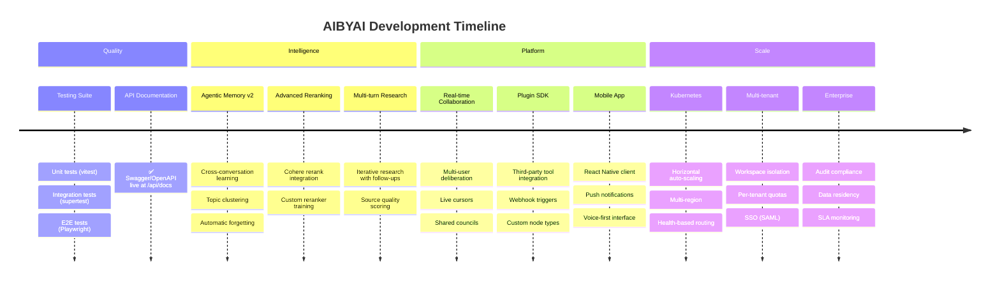
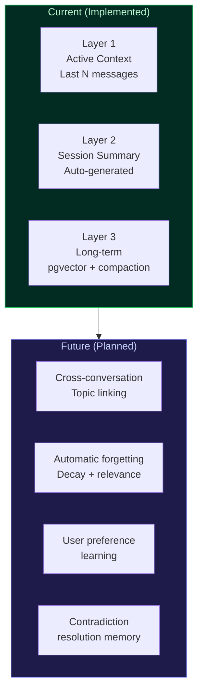
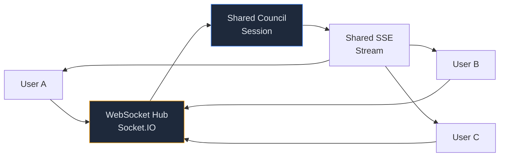
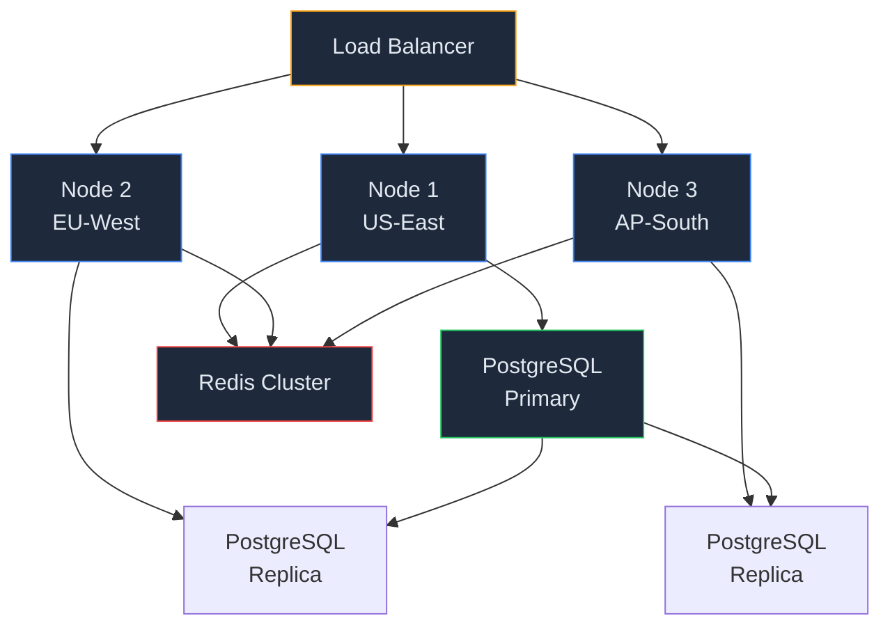

# AIBYAI Roadmap

### What's Next

---

All 22 original roadmap phases and all 12 Master Execution Plan tiers are **complete**. This document tracks future work — quality improvements, new capabilities, and scaling targets.

---

## Current Architecture

```mermaid
flowchart LR
    subgraph COMPLETE["Implemented"]
        direction TB
        A["Multi-Agent Deliberation\n4+ agents, peer review, debate"]
        B["9 LLM Providers\nOpenAI, Anthropic, Gemini, Groq, Ollama..."]
        C["RAG Pipeline\npgvector, hybrid search, KB management"]
        D["Workflow Engine\n10+ node types, visual canvas"]
        E["Research Mode\nMulti-step web research"]
        F["Code Sandbox\nisolated-vm + Python"]
        G["Marketplace\nPrompts, workflows, personas, tools"]
        H["Observability\nTracing, LangFuse, reliability scoring"]
        I["Auth + RBAC\nOAuth2, roles, sharing"]
        J["Infrastructure\nDocker, BullMQ, CI, PWA"]
    end

    style COMPLETE fill:#022c22,stroke:#22c55e,color:#bbf7d0
```

---

## Future Roadmap

---

## ~~API Documentation~~ — Complete

> **Status: Done** — Swagger/OpenAPI docs are live at `/api/docs`.

All 35 route handlers have `@openapi` JSDoc annotations. Interactive Swagger UI is mounted at `/api/docs` with OpenAPI 3.0 spec available at `/api/docs/spec.json`.

---

## Testing & Quality Assurance

> **Priority: High** — Test suite exists (7 test files, 97 passing tests) but coverage can expand.

### Unit Tests

Target **70% statement coverage** across all services.

| Area | Files | Framework |
|---|---|---|
| Services | `src/services/*.ts` | vitest + mocked Prisma |
| Adapters | `src/adapters/*.ts` | vitest + nock (HTTP mocking) |
| Middleware | `src/middleware/*.ts` | vitest |
| Workflow nodes | `src/workflow/nodes/*.ts` | vitest |
| Lib utilities | `src/lib/*.ts` | vitest |

### Integration Tests

Every API route: happy path + 401 + invalid input = minimum 3 tests per route.

| Area | Approach |
|---|---|
| 35 API routes | supertest against Express app |
| Database operations | Test Prisma against real PostgreSQL |
| Queue processing | BullMQ job lifecycle testing |
| SSE streaming | Event stream validation |

### E2E Tests

Critical user flows with Playwright (already installed in the project).

| Flow | Description |
|---|---|
| Authentication | Sign up, login, OAuth redirect |
| Council deliberation | Ask question, receive streamed debate + verdict |
| Knowledge base | Create KB, upload document, query with RAG |
| Workflow builder | Create workflow, add nodes, execute |
| Marketplace | Browse, install item, verify in account |

---

## Agentic Memory v2

> **Priority: Medium** — Current memory works but doesn't learn across conversations.

### Goals

- **Cross-conversation learning**: Link related topics across separate conversations. When a user discusses "React performance" in one chat and "frontend optimization" in another, the system should connect these.
- **Automatic forgetting**: Implement decay functions so stale memories lose relevance over time. Frequently accessed memories persist; one-off facts fade.
- **Preference learning**: Track which agent archetypes the user prefers, which response styles they engage with, and adapt council composition over time.
- **Contradiction resolution**: When new information contradicts stored memory, create a resolution record rather than silently overwriting.

---

## Advanced Reranking

> **Priority: Medium** — Currently using RRF (Reciprocal Rank Fusion) only.

### Planned

- **Cohere rerank**: Integration with `rerank-english-v3.0` for hybrid search results (code exists in vectorStore.service.ts but needs the Cohere API key path)
- **Cross-encoder reranking**: Fine-tuned model for domain-specific relevance scoring
- **Dynamic k selection**: Automatically choose how many chunks to retrieve based on query complexity

---

## Real-time Collaboration

> **Priority: Medium** — Currently single-user per session.

### Vision

- Multiple users join a shared deliberation session
- Live cursors showing who's viewing what
- Shared council configuration (collaborative archetype selection)
- Per-user annotations on agent responses
- Voting on which synthesis direction to take

---

## Plugin SDK

> **Priority: Low** — For third-party extensibility.

### Planned Capabilities

- **Custom tool types**: NPM package that registers new tools in the tool registry
- **Custom workflow nodes**: Third-party node handlers with UI components
- **Webhook triggers**: Fire webhooks on deliberation events (verdict, conflict, etc.)
- **Provider plugins**: Package-based provider adapters (beyond current EMOF UI approach)

---

## Mobile App

> **Priority: Low** — PWA covers basic mobile usage.

### Planned

- React Native client with shared API
- Push notifications for research job completion, workflow results
- Voice-first interaction mode (STT input, TTS output by default)
- Offline mode with syncing (extending current IndexedDB approach)

---

## Kubernetes & Multi-Region

> **Priority: Low** — Docker Compose covers current scale.

### Goals

- Helm charts for Kubernetes deployment
- Horizontal pod auto-scaling based on queue depth and request latency
- Multi-region PostgreSQL with read replicas
- Redis Cluster for distributed caching and rate limiting
- Health-based routing (route away from degraded regions)

---

## Multi-Tenant & Enterprise

> **Priority: Low** — Single-tenant architecture is sufficient for current use.

### Planned

- **Workspace isolation**: Separate data, configs, and billing per tenant
- **Per-tenant quotas**: Token limits, storage limits, concurrent deliberation limits
- **SSO**: SAML 2.0 and OpenID Connect for enterprise identity providers
- **Audit compliance**: SOC 2 logging format, data retention policies
- **Data residency**: Ensure data stays in specific geographic regions
- **SLA monitoring**: Uptime tracking, latency SLOs, automated alerting

---

**[Back to README](./README.md)**

