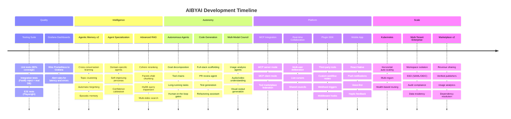
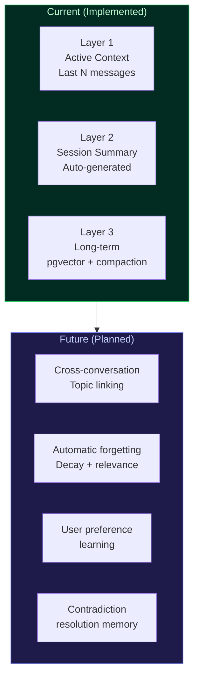
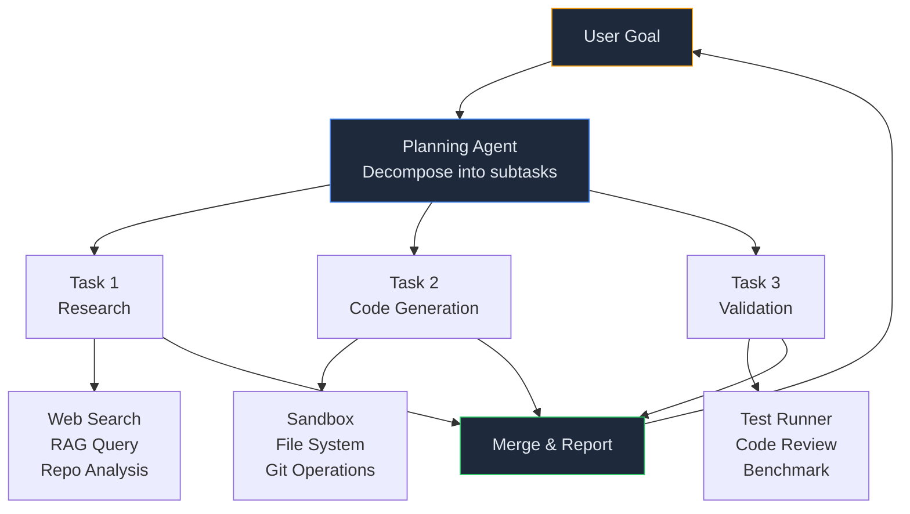
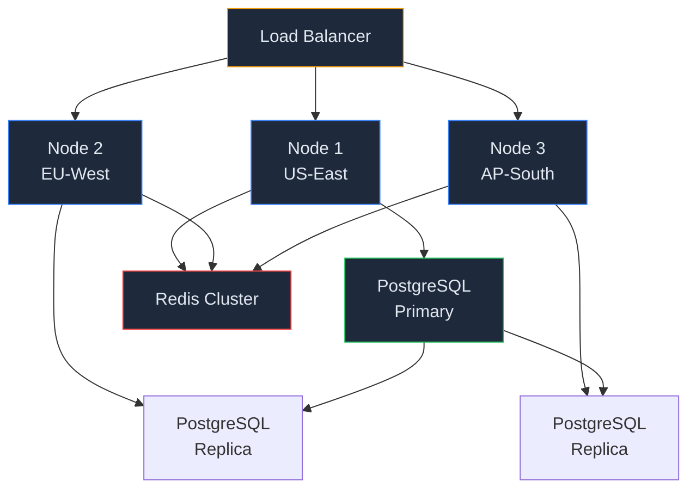

# AIBYAI Roadmap

### What's Next

---

All 22 original roadmap phases, all 12 Master Execution Plan tiers, and the 10-task tech migration are **complete**. This document tracks future work — quality improvements, new capabilities, and scaling targets.

---

## Completed Migrations

The following infrastructure upgrades have been completed on the `sidecamel` branch:

| Migration | From | To | Status |
|---|---|---|---|
| Runtime | Node.js 20 | Node.js 22 LTS | Done |
| Vector indexes | IVFFlat (default) | HNSW (m=16, ef=64) | Done |
| Password hashing | bcrypt | argon2id (with legacy fallback) | Done |
| Token security | Static JWT | Short-lived access + rotating refresh tokens | Done |
| Metrics | Internal JSON only | Prometheus (prom-client) + histograms | Done |
| Sandbox | No resource caps | isolated-vm 128MB + Python ulimit | Done |
| WebSocket | Socket.IO | Native ws | Done |
| Charts | Recharts | Apache ECharts | Done |
| HTTP framework | Express 5.2 | Fastify 5 (33 native plugins) | Done |
| ORM | Prisma 7.6 | Drizzle ORM (zero Prisma imports) | Done |

---

## Current Architecture

```mermaid
flowchart LR
    subgraph COMPLETE["Implemented"]
        direction TB
        A["Multi-Agent Deliberation\n4+ agents, peer review, debate"]
        B["9 LLM Providers\nOpenAI, Anthropic, Gemini, Groq, Ollama..."]
        C["RAG Pipeline\npgvector HNSW, hybrid search, KB management"]
        D["Workflow Engine\n10+ node types, visual canvas"]
        E["Research Mode\nMulti-step web research"]
        F["Code Sandbox\nisolated-vm + Python (hardened)"]
        G["Marketplace\nPrompts, workflows, personas, tools"]
        H["Observability\nPrometheus, LangFuse, reliability scoring"]
        I["Auth + Security\nargon2id, JWT rotation, OAuth2, RBAC"]
        J["Infrastructure\nFastify 5, Drizzle, Node 22, Docker, CI"]
    end

    style COMPLETE fill:#022c22,stroke:#22c55e,color:#bbf7d0
```

---

## Future Roadmap

---

## Testing & Quality Assurance

> **Priority: High** — Test suite exists (7 test files, 97 passing tests) but coverage needs expansion for the new Fastify + Drizzle codebase.

### Unit Tests

Target **80% statement coverage** across all services.

| Area | Files | Framework |
|---|---|---|
| Services | `src/services/*.ts` | vitest + mocked Drizzle |
| Adapters | `src/adapters/*.ts` | vitest + nock (HTTP mocking) |
| Middleware | `src/middleware/*.ts` | vitest |
| Workflow nodes | `src/workflow/nodes/*.ts` | vitest |
| Lib utilities | `src/lib/*.ts` | vitest |

### Integration Tests

Every API route: happy path + 401 + invalid input = minimum 3 tests per route.

| Area | Approach |
|---|---|
| 35 API routes | `inject()` against Fastify instance |
| Database operations | Drizzle against real PostgreSQL |
| Queue processing | BullMQ job lifecycle testing |
| SSE streaming | Event stream validation |

### E2E Tests

Critical user flows with Playwright.

| Flow | Description |
|---|---|
| Authentication | Sign up, login, token refresh, OAuth redirect |
| Council deliberation | Ask question, receive streamed debate + verdict |
| Knowledge base | Create KB, upload document, query with RAG |
| Workflow builder | Create workflow, add nodes, execute |
| Marketplace | Browse, install item, verify in account |

---

## Grafana Dashboards

> **Priority: High** — Prometheus metrics are exported but no visualization layer yet.

### Goals

- Wire `prom-client` metrics to Grafana via Prometheus scraping
- Create dashboards: request latency (p50/p95/p99), provider call duration, queue depth, active SSE connections, token usage per model
- Set up alert rules: error rate spike, latency degradation, queue backlog
- Add `docker-compose` services for Prometheus + Grafana (dev profile)

---

## Agentic Memory v2

> **Priority: Medium** — Current memory works but doesn't learn across conversations.

### Goals

- **Cross-conversation learning**: Link related topics across separate conversations. When a user discusses "React performance" in one chat and "frontend optimization" in another, the system should connect these.
- **Automatic forgetting**: Implement decay functions so stale memories lose relevance over time. Frequently accessed memories persist; one-off facts fade.
- **Preference learning**: Track which agent archetypes the user prefers, which response styles they engage with, and adapt council composition over time.
- **Contradiction resolution**: When new information contradicts stored memory, create a resolution record rather than silently overwriting.

---

## Advanced Reranking

> **Priority: Medium** — Currently using RRF (Reciprocal Rank Fusion) only.

### Goals

- **Cohere rerank**: Integration with `rerank-english-v3.0` for hybrid search results
- **Cross-encoder reranking**: Fine-tuned model for domain-specific relevance scoring
- **Dynamic k selection**: Automatically choose how many chunks to retrieve based on query complexity
- **Parent-child chunking**: Retrieve parent context when child chunk matches for better context windows
- **Query expansion**: Automatic query rewriting and HyDE (Hypothetical Document Embeddings) for improved recall
- **Multi-index search**: Search across knowledge bases, code repos, and conversation history simultaneously

---

## Agent Specialization & Self-Improvement

> **Priority: High** — Agents use static archetypes today.

- **Domain-specific agents**: Pre-trained archetypes for legal, medical, financial, and engineering domains with specialized vocabulary and reasoning patterns
- **Self-improving personas**: Agents track their own accuracy over time and adjust reasoning strategies based on past performance
- **Agent collaboration protocols**: Agents can delegate sub-tasks to other agents, forming dynamic chains
- **Confidence calibration**: Agents learn to produce well-calibrated confidence scores through feedback loops
- **Archetype evolution**: User interaction patterns gradually shift archetype weights and behavior

---

## Autonomous Agent Mode

> **Priority: High** — Currently agents only respond to single queries.

- **Goal decomposition**: User provides a high-level goal; planning agent breaks it into executable subtasks
- **Tool chains**: Agents can sequence tools (search, analyze, code, test, deploy) without user intervention
- **Long-running tasks**: Background agents that work for hours on complex research or code generation
- **Human-in-the-loop checkpoints**: Configurable approval gates before irreversible actions
- **Progress streaming**: Real-time task progress via SSE with intermediate artifacts

---

## Multi-Modal Council

> **Priority: Medium** — Currently text-only deliberation.

- **Image analysis agents**: Council members that can analyze images, charts, diagrams, and screenshots
- **Audio/video understanding**: Process audio transcripts and video frames as council input
- **Document OCR**: Extract and reason over scanned documents, handwritten notes, whiteboards
- **Visual output generation**: Agents can produce diagrams, charts, and visual explanations as part of their responses
- **Cross-modal reasoning**: Agents reference visual evidence when debating text-based claims

---

## MCP Integration (Model Context Protocol)

> **Priority: Medium** — Enables AIBYAI as a tool server for external agents.

- **MCP server mode**: Expose AIBYAI's deliberation engine as an MCP tool — any MCP-compatible client can invoke a council
- **MCP client mode**: AIBYAI agents can call external MCP servers for specialized capabilities (databases, APIs, file systems)
- **Tool marketplace federation**: Browse and install tools from the MCP ecosystem directly into AIBYAI workflows
- **Dynamic tool discovery**: Agents automatically discover and use available MCP tools based on task requirements

---

## Code Generation & Review

> **Priority: Medium** — Sandbox exists but no autonomous code generation.

- **Full-stack scaffolding**: Describe an app in natural language and council generates project structure, components, API routes, database schema
- **PR review agent**: Automated code review with multi-perspective analysis (security agent, performance agent, style agent)
- **Test generation**: Given a function or module, generate comprehensive test suites with edge cases
- **Refactoring assistant**: Council analyzes codebase and suggests refactoring with before/after diffs
- **Documentation generation**: Produce API docs, architecture diagrams, and inline documentation from code analysis

---

## Real-time Collaboration

> **Priority: Medium** — Currently single-user per session.

- Multiple users join a shared deliberation session
- Live cursors showing who's viewing what
- Shared council configuration (collaborative archetype selection)
- Per-user annotations on agent responses
- Voting on which synthesis direction to take

---

## Plugin SDK

> **Priority: Low** — For third-party extensibility.

### Goals

- **Custom tool types**: NPM package that registers new tools in the tool registry
- **Custom workflow nodes**: Third-party node handlers with UI components
- **Webhook triggers**: Fire webhooks on deliberation events (verdict, conflict, etc.)
- **Provider plugins**: Package-based provider adapters (beyond current EMOF UI approach)
- **Middleware hooks**: Plugin into the deliberation pipeline (pre-process, post-process, custom scoring)

---

## Mobile App

> **Priority: Low** — PWA covers basic mobile usage.

### Goals

- React Native client with shared API
- Push notifications for research job completion, workflow results, background agent updates
- Voice-first interaction mode (STT input, TTS output by default)
- Offline mode with syncing (extending current IndexedDB approach)
- Haptic feedback for deliberation milestones

---

## Kubernetes & Multi-Region

> **Priority: Low** — Docker Compose covers current scale.

### Goals

- Helm charts for Kubernetes deployment
- Horizontal pod auto-scaling based on queue depth and request latency
- Multi-region PostgreSQL with read replicas
- Redis Cluster for distributed caching and rate limiting
- Health-based routing (route away from degraded regions)

---

## Multi-Tenant & Enterprise

> **Priority: Low** — Single-tenant architecture is sufficient for current use.

### Goals

- **Workspace isolation**: Separate data, configs, and billing per tenant
- **Per-tenant quotas**: Token limits, storage limits, concurrent deliberation limits
- **SSO**: SAML 2.0 and OpenID Connect for enterprise identity providers
- **Audit compliance**: SOC 2 logging format, data retention policies, GDPR data export
- **Data residency**: Ensure data stays in specific geographic regions
- **SLA monitoring**: Uptime tracking, latency SLOs, automated alerting

---

## Marketplace v2

> **Priority: Low** — Current marketplace is functional but basic.

### Goals

- **Revenue sharing**: Creators earn from paid marketplace items
- **Verified publishers**: Trust badges for vetted creators
- **Usage analytics**: Track installs, active usage, retention per item
- **Collections & categories**: Curated bundles (e.g. "Legal Pack", "Code Review Kit")
- **Versioning with changelogs**: Semantic versioning, automatic update notifications
- **Dependency resolution**: Marketplace items that depend on other items auto-install dependencies

---

## Remaining Express Routes

> **Priority: Low** — Two routes remain on the Express compatibility layer.

| Route | Reason | Path Forward |
|---|---|---|
| `ask.ts` | Complex SSE streaming + multiple middleware (optionalAuth, checkQuota, validate) | Convert to Fastify with `reply.raw` SSE pattern |
| `uploads.ts` | Multer file upload middleware | Convert to `@fastify/multipart` |

Both routes work correctly through `@fastify/express` — conversion is a cleanup task, not a functional requirement.

---

**[Back to README](./README.md)**

