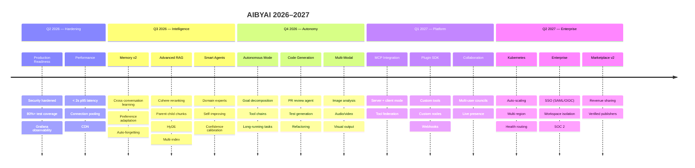

# AIBYAI Roadmap

### The Future in a Coconut

---

---

## Phase 1: Hardening & Production Readiness (Q2 2026)

> **Status: In Progress**

### Security

| What | Why | Status |
|------|-----|--------|
| Redis-backed rate limiting | In-memory resets on restart, bypassed in multi-instance | Done |
| Sandbox network isolation | Python subprocess could phone home | Done |
| SSRF on all outbound HTTP | Workflow nodes, tools, adapters could hit internal IPs | Done |
| JWT algorithm pinning + Zod | Prevent algorithm confusion + type-safe payloads | Done |
| Safe math parser (no eval) | Agent expressions could inject code | Done |
| Upload allowlist + auth | Anonymous uploads, no file type filter | Done |
| OAuth email collision fix | Account takeover via duplicate email | Done |
| Circuit breaker on all providers | Cascading failures when one provider goes down | Done |

### Testing

| What | Target | Status |
|------|--------|--------|
| Unit tests (auth, SSRF, RBAC, sandbox, validation, rate limit) | 6 test files, 63 tests | Done |
| Integration tests (all major API routes) | 8 route test files | Done |
| E2E tests (Playwright) | 5 critical user flows | Planned |
| Target 80% statement coverage | From 6.2% to 80% | In Progress |

### Observability

| What | Status |
|------|--------|
| Grafana dashboards (latency, provider health, errors, tokens) | Done |
| Prometheus datasource auto-provisioned | Done |
| Alert rules (error rate > 5%, p99 > 5s, queue backlog > 100) | Planned |
| Structured error tracking with correlation IDs | Planned |

### Performance

- Database HNSW vector indexes on all 4 pgvector columns (Done)
- Queue dead-letter queue with exponential backoff retry (Done)
- Connection pooling for PostgreSQL
- Frontend bundle splitting and lazy loading
- CDN for static assets

---

## Phase 2: Intelligence Layer (Q3 2026)

> **Status: Planned**

### Agentic Memory v2

Current memory is 3-layer (active context → session summary → long-term vector) but doesn't learn across conversations.

- **Cross-conversation learning** — "React performance" in chat A connects to "frontend optimization" in chat B
- **Preference adaptation** — Auto-tune council composition based on what archetypes/styles users prefer
- **Auto-forgetting** — Decay functions so stale memories fade; frequently accessed ones persist
- **Contradiction resolution** — New info vs. stored memory creates resolution records, not silent overwrites

### Advanced RAG

Current: RRF only. Target:

- Cohere `rerank-english-v3.0` for hybrid search
- Parent-child chunking (retrieve parent when child matches)
- HyDE (Hypothetical Document Embeddings) for better recall
- Multi-index search across KBs, repos, and conversation history
- Dynamic k selection based on query complexity

### Agent Specialization

Current: Static archetypes. Target:

- Domain experts (legal, medical, financial, engineering)
- Self-improving personas that track accuracy and adjust strategies
- Inter-agent delegation — specialists form dynamic chains
- Confidence calibration through feedback loops

---

## Phase 3: Autonomous Operations (Q4 2026)

> **Status: Planned**

### Autonomous Agent Mode

- **Goal decomposition** — High-level goal → executable subtask tree
- **Tool chains** — search → analyze → code → test → deploy without human intervention
- **Long-running tasks** — Background agents working hours on complex research
- **Human-in-the-loop gates** — Configurable approval checkpoints
- **Progress streaming** — Real-time SSE with intermediate artifacts

### Code Generation & Review

- Full-stack scaffolding from natural language
- PR review agent (security + performance + style perspectives)
- Test generation with edge cases
- Refactoring assistant with before/after diffs

### Multi-Modal Council

- Image analysis agents in deliberation
- Audio/video understanding as council input
- Document OCR (scanned docs, whiteboards)
- Visual output (diagrams, charts, explanations)
- Cross-modal reasoning (visual evidence in text debates)

---

## Phase 4: Platform & Ecosystem (Q1 2027)

> **Status: Planned**

### MCP Integration

- **Server mode** — Expose deliberation as MCP tool for external agents
- **Client mode** — AIBYAI agents call external MCP servers
- **Tool federation** — Browse/install MCP ecosystem tools into workflows

### Plugin SDK

- Custom tools via NPM packages
- Custom workflow nodes with UI components
- Webhook triggers on deliberation events
- Middleware hooks (pre/post-process, custom scoring)

### Real-time Collaboration

- Multi-user deliberation with shared councils
- Live cursors and presence
- Per-user annotations on responses
- Voting on synthesis direction

---

## Phase 5: Scale & Enterprise (Q2 2027)

> **Status: Planned**

### Infrastructure

- Helm charts for Kubernetes
- Horizontal auto-scaling on queue depth + latency
- Multi-region PostgreSQL with read replicas
- Redis Cluster for distributed state
- Health-based routing with automatic failover

### Enterprise Features

- **SSO** — SAML 2.0 + OpenID Connect
- **Workspace isolation** — Separate data, configs, billing per tenant
- **Per-tenant quotas** — Tokens, storage, concurrent deliberations
- **Audit compliance** — SOC 2 logging, GDPR export, data retention
- **Data residency** — Geographic data pinning
- **SLA monitoring** — 99.9% uptime target

### Marketplace v2

- Revenue sharing for creators
- Verified publisher badges
- Usage analytics (installs, retention)
- Curated collections ("Legal Pack", "Code Review Kit")
- Semantic versioning with auto-update notifications
- Dependency resolution

### Mobile App

- React Native with shared API
- Push notifications for job completion
- Voice-first mode (STT in, TTS out)
- Offline sync
- Haptic feedback for deliberation milestones

---

## Business Milestones

| Milestone | Target | Metric |
|---|---|---|
| **Production Launch** | Q2 2026 | Zero critical vulns, 80%+ test coverage |
| **First 100 Users** | Q3 2026 | Organic via open-source community |
| **Enterprise Pilot** | Q4 2026 | 1–3 enterprises on paid pilot |
| **SaaS Launch** | Q1 2027 | Self-serve signup, usage-based billing |
| **Series A Ready** | Q2 2027 | $100K ARR, 10+ enterprise accounts |

---

## Why AIBYAI Wins

1. **Multi-Agent Consensus** — No competitor offers structured deliberation with mathematical scoring. One model gives opinions; AIBYAI gives peer-reviewed verdicts.

2. **Provider Agnostic** — 7+ adapters with automatic failover. No vendor lock-in. Mix providers per query for cost optimization.

3. **Enterprise Trust** — Cold validation, hallucination detection, confidence scores, full audit trail. The evidence layer enterprises need.

4. **Extensibility** — Workflow engine, marketplace, plugin SDK, MCP. AIBYAI becomes the orchestration layer for any AI capability.

5. **Self-Hosted Option** — Docker Compose to production in minutes. Data residency requirements? Run it on your own infra.

---

## Revenue Model

| Tier | Price | Includes |
|---|---|---|
| **Community** | Free / OSS | Self-hosted, unlimited deliberations, all 7 providers |
| **Pro** | $49/user/mo | Managed hosting, priority support, advanced analytics |
| **Team** | $29/user/mo (min 5) | Shared workspaces, collaboration, SSO |
| **Enterprise** | Custom | Multi-region, SLA, dedicated support, data residency |

---

**[Back to README](./README.md)**

