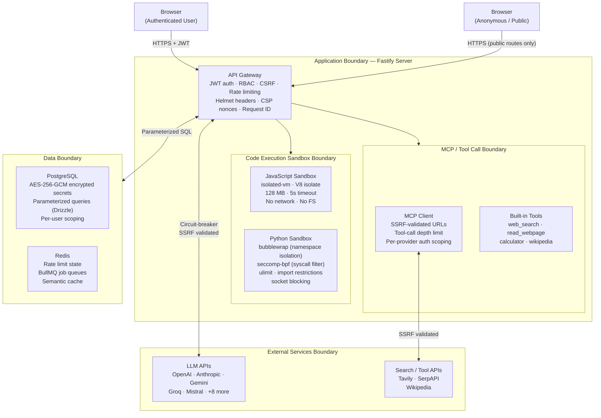

# Threat Model — AIBYAI

Security architecture analysis covering trust boundaries, attack surfaces, mitigations, and residual risks.

> Related: [SECURITY.md](./SECURITY.md) (vulnerability reporting policy) · [DOCUMENTATION.md — Security](./DOCUMENTATION.md#security) (implementation reference)

---

## Trust Boundaries

---

## Attack Surfaces

### 1. Code Sandbox Execution (HIGH RISK)

**Threat**: Remote Code Execution (RCE) via user-submitted JavaScript or Python.

**Mitigations:**

| Layer | JavaScript | Python |
|---|---|---|
| Process isolation | V8 isolate (isolated-vm) | bubblewrap userspace sandbox |
| Namespace isolation | — | `--unshare-all` (PID, net, mount, UTS) |
| Filesystem isolation | Blocked | Read-only bind mounts; `/tmp` only writable |
| Network isolation | No fetch/require | Socket-level blocking + no network namespace |
| Syscall filtering | — | seccomp-bpf (blocks ptrace, mount, bpf, unshare, kexec, +25 more) |
| Memory limit | 128 MB | 256 MB (ulimit -v) |
| CPU / time limit | 5s timeout (SIGKILL) | 10s CPU (ulimit -t) + SIGKILL on process timeout |
| Import restrictions | — | ctypes, subprocess, signal, gc, inspect, dis, pickle blocked |
| File write restrictions | — | `open()` monkey-patched; writes only to `/tmp` |
| Code size cap | 500 KB | 500 KB |
| Output cap | 1000 lines / 1 MB | 5000 lines / 1 MB |

**Residual risks:**
- Kernel-level bubblewrap escape via unpatched CVEs
- Resource exhaustion within sandbox limits (CPU spin within time budget)
- Side-channel timing attacks

---

### 2. Prompt Injection via Tool Results (HIGH RISK)

**Threat**: Malicious content from external tools (web scraping, Wikipedia, MCP servers) instructs the LLM to exfiltrate data, call unauthorized tools, or manipulate the consensus.

**Mitigations:**
- Tool results are injected as structured context, not as system prompt text
- Tool-call depth limit prevents unbounded recursive tool use
- Web content is HTML-stripped before injection (loop-based sanitizer, handles nested-tag bypass)
- MCP tool results are sandboxed to the tool's declared output schema

**Residual risks:**
- Indirect prompt injection through web-scraped content is not fully preventable
- No semantic analysis of tool results for injection patterns (planned: middleware hook)

---

### 3. MCP Client / Outbound HTTP (MEDIUM RISK)

**Threat**: SSRF, DNS rebinding, data exfiltration via crafted URLs in workflow HTTP nodes or MCP server registrations.

**Mitigations:**
- `src/lib/ssrf.ts` validates all outbound URLs:
  - Resolves DNS and checks all IPs against blocklist
  - Blocks: `127.0.0.0/8`, `10.0.0.0/8`, `172.16.0.0/12`, `192.168.0.0/16`
  - Blocks: link-local (`169.254.0.0/16`), cloud metadata (`169.254.169.254`)
  - Blocks: IPv6 loopback, unique-local, link-local
- `redirect: "manual"` on all fetches — redirects are re-validated before following
- Per-provider API key scoping (each provider only receives its own credential)
- Circuit breaker prevents amplification via failing provider

**Residual risks:**
- DNS rebinding: IP is checked at validation time, not at connection time. A short-TTL DNS record could return a safe IP during validation, then a private IP on connection.
- Rate limiting per outbound tool is not enforced (planned: per-tool rate limit)

---

### 4. Authentication & Authorization (MEDIUM RISK)

**Threat**: Session hijacking, privilege escalation, CSRF, brute-force login.

**Mitigations:**
- JWT (HS256) access tokens with 15-minute TTL
- Rotating httpOnly refresh tokens (7-day TTL, stored in database for revocation)
- CSRF protection via `X-Requested-With` header requirement on state-mutating endpoints
- Argon2id password hashing (memory-hard, OWASP recommended)
- Constant-time token comparison (prevents timing attacks)
- Redis-backed rate limiting: 10 requests/min for auth endpoints (explicitly enforced, not just config-based)
- Account suspension check in Redis (fast lookup, not just DB)
- Admin routes require explicit `admin` role middleware — no implicit escalation

**Residual risks:**
- No MFA support (planned in Phase 1)
- JWT rotation (short-lived + refresh) is implemented but refresh token rotation is single-use only — parallel requests can cause race conditions on token refresh

---

### 5. Data Storage (LOW-MEDIUM RISK)

**Threat**: Data leakage, cross-tenant access, encryption key compromise.

**Mitigations:**
- AES-256-GCM for secrets at rest: provider API keys, council configs, memory backend credentials
- Per-record IV derived via scrypt — same plaintext encrypts to different ciphertext
- Key rotation supported via versioned envelope (`CURRENT_ENCRYPTION_VERSION`)
- All Drizzle queries parameterized — no raw SQL string concatenation
- Per-user data scoping on all queries
- Semantic cache scoped by userId — no cross-user cache hits

**Residual risks:**
- Conversation content (chat messages, verdicts) stored in plaintext in PostgreSQL — only per-user access scoping, no field-level encryption
- Backup encryption not enforced by default

---

### 6. HTML / Content Sanitization (LOW RISK)

**Threat**: XSS via unsanitized HTML from web scraping or user-uploaded documents.

**Mitigations:**
- Loop-based stripping of `<script>` and `<style>` tags:
  - Closing tag regex includes `\s*` before `>` (handles `</script >` variants)
  - `while(prev !== result)` loop prevents nested-tag bypass (e.g., `<scr<script>ipt>`)
- `<[^>]+>` strips all remaining HTML tags after script/style removal
- HTML entity decoding is conservative — only 5 common entities decoded

**Residual risks:**
- SVG-based XSS not explicitly filtered (web content is injected as LLM context, not rendered as HTML in the app)

---

### 7. Supply Chain (LOW RISK)

**Threat**: Malicious dependencies, typosquatting, compromised packages.

**Mitigations:**
- `package-lock.json` lockfile pins exact versions
- GitHub CodeQL scanning on every push
- Dependabot security alerts enabled

**Recommended additions:**
- `npm audit` in CI pipeline (not currently required to pass)
- SBOM generation
- Renovate or Dependabot auto-PRs for dependency updates

---

## Data Flow Sensitivity

| Data Type | Encryption | Access Control | Notes |
|---|---|---|---|
| Provider API keys | AES-256-GCM | Per-user, decrypted on demand | Never cached in memory beyond request lifetime |
| Council configs | AES-256-GCM | Per-user | Encrypted before storage, decrypted on GET |
| Conversations & verdicts | Plaintext in DB | userId-scoped | Field-level encryption planned |
| Uploaded files | Disk (OS-level) | userId-scoped | Chunked via KB pipeline, original file retained |
| Vector embeddings | Plaintext in pgvector | userId-scoped | Not sensitive; derived representation only |
| Audit logs | Plaintext | Admin-only | Streamed export via BullMQ |
| Execution traces | Plaintext | userId-scoped | Optional LangFuse integration |
| Rate limit counters | Plaintext in Redis | Server-internal | TTL-expiring, no PII |

---

## Recent Security Hardening

Changes made as part of CodeQL audit (alerts #67–#78):

| Alert | File | Fix Applied |
|---|---|---|
| `js/incomplete-multi-character-sanitization` | `src/lib/tools/read_webpage.ts` | Loop-based stripping + `\s*` closing tag regex |
| `js/incomplete-multi-character-sanitization` | `src/lib/tools/builtin.ts` | Same loop-based fix in `stripHtml()` |
| `js/bad-tag-filter` | `src/lib/tools/read_webpage.ts` | `<\/script\s*>` pattern |
| `js/bad-tag-filter` | `src/lib/tools/builtin.ts` | `<\/script\s*>` + `<\/style\s*>` patterns |
| `js/http-to-file-access` | `src/sandbox/pythonSandbox.ts` | `path.resolve()` + boundary assertion before `writeFile` |
| `js/file-system-race` | `src/lib/cost.ts` | Atomic single `readFileSync` with try/catch, removing `existsSync`/`statSync` |
| `js/insecure-temporary-file` | `src/processors/audio.processor.ts` | Assert file is NOT in `os.tmpdir()` before `fs.open()` |
| `js/missing-rate-limiting` | `src/app.ts` | Explicit Redis-backed preHandler on `GET /` |
| `js/missing-rate-limiting` | `src/routes/auth.ts` | Explicit Redis `authRateLimit` preHandler on login/register |

---

## Recommended Future Hardening

1. **DNS rebinding protection** — check IP at connection time, not just validation time
2. **MFA for admin accounts** — TOTP or hardware key required for `role: admin`
3. **JWT refresh token rotation** — invalidate all refresh tokens on rotation to prevent parallel-request race
4. **Field-level encryption** for conversation content (PII in chat messages)
5. **Per-tool rate limiting** in MCP client
6. **SBOM generation** and dependency scanning in CI
7. **Content Security Policy review** — tighten `script-src` beyond nonce-only
8. **Network egress policy** for sandbox processes (OS firewall rules in addition to socket blocking)
