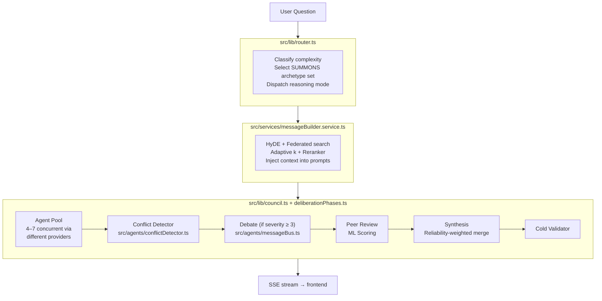

# Contributing to AIBYAI

Thanks for your interest in contributing to AIBYAI — a multi-agent deliberative intelligence platform where a council of AI models argues, critiques each other's claims, and produces a scored consensus.

## Table of Contents

- [Getting Started](#getting-started)
- [Project Structure](#project-structure)
- [Development Workflow](#development-workflow)
- [Running Tests](#running-tests)
- [Code Style](#code-style)
- [Architecture Overview](#architecture-overview)
- [Extension Points](#extension-points)
  - [Adding a New LLM Provider](#adding-a-new-llm-provider)
  - [Adding a New Archetype](#adding-a-new-archetype)
  - [Adding a New Reasoning Mode](#adding-a-new-reasoning-mode)
  - [Adding a New Workflow Node Type](#adding-a-new-workflow-node-type)
- [Submitting Changes](#submitting-changes)
- [Good First Issues](#good-first-issues)

---

## Getting Started

### Prerequisites

- **Node.js** 22+
- **Docker & Docker Compose** (for Postgres + Redis)
- At least one AI provider API key (OpenAI, Anthropic, or Google)

### Local Setup

```bash
# 1. Clone
git clone https://github.com/Yash-Awasthi/aibyai.git
cd aibyai

# 2. Copy env and fill in the required fields
cp .env.example .env
# Minimum required:
#   DATABASE_URL, JWT_SECRET (min 32 chars), MASTER_ENCRYPTION_KEY (min 64-char hex)
#   At least one of: OPENAI_API_KEY, ANTHROPIC_API_KEY, GOOGLE_API_KEY

# 3. Start Postgres + Redis
docker compose up db redis -d

# 4. Run database migrations
npm run db:push

# 5. Install dependencies
npm install
cd frontend && npm install && cd ..

# 6. Start both backend + frontend (hot reload)
npm run dev:all
```

Backend: `http://localhost:3000` · Frontend: `http://localhost:5173`

### Full Docker (production-like)

```bash
cp .env.example .env  # fill in values
docker compose up     # app + db + redis + prometheus + grafana
```

---

## Project Structure

```
aibyai/
├── src/                        # Backend (Fastify + TypeScript)
│   ├── adapters/               # Per-provider LLM adapters (OpenAI, Anthropic, Gemini…)
│   ├── agents/                 # Orchestrator, conflict detector, shared memory, message bus
│   ├── config/                 # Env validation, archetypes
│   ├── db/schema/              # Drizzle ORM schemas + HNSW indexes
│   ├── lib/
│   │   ├── council.ts          # Core deliberation loop (main entry point)
│   │   ├── deliberationPhases.ts # Debate mechanics and phase management
│   │   ├── scoring.ts          # ML-based opinion scoring
│   │   ├── router.ts           # Query classification + archetype selection
│   │   ├── archetypeManager.ts # 14 built-in archetype definitions
│   │   └── tools/              # Tool registry + built-in tools
│   ├── middleware/             # Auth, RBAC, rate limiting, quota, validation
│   ├── processors/             # File processors (PDF, DOCX, XLSX, audio, images)
│   ├── routes/                 # Fastify route plugins (62 files)
│   ├── sandbox/                # Code execution (isolated-vm + bubblewrap/seccomp-bpf)
│   ├── services/               # Business logic (77 services)
│   ├── workflow/               # Workflow executor + 12 node handlers
│   └── index.ts                # Entry point
│
├── frontend/src/               # React 19 + Vite 7 + Tailwind
│   ├── components/             # UI components (ChatArea, MessageList, WorkflowCanvas…)
│   ├── hooks/                  # useDeliberation, useCouncilStream, useCouncilMembers
│   ├── views/                  # 18 page-level views
│   └── router.tsx              # React Router 7 config
│
├── tests/                      # Vitest tests (4300+ test cases)
│   ├── adapters/               # Provider adapter unit tests
│   ├── agents/                 # Agent orchestration tests
│   ├── routes/                 # Route handler unit tests
│   ├── services/               # Service-layer unit tests
│   └── integration/            # Integration tests (require live DB)
│
├── docker-compose.yml
├── eslint.config.js
├── tsconfig.json
└── drizzle.config.ts
```

---

## Development Workflow

### Backend

```bash
npm run dev          # tsx with hot reload, reads .env
npm run typecheck    # tsc --noEmit (no emit, strict mode)
npm run lint         # ESLint src/**/*.ts
```

### Frontend

```bash
cd frontend
npm run dev          # Vite dev server on :5173 (proxies API to :3000)
npm run build        # Production build
```

### Database

```bash
npm run db:push      # Push schema changes to DB (dev — idempotent)
npm run db:generate  # Generate Drizzle migration files
npm run db:studio    # Open Drizzle Studio in browser
```

---

## Running Tests

```bash
npm test                      # Run all tests once
npm run test:watch             # Watch mode
npm run test:ci                # Verbose + bail on first failure
npm run test:coverage          # With coverage report
```

Tests use **Vitest** with heavy mocking — no live database required for unit tests. Integration tests in `tests/integration/` require a running Postgres instance (use `docker compose up db -d`).

When adding a feature, add tests in the matching `tests/` subdirectory. The project targets >90% coverage on new services.

---

## Code Style

- **TypeScript strict mode** is on — avoid `any` where possible (existing warnings are known debt)
- **No `console.log`** in `src/` — use the pino `logger` from `src/lib/logger.ts`
- **Fastify route params** — unused `request`/`reply` args must be prefixed `_request`/`_reply`
- **Imports** — remove unused imports before committing; CI runs ESLint and will warn
- **Error re-throws** — always pass `{ cause: err }` when wrapping a caught error
- **Path operations** — always use `path.resolve()` + boundary assertion when writing files (no TOCTOU)
- **Outbound HTTP** — always pass URLs through `validateSafeUrl()` from `src/lib/ssrf.ts`

ESLint runs on `npm run lint`. CI will fail on `error`-level findings; warnings are acceptable but should be cleaned up.

---

## Architecture Overview

### The Deliberation Loop



### Key Concepts

| Concept | File | Description |
|---|---|---|
| **Provider** | `src/adapters/` | Unified LLM interface per vendor |
| **Archetype** | `src/lib/archetypeManager.ts` | Persona + system prompt template |
| **SUMMONS** | `src/lib/router.ts` | Named archetype sets by query type |
| **Council** | `src/lib/council.ts` | Orchestrates the full deliberation loop |
| **Deliberation phases** | `src/lib/deliberationPhases.ts` | Debate mechanics, peer review, cold validation |
| **Reasoning mode** | `src/lib/reasoningModes.ts` | Pluggable strategies (Standard, Socratic, Red/Blue…) |
| **Reliability** | `src/services/reliability.service.ts` | Per-model scoring persisted across sessions |
| **Message builder** | `src/services/messageBuilder.service.ts` | RAG context injection + prompt assembly |

---

## Extension Points

### Adding a New LLM Provider

1. Create `src/adapters/myprovider.adapter.ts`:
   ```typescript
   import type { IProviderAdapter, AdapterRequest, AdapterChunk } from "./types.js";

   export class MyProviderAdapter implements IProviderAdapter {
     async *generate(req: AdapterRequest): AsyncGenerator<AdapterChunk> {
       // stream tokens from provider
     }
     async listModels(): Promise<string[]> { return ["model-name"]; }
     async isAvailable(): Promise<boolean> { return !!process.env.MYPROVIDER_API_KEY; }
   }
   ```

2. Register in `src/adapters/registry.ts`:
   ```typescript
   if (env.MYPROVIDER_API_KEY) {
     registry.register("myprovider", new MyProviderAdapter());
   }
   ```

3. Add the API key to `.env.example` and `src/config/env.ts` (Zod schema).

4. Add tests in `tests/adapters/myprovider.adapter.test.ts`.

### Adding a New Archetype

Archetypes are defined in `src/lib/archetypeManager.ts`. Add a new entry to the `ARCHETYPES` map:

```typescript
{
  id: "synthesizer",
  name: "Synthesizer",
  description: "Seeks common ground and builds integrative solutions",
  systemPrompt: "You are a Synthesizer. Your role is to...",
  strengths: ["integration", "compromise", "pattern recognition"],
  domain: "general",
}
```

Then include it in the relevant `SUMMONS` categories. Run `npm test` — the archetype tests in `tests/config/` will validate the shape automatically.

### Adding a New Reasoning Mode

1. Add your mode to the `ReasoningMode` union type in `src/lib/reasoningModes.ts`:
   ```typescript
   export type ReasoningMode = "standard" | "socratic" | "red_blue" | "hypothesis" | "confidence" | "mymode";
   ```

2. Implement `runMyMode(question, members, context)` in the same file.

3. Wire it into `src/routes/ask.ts` — add a branch in the mode dispatcher.

4. Add the mode to the `deliberation_mode` enum in `src/middleware/validate.ts`.

5. Add the option to `CouncilConfigPanel` in the frontend (`frontend/src/components/CouncilConfigPanel.tsx`).

### Adding a New Workflow Node Type

1. Create the handler in `src/workflow/nodes/mynode.handler.ts`:
   ```typescript
   import type { NodeHandler, NodeContext } from "../types.js";

   export const myNodeHandler: NodeHandler = {
     type: "mynode",
     async execute(node, inputs, context: NodeContext): Promise<unknown> {
       // node.data contains the node configuration
       // inputs contains outputs from upstream nodes
       return { result: "..." };
     },
   };
   ```

2. Register in `src/workflow/nodes/index.ts`:
   ```typescript
   import { myNodeHandler } from "./mynode.handler.js";
   export const nodeHandlers = {
     ...existingHandlers,
     mynode: myNodeHandler,
   };
   ```

3. Add the node type to `WorkflowNodeType` in `src/workflow/types.ts`.

4. Create the React Flow UI component in `frontend/src/components/workflow/nodes/MyNode.tsx`.

5. Register it in the workflow node palette (`frontend/src/components/workflow/NodePalette.tsx`).

---

## Submitting Changes

1. **Fork** the repo and create a branch: `git checkout -b feat/my-feature`
2. Make your changes with tests
3. Run all checks — all must pass:
   ```bash
   npm run typecheck
   npm run lint
   npm test
   ```
4. Open a PR with a clear description of what changed and why
5. Keep PRs focused — one feature or fix per PR

### Commit Style

```
feat(scope): short description
fix(scope): short description
docs(scope): short description
refactor(scope): short description
test(scope): short description
```

Examples:
- `feat(reasoning): add devil's advocate mode`
- `fix(auth): handle expired JWT gracefully`
- `docs(contributing): add workflow node extension guide`

---

## Good First Issues

If you're new to the codebase, these are well-contained starting points:

- **Reduce `no-explicit-any` warnings** — pick any file in `src/adapters/` and replace `any` with proper types
- **Add a new archetype** — add a persona to `src/lib/archetypeManager.ts` and its SUMMONS membership
- **Write missing route tests** — `tests/routes/` always needs more coverage
- **Improve streaming UI** — the frontend doesn't yet visualize `mode_phase` SSE events from reasoning modes
- **Empty catch blocks** — a few `// no-op` catch blocks in strategies could log a debug message instead
- **Add a built-in tool** — implement a new tool in `src/lib/tools/builtin.ts` (e.g., `unit_converter`, `timezone_compare`)

---

## Questions?

Open a [GitHub Discussion](https://github.com/Yash-Awasthi/aibyai/discussions) or file an [issue](https://github.com/Yash-Awasthi/aibyai/issues).
