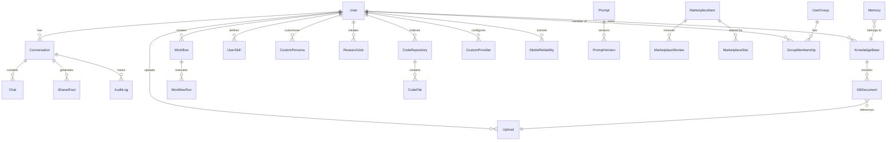
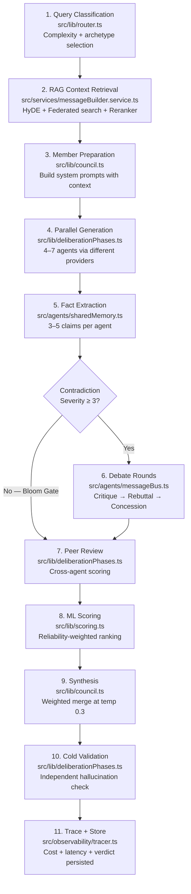
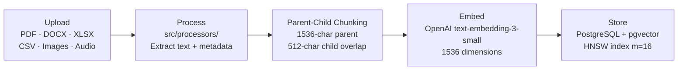
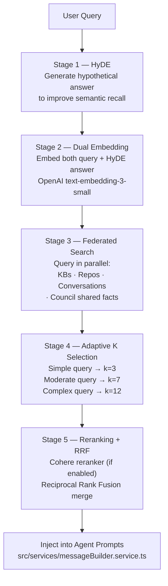
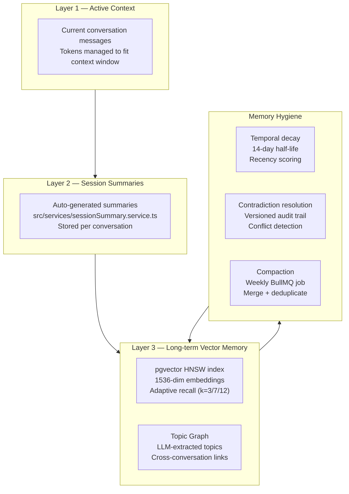
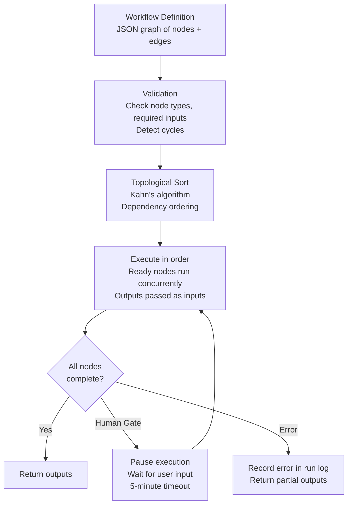
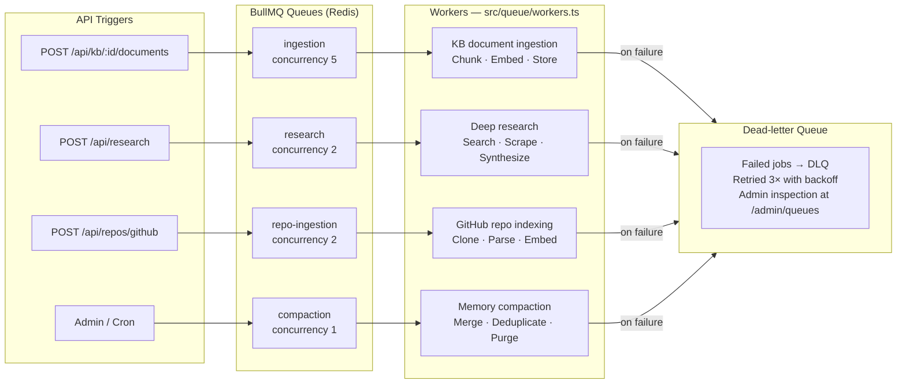
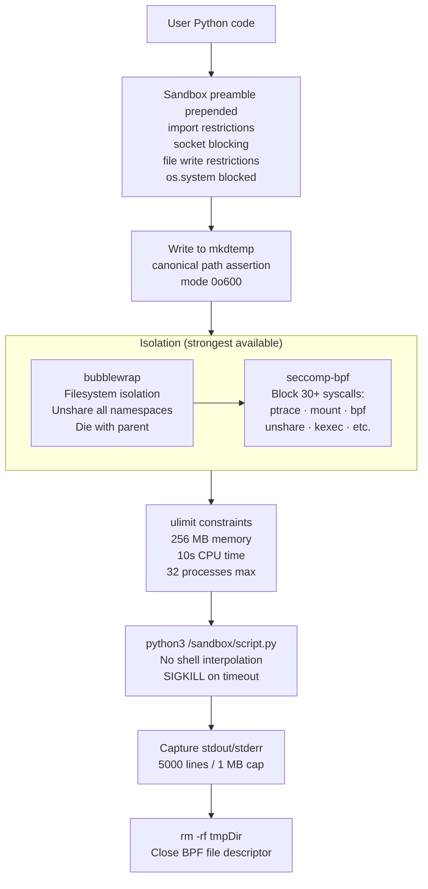

<div align="center">

# AIBYAI — Technical Documentation

### Complete Reference for Setup, APIs, Architecture, and Deployment

[README](./README.md) · [Contributing](./CONTRIBUTING.md) · [Security](./SECURITY.md) · [Threat Model](./THREAT_MODEL.md) · [Roadmap](./ROADMAP.md)

</div>

---

## Table of Contents

- [Setup & Installation](#setup--installation)
- [Environment Variables](#environment-variables)
- [API Reference](#api-reference)
- [Project Structure](#project-structure)
- [Database Schema](#database-schema)
- [Deliberation Engine](#deliberation-engine)
- [RAG Pipeline](#rag-pipeline)
- [Agentic Memory](#agentic-memory)
- [Workflow Engine](#workflow-engine)
- [Queue System](#queue-system)
- [Autonomous Operations](#autonomous-operations)
- [MCP Integration](#mcp-integration)
- [Collaborative Rooms](#collaborative-rooms)
- [Connectors](#connectors)
- [Conversation Branches](#conversation-branches)
- [Workspaces](#workspaces)
- [Provider Adapters](#provider-adapters)
- [Code Sandbox](#code-sandbox)
- [Security](#security)
- [Deployment](#deployment)
- [Contributing](#contributing)

---

## Setup & Installation

### Prerequisites

- **Node.js** >= 22.0.0 (LTS)
- **PostgreSQL** 16 with the [pgvector](https://github.com/pgvector/pgvector) extension
- **Redis** 7+
- At least one AI provider API key (OpenAI, Anthropic, or Google)

### Local Development

```bash
# Clone the repository
git clone https://github.com/Yash-Awasthi/aibyai.git
cd aibyai

# Install backend dependencies
npm install

# Install frontend dependencies
cd frontend && npm install && cd ..

# Copy and configure environment
cp .env.example .env
# Edit .env — required: DATABASE_URL, JWT_SECRET, MASTER_ENCRYPTION_KEY
# At least one of: OPENAI_API_KEY, ANTHROPIC_API_KEY, GOOGLE_API_KEY

# Push database schema (creates all tables and HNSW indexes)
npm run db:push

# Start both backend and frontend
npm run dev:all
```

The backend runs on **http://localhost:3000** and the frontend on **http://localhost:5173** (Vite proxy to backend).

### Available Scripts

| Script | Description |
|---|---|
| `npm run dev` | Backend only (tsx with hot reload) |
| `npm run dev:all` | Backend + frontend concurrently |
| `npm run build` | Production build (frontend + TypeScript compile) |
| `npm start` | Run production build |
| `npm run typecheck` | TypeScript strict check (no emit) |
| `npm run lint` | ESLint on `src/**/*.ts` |
| `npm test` | Vitest single run |
| `npm run test:watch` | Vitest watch mode |
| `npm run test:ci` | Verbose, bail on first failure |
| `npm run test:coverage` | Coverage report |
| `npm run benchmark` | Run performance benchmarks (autocannon) |
| `npm run db:push` | Push Drizzle schema to database |
| `npm run db:generate` | Generate Drizzle migration files |
| `npm run db:studio` | Open Drizzle Studio GUI |

---

## Environment Variables

All variables are validated at startup using Zod (`src/config/env.ts`). The server will fail to start if required variables are missing or malformed.

### Required

| Variable | Type | Description |
|---|---|---|
| `DATABASE_URL` | URL | PostgreSQL connection string with pgvector extension |
| `JWT_SECRET` | string (min 32 chars) | Secret key for JWT signing and verification |
| `MASTER_ENCRYPTION_KEY` | string (min 64-char hex) | AES-256-GCM key for encrypting secrets at rest |

### AI Provider Keys

At least one is required. The system logs a warning at startup if none are present, and rejects requests in production.

| Variable | Provider | Models |
|---|---|---|
| `OPENAI_API_KEY` | OpenAI | GPT-4o, GPT-4o-mini, GPT-5, o1, o3, o4 |
| `ANTHROPIC_API_KEY` | Anthropic | Claude 3.5 Sonnet, Claude 4, Claude Opus |
| `GOOGLE_API_KEY` | Google Gemini | Gemini 2.0 Flash, Gemini 2.5 Pro |
| `GROQ_API_KEY` | Groq | LLaMA 3.x, LLaMA 4, Mixtral (fast inference) |
| `OPENROUTER_API_KEY` | OpenRouter | Multi-model gateway |
| `MISTRAL_API_KEY` | Mistral | Mistral Small, Mistral Large, Codestral |
| `CEREBRAS_API_KEY` | Cerebras | LLaMA 3.3 70B (fast inference) |
| `NVIDIA_API_KEY` | NVIDIA NIM | NVIDIA-hosted models |
| `XIAOMI_MIMO_API_KEY` | Xiaomi MiMo | MiMo models |
| `COHERE_API_KEY` | Cohere | Reranking only (optional enhancement) |

### Runtime Defaults

| Variable | Default | Description |
|---|---|---|
| `PORT` | `3000` | Server port |
| `NODE_ENV` | `development` | `development` / `production` / `test` |
| `REDIS_URL` | `redis://localhost:6379` | Redis connection URL |
| `OLLAMA_BASE_URL` | `http://localhost:11434` | Ollama local inference URL |
| `RATE_LIMIT_WINDOW_MS` | `60000` | Rate limit window (ms) |
| `RATE_LIMIT_MAX` | `10` | Max requests per window |
| `ENABLE_SEMANTIC_CACHE` | `false` | Enable semantic response caching (L1 Redis + L2 pgvector) |
| `CURRENT_ENCRYPTION_VERSION` | `1` | Encryption key version for rotation |

### OAuth2

| Variable | Description |
|---|---|
| `GOOGLE_CLIENT_ID` | Google OAuth2 client ID |
| `GOOGLE_CLIENT_SECRET` | Google OAuth2 client secret |
| `GITHUB_CLIENT_ID` | GitHub OAuth2 client ID |
| `GITHUB_CLIENT_SECRET` | GitHub OAuth2 client secret |
| `OAUTH_CALLBACK_BASE_URL` | Base URL for OAuth redirect callbacks (`http://localhost:3000` in dev) |

### Tools & Observability

| Variable | Description |
|---|---|
| `TAVILY_API_KEY` | Web search via Tavily (primary provider) |
| `SERP_API_KEY` | Web search via SerpAPI (fallback) |
| `LANGFUSE_SECRET_KEY` | LangFuse trace export (secret key) |
| `LANGFUSE_PUBLIC_KEY` | LangFuse trace export (public key) |
| `SYSTEM_PROMPT` | Global system prompt override for all agents |
| `ALLOWED_ORIGINS` | Comma-separated CORS allowed origins |
| `TRUST_PROXY` | Fastify trust proxy setting (CIDR or `true`) |
| `FRONTEND_URL` | Frontend URL for OAuth redirect and CORS |
| `ALLOW_UNSAFE_SANDBOX` | Set `1` to allow sandbox without bubblewrap (dev only) |

---

## API Reference

All endpoints are prefixed with `/api/` unless noted. Authentication uses `Authorization: Bearer <token>` with JWT. Endpoints marked `(auth)` require authentication; `(admin)` requires admin role.

Interactive Swagger docs available at `/api/docs`.

### Authentication

```
POST /api/auth/register          Register { email, password, name }
POST /api/auth/login             Login → { token, user }
GET  /api/auth/me                Current user profile (auth)
GET  /api/auth/google            Google OAuth2 redirect
GET  /api/auth/google/callback   Google OAuth2 callback
GET  /api/auth/github            GitHub OAuth2 redirect
GET  /api/auth/github/callback   GitHub OAuth2 callback
```

### Council Deliberation

```
POST /api/ask                    Start deliberation (SSE stream, auth)
```

**Request body:**
```json
{
  "question": "What are the trade-offs of microservices?",
  "mode": "auto",
  "rounds": 2,
  "conversationId": null,
  "members": [],
  "upload_ids": [],
  "kb_id": null,
  "repo_id": null,
  "maxTokens": 2000
}
```

**Deliberation modes:**

| Mode | Behavior |
|---|---|
| `auto` | System selects best mode based on query |
| `standard` | Parallel generation + peer review |
| `socratic` | Iterative questioning to deepen understanding |
| `red_blue` | Adversarial red team vs. blue team |
| `hypothesis` | Hypothesis generation + systematic testing |
| `confidence` | Agents explicitly quantify and defend certainty |

**SSE events (in order):**

| Event | Payload | Description |
|---|---|---|
| `status` | `{ message }` | Progress updates |
| `member_chunk` | `{ name, chunk }` | Streaming token from agent |
| `opinion` | `{ name, opinion, confidence }` | Complete agent response |
| `peer_review` | `{ round, reviews }` | Structured critiques |
| `scored` | `{ opinions, scores }` | ML-ranked responses |
| `validator_result` | `{ valid, issues }` | Cold validation result |
| `metrics` | `{ tokens, cost, latency }` | Usage metrics |
| `done` | `{ verdict, confidence, opinions }` | Final synthesis |

### Council Configuration

```
GET  /api/council/config         Get council config (auth)
PUT  /api/council/config         Update config { members, rounds, mode } (auth)
```

### Conversation History

```
GET  /api/history                List conversations (auth)
GET  /api/history/:id            Get conversation messages (auth)
GET  /api/history/search?q=...   Search conversations (auth)
```

### Knowledge Bases

```
GET    /api/kb                          List knowledge bases (auth)
POST   /api/kb                          Create KB { name, description } (auth)
DELETE /api/kb/:id                      Delete KB + all chunks (auth)
POST   /api/kb/:id/documents            Add document { upload_id } (auth)
GET    /api/kb/:id/documents            List documents in KB (auth)
DELETE /api/kb/:kbId/documents/:docId   Remove document (auth)
```

### File Uploads

```
POST /api/uploads                Upload files (multipart, auth)
GET  /api/uploads/:id/status     Upload processing status (auth)
GET  /api/uploads/:id/raw        Download file (auth, owner only)
```

Supported formats: PDF, DOCX, XLSX, CSV, TXT, PNG, JPG, GIF, WebP, MP3, MP4, WAV, OGG, M4A, WebM

### Research

```
POST   /api/research        Start research job { query } (auth)
GET    /api/research         List research jobs (auth)
GET    /api/research/:id     Get job status + report (auth)
DELETE /api/research/:id     Delete research job (auth)
```

### Repositories

```
GET    /api/repos                    List indexed repos (auth)
POST   /api/repos/github             Index repo { owner, repo } (auth)
GET    /api/repos/:id/status         Indexing status (auth)
POST   /api/repos/:id/search         Search code { query } (auth)
DELETE /api/repos/:id                Delete repo + files (auth)
```

### Workflows

```
GET    /api/workflows                List workflows (auth)
POST   /api/workflows                Create { name, definition } (auth)
GET    /api/workflows/:id            Get workflow + definition (auth)
PUT    /api/workflows/:id            Update workflow (auth)
DELETE /api/workflows/:id            Delete workflow (auth)
POST   /api/workflows/:id/run        Execute { inputs } (auth)
GET    /api/workflows/:id/runs       List runs (auth)
GET    /api/workflows/runs/:runId    Run status + outputs (auth)
```

### Prompts

```
GET  /api/prompts                 List prompts (auth)
POST /api/prompts                 Create prompt + first version (auth)
GET  /api/prompts/:id/versions    List versions (auth)
POST /api/prompts/:id/versions    Save new version (auth)
POST /api/prompts/test            Test prompt { content, model } (auth)
```

### Marketplace

```
GET    /api/marketplace                       List (?type, ?tags, ?sort, ?search, ?filter=starred|installed|mine)
GET    /api/marketplace/:id                   Item detail (includes starred flag for auth users)
POST   /api/marketplace                       Publish item (auth)
PUT    /api/marketplace/:id                   Update (author only, auth)
DELETE /api/marketplace/:id                   Delete (author/admin, auth)
POST   /api/marketplace/:id/install           Install to account — imports content, increments downloads (auth)
POST   /api/marketplace/:id/uninstall         Remove from account (auth)
POST   /api/marketplace/:id/star              Toggle star — returns { starred: true|false } (auth)
POST   /api/marketplace/:id/reviews           Add review { rating, comment } (auth)
GET    /api/marketplace/:id/reviews           List reviews
```

**Filter params on `GET /api/marketplace`:**

| Param | Values | Description |
|---|---|---|
| `?filter` | `starred`, `installed`, `mine` | Show only starred/installed/authored items |
| `?sort` | `downloads`, `stars`, `recent` | Sort order |
| `?type` | `prompt`, `workflow`, `persona`, `tool` | Filter by item type |
| `?search` | string | Full-text search on name + tags |

Installed items expose a JSON download: the `content` field of `GET /api/marketplace/:id` contains the raw importable JSON for prompts, workflows, personas, and tools.

### Skills

```
GET    /api/skills             List user skills (auth)
POST   /api/skills             Create { name, description, code, parameters } (auth)
PUT    /api/skills/:id         Update skill (auth)
DELETE /api/skills/:id         Delete skill (auth)
POST   /api/skills/:id/test    Test with inputs (auth)
```

### Code Sandbox

```
POST /api/sandbox/execute      Run code { language, code } (auth, rate-limited)
```

Languages: `javascript`, `python`

### Personas & Prompt DNA

```
GET    /api/personas           List built-in + custom personas (auth)
POST   /api/personas           Create custom persona (auth)
PUT    /api/personas/:id       Update persona (auth)
DELETE /api/personas/:id       Delete persona (auth)
GET    /api/prompt-dna         List prompt DNA profiles (auth)
POST   /api/prompt-dna         Create profile (auth)
PUT    /api/prompt-dna/:id     Update profile (auth)
DELETE /api/prompt-dna/:id     Delete profile (auth)
```

### Analytics & Traces

```
GET /api/analytics/overview    Usage analytics dashboard (auth)
GET /api/traces                List execution traces (auth)
GET /api/traces/:id            Trace detail with steps (auth)
GET /api/metrics               System metrics (Prometheus format)
GET /api/usage                 Token usage stats (auth)
```

### Queue Management

```
GET    /api/queue/stats                   Queue statistics (auth)
GET    /api/queue/jobs/:queue/:id         Job status (auth)
DELETE /api/queue/jobs/:queue/:id         Cancel job (admin)
```

### Administration

```
GET    /api/admin/users                        List all users (admin)
PUT    /api/admin/users/:id/role               Change role { role } (admin)
POST   /api/admin/groups                       Create group (admin)
POST   /api/admin/groups/:id/members           Add member (admin)
DELETE /api/admin/groups/:id/members/:userId   Remove member (admin)
GET    /api/admin/stats                        System stats (admin)
POST   /api/admin/rotate-keys                  Rotate encryption keys (admin)
```

### Sharing & Export

```
POST   /api/share/conversation/:id   Share conversation → { token } (auth)
GET    /api/share/:token             View shared conversation (public)
DELETE /api/share/conversation/:id   Remove share (auth)
GET    /api/export/markdown/:id      Export as Markdown (auth)
GET    /api/export/json/:id          Export as JSON (auth)
```

### Health Check

```
GET /health    System health (public)
```

```json
{
  "status": "ok",
  "uptime": 3600,
  "env": "production",
  "checks": { "database": "ok", "redis": "ok" },
  "providers": ["openai", "anthropic", "gemini", "ollama"],
  "version": "1.0.0"
}
```

---

## Project Structure

```
aibyai/
├── src/
│   ├── adapters/                      # LLM provider adapters
│   │   ├── types.ts                   # IProviderAdapter interface
│   │   ├── registry.ts                # Auto-registration + model→provider resolution
│   │   ├── openai.adapter.ts          # OpenAI (GPT-4o, o-series)
│   │   ├── anthropic.adapter.ts       # Anthropic (Claude family)
│   │   ├── gemini.adapter.ts          # Google Gemini
│   │   ├── groq.adapter.ts            # Groq (OpenAI-compatible)
│   │   ├── ollama.adapter.ts          # Ollama (local models)
│   │   ├── openrouter.adapter.ts      # OpenRouter (multi-provider)
│   │   └── custom.adapter.ts          # EMOF dynamic custom providers
│   │
│   ├── agents/                        # Multi-agent orchestration
│   │   ├── orchestrator.ts            # Full deliberation DAG
│   │   ├── conflictDetector.ts        # Cross-agent contradiction detection
│   │   ├── messageBus.ts              # Inter-agent debate messaging
│   │   ├── sharedMemory.ts            # Shared fact graph
│   │   └── personas.ts                # Built-in + custom agent personas
│   │
│   ├── auth/                          # OAuth2 strategies
│   │   ├── google.strategy.ts
│   │   └── github.strategy.ts
│   │
│   ├── config/
│   │   └── env.ts                     # Zod-validated environment schema
│   │
│   ├── lib/                           # Core engine (40+ files)
│   │   ├── council.ts                 # Council orchestration (main entry)
│   │   ├── deliberationPhases.ts      # Debate mechanics and phase management
│   │   ├── scoring.ts                 # ML-based opinion scoring
│   │   ├── router.ts                  # Query classification + archetype selection
│   │   ├── evaluation.ts              # Council performance evaluation
│   │   ├── cost.ts                    # Per-query cost tracking
│   │   ├── cache.ts                   # Semantic response caching
│   │   ├── redis.ts                   # Redis client
│   │   ├── db.ts                      # PostgreSQL connection pool
│   │   ├── drizzle.ts                 # Drizzle ORM client
│   │   ├── logger.ts                  # Pino structured logger
│   │   ├── prometheusMetrics.ts       # Prometheus counters + histograms
│   │   ├── socket.ts                  # WebSocket (native ws)
│   │   ├── crypto.ts                  # AES-256-GCM encryption
│   │   ├── ssrf.ts                    # SSRF URL validation
│   │   ├── pii.ts                     # PII detection + masking
│   │   ├── breaker.ts                 # Opossum circuit breaker wrapper
│   │   ├── sweeper.ts                 # Background maintenance jobs
│   │   ├── memoryCrons.ts             # Scheduled memory compaction
│   │   ├── archetypeManager.ts        # 14 built-in archetypes
│   │   ├── tools/                     # Tool registry + built-in tools
│   │   │   ├── index.ts               # registerTool / executeTool
│   │   │   ├── builtin.ts             # web_search, calculator, datetime, wikipedia
│   │   │   ├── execute_code.ts        # Code execution via sandbox
│   │   │   ├── read_webpage.ts        # Web scraping + HTML sanitization
│   │   │   ├── skillExecutor.ts       # User skill registration as tools
│   │   │   └── search.ts              # Tavily / SerpAPI integration
│   │   └── ml/                        # ML strategies
│   │       ├── hyde.ts                # HyDE embeddings
│   │       └── reranker.ts            # Cohere reranking
│   │
│   ├── middleware/                    # Request pipeline middleware (11 files)
│   │   ├── fastifyAuth.ts             # Fastify JWT preHandlers
│   │   ├── rbac.ts                    # Role-based access control
│   │   ├── rateLimit.ts               # Redis-backed rate limiting
│   │   ├── validate.ts                # Zod request validation
│   │   ├── quota.ts                   # User quota enforcement
│   │   ├── upload.ts                  # Multer file upload
│   │   ├── requestId.ts               # Request ID correlation
│   │   ├── cspNonce.ts                # CSP nonce generation
│   │   └── errorHandler.ts            # Global error handling
│   │
│   ├── observability/
│   │   └── tracer.ts                  # Execution tracing + LangFuse export
│   │
│   ├── processors/                    # Document processing
│   │   ├── router.processor.ts        # MIME-type routing
│   │   ├── pdf.processor.ts
│   │   ├── docx.processor.ts
│   │   ├── xlsx.processor.ts
│   │   ├── csv.processor.ts
│   │   ├── txt.processor.ts
│   │   ├── image.processor.ts
│   │   └── audio.processor.ts         # Whisper transcription
│   │
│   ├── queue/                         # BullMQ async jobs
│   │   ├── connection.ts              # IORedis connection
│   │   ├── queues.ts                  # Queue definitions
│   │   └── workers.ts                 # Workers (ingestion, research, repo, compaction)
│   │
│   ├── routes/                        # Fastify route plugins (160 files)
│   │   ├── ask.ts                     # Council deliberation endpoint (SSE)
│   │   ├── auth.ts                    # Authentication + OAuth
│   │   ├── council.ts                 # Council configuration
│   │   ├── history.ts                 # Conversation history
│   │   ├── kb.ts                      # Knowledge base management
│   │   ├── uploads.ts                 # File uploads
│   │   ├── research.ts                # Deep research
│   │   ├── repos.ts                   # GitHub repositories
│   │   ├── workflows.ts               # Workflow CRUD + execution
│   │   ├── prompts.ts                 # Prompt templates + versioning
│   │   ├── marketplace.ts             # Community marketplace
│   │   ├── skills.ts                  # User skills
│   │   ├── sandbox.ts                 # Code execution
│   │   ├── personas.ts                # Custom personas
│   │   ├── memory.ts                  # Memory operations
│   │   ├── analytics.ts               # Usage analytics
│   │   ├── traces.ts                  # Execution traces
│   │   ├── admin.ts                   # Admin management
│   │   ├── share.ts                   # Sharing system
│   │   ├── voice.ts                   # Voice input
│   │   ├── tts.ts                     # Text-to-speech
│   │   ├── export.ts                  # Data export
│   │   └── ...                        # (+13 more)
│   │
│   ├── sandbox/                       # Code execution isolation
│   │   ├── jsSandbox.ts               # JavaScript (isolated-vm, V8 isolate)
│   │   ├── pythonSandbox.ts           # Python (bubblewrap + seccomp-bpf + ulimit)
│   │   └── seccomp.ts                 # seccomp-bpf policy generation
│   │
│   ├── services/                      # Business logic (92 files)
│   │   ├── council.service.ts         # Council composition
│   │   ├── conversation.service.ts    # Conversation management
│   │   ├── vectorStore.service.ts     # pgvector operations
│   │   ├── embeddings.service.ts      # Embedding generation
│   │   ├── chunker.service.ts         # Document chunking
│   │   ├── ingestion.service.ts       # Document ingestion pipeline
│   │   ├── messageBuilder.service.ts  # RAG context + message formatting
│   │   ├── research.service.ts        # Deep research engine
│   │   ├── reliability.service.ts     # Model reliability scoring
│   │   ├── memoryRouter.service.ts    # Memory backends + topic graph
│   │   ├── memoryCompaction.service.ts# Memory cleanup
│   │   ├── sessionSummary.service.ts  # Conversation summarization
│   │   ├── agentSpecialization.service.ts # Domain-specific agent profiles
│   │   ├── goalDecomposition.service.ts   # Task DAG decomposition
│   │   ├── backgroundAgents.service.ts    # Long-running task execution
│   │   ├── hitlGates.service.ts           # Human-in-the-loop gates
│   │   ├── codeGeneration.service.ts      # Full-stack code scaffolding
│   │   ├── mcpClient.service.ts           # MCP client (connect to external tools)
│   │   ├── mcpServer.service.ts           # MCP server (expose AIBYAI as tool server)
│   │   ├── pluginRegistry.service.ts      # Custom tool packages
│   │   ├── audioVideo.service.ts          # Transcription + keyframe analysis
│   │   ├── multiUserDeliberation.service.ts # Real-time multi-user sessions
│   │   ├── workflowEngine.service.ts      # Visual workflow orchestration
│   │   └── ...                            # (+8 more: marketplace, evaluation, voting…)
│   │
│   ├── types/                         # TypeScript declarations
│   └── workflow/                      # Workflow execution
│       ├── executor.ts                # Topological execution engine (Kahn's algorithm)
│       ├── types.ts                   # WorkflowDefinition, WorkflowNode types
│       └── nodes/                     # Node handlers (9 dedicated + 3 handled in executor)
│           ├── llm.handler.ts
│           ├── tool.handler.ts
│           ├── condition.handler.ts
│           ├── template.handler.ts
│           ├── code.handler.ts
│           ├── http.handler.ts
│           ├── loop.handler.ts
│           ├── merge.handler.ts
│           ├── split.handler.ts
│           └── index.ts
│
├── frontend/src/
│   ├── components/                    # React components
│   │   ├── ChatArea.tsx
│   │   ├── MessageList.tsx            # Markdown + artifact rendering
│   │   ├── InputArea.tsx
│   │   ├── CouncilConfigPanel.tsx     # Council member configuration
│   │   ├── CostTracker.tsx            # Token cost display
│   │   ├── OfflineIndicator.tsx       # Offline detection + IndexedDB cache
│   │   └── workflow/                  # Workflow editor components
│   │       └── nodes/                 # 12 custom React Flow node UIs
│   │
│   ├── views/                         # Page views (18 files)
│   │   ├── ChatView.tsx               # Main chat interface
│   │   ├── DebateDashboardView.tsx    # Council debate visualization
│   │   ├── WorkflowEditorView.tsx     # Visual workflow builder
│   │   ├── PromptIDEView.tsx          # Prompt IDE with versioning
│   │   ├── MarketplaceView.tsx        # Marketplace browser
│   │   ├── SkillsView.tsx             # User skill editor
│   │   ├── AnalyticsView.tsx          # Analytics dashboard
│   │   ├── MemorySettingsView.tsx     # Memory backend config
│   │   ├── ReposView.tsx              # Repository management
│   │   └── AdminView.tsx              # Admin dashboard
│   │
│   ├── hooks/                         # Custom React hooks
│   │   ├── useDeliberation.ts         # Deliberation state management
│   │   ├── useCouncilStream.ts        # SSE streaming
│   │   └── useCouncilMembers.ts       # Council member state
│   │
│   ├── context/                       # Auth + Theme contexts
│   ├── types/                         # TypeScript definitions
│   └── router.tsx                     # React Router 7 config
│
├── tests/                             # 282 test files, 4300+ tests
│   ├── adapters/                      # Provider adapter unit tests
│   ├── agents/                        # Agent orchestration tests
│   ├── services/                      # Service-layer unit tests
│   ├── routes/                        # Route handler tests
│   ├── integration/                   # End-to-end tests (require live DB)
│   ├── e2e/                           # Playwright browser tests
│   └── load/                          # Performance benchmarks
│
├── grafana/                           # Auto-provisioned monitoring dashboards
├── scripts/                           # Setup scripts, diagnostics, load tests
├── docker-compose.yml                 # PostgreSQL + Redis + Prometheus + Grafana
├── Dockerfile                         # Multi-stage production build
├── drizzle.config.ts                  # Database migration config
├── vitest.config.ts                   # Test configuration
├── eslint.config.js                   # ESLint configuration
└── .env.example                       # Environment template
```

**By the numbers:** ~479 backend TypeScript files · ~66 frontend React files · 62 Drizzle schema files · 160 API route plugins · 92 services · 14 middleware · 8 document processors · 16 LLM provider adapters · 51 data source connectors · 4300+ tests.

---

## Database Schema

62 Drizzle ORM schema files across these domains:



### Key Models

| Model | Purpose | Notable Columns |
|---|---|---|
| `User` | Accounts | `role` (admin/member/viewer), hashed password (argon2id), `suspendedAt` |
| `Conversation` | Multi-turn sessions | `title`, `userId`, summon type, `deliberationMode` |
| `Chat` | Individual responses | `question`, `verdict`, `opinions` (JSON), `embedding` (vector 1536) |
| `Memory` | RAG chunks | `content`, `embedding` (vector 1536), `kbId`, `sourceUrl`, `lastAccessed` |
| `SemanticCache` | Response cache | `queryEmbedding` (vector 1536), `response`, `ttl`, `hitCount` |
| `CustomProvider` | EMOF providers | `baseUrl`, `authKey` (AES-256-GCM encrypted), `capabilities` (JSON) |
| `CouncilConfig` | Per-user council setup | `config` (AES-256-GCM encrypted JSON) |
| `MarketplaceItem` | Community items | `type`, `content` (JSON), `downloads`, `stars` |
| `UserSkill` | Python tools | `code`, `parameters` (JSON schema) |
| `Trace` | Observability | `steps` (JSON), `totalLatencyMs`, `totalCostUsd` |
| `ModelReliability` | Per-model scoring | `agreedWith`, `contradicted`, `toolErrors`, `reliabilityScore` |
| `CodeFile` | Repo index | `path`, `language`, `embedding` (vector 1536) |

All vector columns use pgvector HNSW indexes (`m=16`, `efConstruction=64`) for fast approximate nearest-neighbor search.

---

## Deliberation Engine

The deliberation engine is the core of AIBYAI. It orchestrates multiple LLM agents through a structured debate pipeline and produces a scored consensus verdict.

### Pipeline Phases



### Scoring Formulas

**Final confidence:**
```
Confidence = claimScore × 0.6 + debateScore × 0.3 + diversityBonus × 0.1
```

**Consensus** is measured as average pairwise cosine similarity across agent responses. The system targets ≥ 0.85 (85%).

**Per-model reliability** (persisted across sessions):
```
Reliability = (Agreed / (Agreed + Contradicted + 1)) × 0.7
            + (1 - ToolErrors / (TotalResponses + 1)) × 0.3
```

High-reliability models are weighted more heavily during synthesis. Low-reliability models have their claims penalized during conflict resolution.

### Bloom Gate

A quality control mechanism that prevents round degradation. If a debate round produces lower consensus than the previous round, the system halts further refinement and proceeds directly to synthesis — avoiding argumentative loops that degrade output quality.

### Reasoning Modes

| Mode | Strategy |
|---|---|
| `standard` | Parallel generation + peer review rounds |
| `socratic` | Iterative questioning to unpack assumptions |
| `red_blue` | Red team attacks the hypothesis, blue team defends |
| `hypothesis` | Agents propose hypotheses, others design tests |
| `confidence` | Agents explicitly state and defend certainty levels |

### Agent Archetypes (14 built-in)

| Archetype | Focus |
|---|---|
| Architect | Systems thinking, structure, long-term design |
| Contrarian | Challenges assumptions, plays devil's advocate |
| Empiricist | Evidence-based, cites data, skeptical of anecdote |
| Ethicist | Moral implications, fairness, societal impact |
| Futurist | Trends, second-order effects, emerging patterns |
| Pragmatist | Practical implementation, trade-offs, feasibility |
| Historian | Precedents, patterns, what history shows |
| Empath | Human factors, emotional intelligence, UX |
| Outsider | First-principles, avoids domain assumptions |
| Strategist | Competitive dynamics, positioning, leverage |
| Minimalist | Simplicity, Occam's razor, YAGNI |
| Creator | Novel combinations, lateral thinking |
| Judge | Weighs evidence, reaches verdicts |
| Devil's Advocate | Steelmans opposing views |

---

## RAG Pipeline

The Retrieval-Augmented Generation pipeline runs before every deliberation to inject relevant context into agent prompts.

### Ingestion (Async via BullMQ)



### Retrieval (Per Query — 5 Stages)



### Hybrid Search

Each federated search branch combines vector similarity (cosine distance via pgvector) with BM25 keyword search (PostgreSQL full-text), merged using Reciprocal Rank Fusion:

```
score_rrf = 1 / (rank_vector + 60) + 1 / (rank_keyword + 60)
```

### Embedding Providers

| Role | Provider | Model | Dimensions |
|---|---|---|---|
| Primary | OpenAI | text-embedding-3-small | 1536 |
| Fallback | Google | text-embedding-004 | 768 |
| Cache | LRU (1000 entries) | keyed by SHA-256 of input | — |

---

## Agentic Memory

AIBYAI uses a three-layer memory system that persists knowledge across conversations.

### Memory Architecture



### Key Properties

- **Temporal decay** — memory relevance scores decay with a 14-day half-life. Frequently accessed memories decay more slowly.
- **Topic graph** — LLM extracts topics from each conversation and links related discussions via embedding similarity. This enables cross-conversation recall ("remember when we discussed X?").
- **Contradiction resolution** — when a new memory contradicts an existing one, both are preserved with versioned audit trails and the conflict is flagged.
- **Compaction** — weekly background job merges redundant memories, deduplicates facts, and purges expired entries.

### Memory Backends

Configured via `src/services/memoryRouter.service.ts`. Supports:
- PostgreSQL (default, local)
- Redis (fast access)
- Custom external backends (configurable via UI at `/memory/settings`)

---

## Workflow Engine

The visual workflow engine allows building multi-step AI pipelines via a drag-and-drop canvas (React Flow frontend, `src/workflow/executor.ts` backend).

### Node Types

| Node | Input | Output | Description |
|---|---|---|---|
| `input` | — | User value | Workflow input declaration |
| `output` | Any | — | Workflow output |
| `llm` | System prompt, user prompt, model | Generated text | LLM call via smart router |
| `tool` | Tool name, parameters | Tool result | Execute registered tool |
| `condition` | Value, operator, compare_to | `true`/`false` | Branch on condition |
| `template` | Template string + variables | Rendered text | `{{placeholder}}` substitution |
| `code` | Language, source | Stdout + stderr | Sandbox execution |
| `http` | URL, method, headers, body | Response | HTTP request (SSRF-validated) |
| `loop` | Items array, inner graph | Results array | Execute sub-graph per item |
| `merge` | Multiple inputs | Combined | Merge parallel branches |
| `split` | Single input | Multiple | Split to parallel branches |
| `human_gate` | Prompt, options | User choice | Pause for human input (5 min timeout) |

### Execution Flow



### Execution Model

- The executor builds a dependency graph and sorts nodes using Kahn's topological sort algorithm
- Nodes with no unsatisfied dependencies execute concurrently
- HTTP nodes go through SSRF validation (`src/lib/ssrf.ts`) before the request is made
- Code nodes (`javascript`, `python`) run in the sandbox — same isolation as `/api/sandbox/execute`
- Human Gate nodes set `status: waiting` on the run record. The frontend polls until the user submits input, then execution resumes from that node

---

## Queue System

Four BullMQ queues handle long-running asynchronous tasks, backed by Redis.



Workers are started automatically with the server (`src/index.ts`). In development mode, BullMQ Board is mounted at `/admin/queues` for queue inspection and job management.

---

## Autonomous Operations

### Goal Decomposition

`src/services/goalDecomposition.service.ts` breaks complex objectives into a DAG of subtasks:

```
Input: "Write a competitor analysis for our product"
   ↓
LLM decomposes into 5–8 subtasks
   ↓
Cycle detection (DFS)
Topological sort
   ↓
Execute subtasks in order
   ↓ (on failure)
Cascading failure analysis — which dependent tasks to skip?
```

Supports 3 pre-built templates: **Research Report**, **Competitive Analysis**, **Data Pipeline**.

### Background Agents

`src/services/backgroundAgents.service.ts` handles long-running tasks (minutes to hours):

- **Checkpointing** — saves intermediate results to Redis every N steps
- **Pause/Resume** — users can pause via API, system resumes from last checkpoint
- **Progress tracking** — SSE stream provides real-time progress updates
- **Artifact streaming** — intermediate artifacts delivered via EventEmitter pub/sub with late-join replay

### Human-in-the-Loop Gates

`src/services/hitlGates.service.ts` provides 4 gate types:

| Gate | Description |
|---|---|
| `approval` | A human must explicitly approve before proceeding |
| `review` | A human reviews the output and annotates; execution continues |
| `confirmation` | Prompt + explicit yes/no from one or more users |
| `escalation` | Escalate to a higher-authority user if primary doesn't respond within timeout |

Gates support multi-approver quorum requirements and auto-timeout (default 5 minutes, configurable).

---

## MCP Integration

AIBYAI implements the [Model Context Protocol](https://modelcontextprotocol.io/) in both directions.

### Server Mode (`src/services/mcpServer.service.ts`)

Exposes AIBYAI as an MCP-compatible tool server:

| Tool exposed | Description |
|---|---|
| `deliberate` | Run full council deliberation on a question |
| `knowledge_search` | Search knowledge bases and conversation history |
| `generate_tests` | Generate test cases from a code snippet |
| `synthesize` | Synthesize a consensus from multiple text inputs |

Connect via JSON-RPC 2.0 at `/api/mcp` with your MCP client.

### Client Mode (`src/services/mcpClient.service.ts`)

Connects to external MCP servers:

1. Register an MCP server via the UI (Providers page → MCP Servers)
2. On connection, tools are automatically discovered via `tools/list`
3. Discovered tools appear in the tool registry and are available in workflows, skills, and council tool calls
4. Results are cached with configurable TTL
5. Auth headers are forwarded from the originating user request

---

## Collaborative Rooms

Multi-user AI sessions where multiple people share the same conversation and interact with the council together in real-time.

### How It Works

1. A host creates a room (`POST /api/rooms`) — receives an `inviteCode`
2. Guests join via `POST /api/rooms/join/:inviteCode` and become participants
3. All participants send messages to the same `conversationId` via `POST /api/ask`
4. The council responds once per message — all participants see the response in real-time via their individual SSE streams
5. The host closes the room with `DELETE /api/rooms/:id`

### API

```
POST   /api/rooms                   Create room { conversationId } → { id, inviteCode } (auth)
POST   /api/rooms/join/:inviteCode  Join room as participant (auth)
GET    /api/rooms/:id               Room info + participant list (auth)
DELETE /api/rooms/:id               Close room (host only, auth)
```

---

## Connectors

Connectors pull external data into knowledge bases for RAG retrieval. Built-in connectors ship with the platform; custom connectors can be defined without code.

### Built-in Connectors

| Connector | Description |
|---|---|
| **GitHub** | Index repositories — clone, parse, embed code files for semantic search |
| **Web scraping** | Scrape URLs via Playwright + content extraction (SSRF-validated) |
| **Confluence** | Pull team wiki pages into the knowledge base |
| **Apify** | Structured web data via Apify actors |

### Custom Connectors

Define any HTTP data source via the UI with no code required:

```
GET    /api/connectors/custom              List custom connectors (auth)
POST   /api/connectors/custom              Create connector { name, baseUrl, auth, endpoints } (auth)
POST   /api/connectors/custom/:id/invoke   Invoke connector → fetch + ingest data (auth)
```

### Connector Sync

Schedule recurring data pulls so knowledge bases stay up to date automatically:

```
POST   /api/connectors/:connectorId/sync                  Trigger a sync now (auth)
GET    /api/connectors/:connectorId/sync/jobs             List sync jobs (auth)
GET    /api/connectors/:connectorId/sync/jobs/:jobId      Job status + result (auth)
POST   /api/connectors/:connectorId/sync/schedules        Create schedule { cron } (auth)
GET    /api/connectors/:connectorId/sync/schedules        List schedules (auth)
```

---

## Conversation Branches

Fork any conversation at any message to explore a different direction without losing the original thread. Each branch is a full, independent conversation with its own history.

```
POST   /api/branches                       Create branch { conversationId, fromMessageId } (auth)
GET    /api/branches/:id                   Branch detail + message history (auth)
GET    /api/conversations/:id/branches     List all branches of a conversation (auth)
```

Branches can be compared side by side in the UI and merged back via a summarise-and-inject workflow.

---

## Workspaces

Isolated namespaces above conversations. Each workspace has its own document set, agent configuration, LLM settings, memory scope, and tool list — completely separate from other workspaces.

```
GET    /api/workspaces                     List user's workspaces (auth)
POST   /api/workspaces                     Create workspace { name, description } (auth)
GET    /api/workspaces/:id                 Workspace detail + config (auth)
PUT    /api/workspaces/:id                 Update workspace settings (auth)
DELETE /api/workspaces/:id                 Delete workspace (auth)
```

Conversations, knowledge bases, and memories all belong to a workspace. Switching workspaces gives a completely fresh context.

---

## Provider Adapters

All adapters implement the `IProviderAdapter` interface:

```typescript
interface IProviderAdapter {
  generate(req: AdapterRequest): Promise<AsyncGenerator<AdapterChunk>>;
  listModels(): Promise<string[]>;
  isAvailable(): Promise<boolean>;
}
```

### Auto-Registration

On startup, `src/adapters/registry.ts` checks which API keys are present and registers adapters automatically. Ollama is always registered and checked for local availability.

| Provider | API Key | Notes |
|---|---|---|
| OpenAI | `OPENAI_API_KEY` | GPT-4o, o-series; function calling |
| Anthropic | `ANTHROPIC_API_KEY` | Claude family; system prompt support |
| Gemini | `GOOGLE_API_KEY` | Gemini 2.0/2.5; multimodal |
| Groq | `GROQ_API_KEY` | OpenAI-compatible; fastest inference |
| OpenRouter | `OPENROUTER_API_KEY` | OpenAI-compatible; 100+ models |
| Ollama | None (always on) | Local inference at `OLLAMA_BASE_URL` |
| Mistral | `MISTRAL_API_KEY` | OpenAI-compatible |
| Cerebras | `CEREBRAS_API_KEY` | OpenAI-compatible; fast |
| NVIDIA NIM | `NVIDIA_API_KEY` | OpenAI-compatible |
| Perplexity | `PERPLEXITY_API_KEY` | Search-augmented responses (Sonar) |
| Fireworks | `FIREWORKS_API_KEY` | Fast open-source model inference |
| Together | `TOGETHER_API_KEY` | Open-source model hosting |
| DeepInfra | `DEEPINFRA_API_KEY` | Open-source model hosting |
| Azure OpenAI | `AZURE_OPENAI_API_KEY` + `AZURE_OPENAI_ENDPOINT` | GPT-4o on Azure |
| LiteLLM | `LITELLM_BASE_URL` | Proxy for 100+ providers via unified API |
| vLLM | `VLLM_BASE_URL` | Self-hosted high-throughput inference |
| Custom (EMOF) | UI-configured | Any OpenAI-compatible endpoint |

### Adding a Custom Provider

Users can add any OpenAI-compatible provider via the UI without code changes:

1. Navigate to Providers → Add Provider
2. Enter base URL, auth type, API key, model list
3. Test connection
4. Provider is immediately available for council members

Custom providers are stored encrypted (`AES-256-GCM`) in the `CustomProvider` table and registered dynamically at runtime.

---

## Code Sandbox

### JavaScript Sandbox (`src/sandbox/jsSandbox.ts`)

Uses `isolated-vm` to run untrusted JavaScript in a V8 isolate:

- **Memory limit:** 128 MB per execution
- **Timeout:** 5 seconds (SIGKILL on exceed)
- **Network:** blocked (no `fetch`, no `require`)
- **File system:** blocked
- **Stdout capture:** 1000 lines / 1 MB cap

### Python Sandbox (`src/sandbox/pythonSandbox.ts`)

Defense-in-depth isolation for Python code execution:



**Isolation tiers** (selected automatically at startup):

| Tier | Tool | Availability |
|---|---|---|
| Strongest | bubblewrap + seccomp-bpf | Most Linux distros |
| Fallback | `unshare` namespaces | Kernel 3.8+ |
| Dev-only | ulimit only | Requires `ALLOW_UNSAFE_SANDBOX=1` in production |

---

## Security

### Implementation Summary

| Layer | Implementation |
|---|---|
| **Authentication** | JWT access tokens (HS256, 15 min TTL) + rotating httpOnly refresh tokens (7 day). Argon2id password hashing (OWASP recommended, memory-hard). |
| **OAuth2** | Google + GitHub via Passport.js. Email verification enforced before account activation. |
| **Authorization** | RBAC middleware: `admin`, `member`, `viewer` roles. Resource ownership checks on all mutations. Per-tenant quota enforcement. |
| **Encryption** | AES-256-GCM for secrets at rest (provider API keys, council configs, memory backend credentials). Per-record IV derived via scrypt. Key rotation supported with versioned envelopes. |
| **Rate Limiting** | Redis-backed sliding window: 10/min auth, 60/min API, 10/min sandbox, 20/min voice. Per-IP and per-user tracking. |
| **Input Validation** | Zod schemas on all request bodies via Fastify preHandler middleware. Safe math expression parser (recursive descent, no `eval()`). LIKE wildcard escaping. |
| **SSRF Protection** | DNS-level validation (`src/lib/ssrf.ts`) blocks private IPs, localhost, link-local, cloud metadata endpoints. Applied to all outbound HTTP: adapters, tools, workflow HTTP nodes, MCP client. |
| **HTML Sanitization** | Loop-based `<script>` / `<style>` stripping (handles nested-tag bypass attempts). Closing tag regex includes `\s*` to match `</script >` variants. |
| **Path Safety** | All file operations canonicalize via `path.resolve()` with explicit boundary assertion. No stat → open race conditions (atomic single-read pattern). |
| **Code Sandbox** | JS: V8 isolate 128 MB, 5s timeout. Python: bubblewrap + seccomp-bpf + ulimit + socket-level network blocking + import restrictions. |
| **Headers** | CSP with nonce, HSTS, X-Frame-Options (SAMEORIGIN), X-Content-Type-Options (nosniff). Request ID correlation across logs. |
| **PII** | Automatic PII detection with risk scoring before sending to AI providers. Configurable redaction middleware. |
| **Secrets** | API keys never logged or returned in responses. All encrypted in database. No keys in environment for deployed containers (use secret injection). |

For the full threat model and attack surface analysis, see [THREAT_MODEL.md](./THREAT_MODEL.md).

---

## Deployment

### Docker Compose (Recommended)

```bash
cp .env.example .env  # fill in required values
docker compose up -d
```

| Service | Image | Port | Purpose |
|---|---|---|---|
| `app` | Custom (Dockerfile) | 3000 | AIBYAI server |
| `db` | `pgvector/pgvector:pg16` | 5433 | PostgreSQL + pgvector |
| `redis` | `redis:7-alpine` | 6379 | Cache, queues, rate limits |
| `prometheus` | `prom/prometheus` | 9090 | Metrics collection |
| `grafana` | `grafana/grafana` | 3001 | Auto-provisioned dashboards |

Database migrations run automatically on boot. Data persists in Docker volumes (`postgres_data`, `redis_data`).

### Manual Production

```bash
npm run build
npm run db:push
NODE_ENV=production node dist/index.js
```

### Nginx Reverse Proxy

```nginx
server {
    listen 443 ssl http2;
    server_name your-domain.com;

    ssl_certificate /etc/nginx/ssl/cert.pem;
    ssl_certificate_key /etc/nginx/ssl/key.pem;

    location / {
        proxy_pass http://app:3000;
        proxy_set_header Host $host;
        proxy_set_header X-Real-IP $remote_addr;
        proxy_set_header X-Forwarded-For $proxy_add_x_forwarded_for;
        proxy_set_header X-Forwarded-Proto $scheme;
    }

    location /ws {
        proxy_pass http://app:3000;
        proxy_http_version 1.1;
        proxy_set_header Upgrade $http_upgrade;
        proxy_set_header Connection "upgrade";
    }
}
```

For horizontal scaling, use an upstream block with multiple app instances and sticky sessions for WebSocket connections.

### Kubernetes

```yaml
apiVersion: apps/v1
kind: Deployment
metadata:
  name: aibyai
spec:
  replicas: 3
  selector:
    matchLabels:
      app: aibyai
  template:
    metadata:
      labels:
        app: aibyai
    spec:
      containers:
      - name: aibyai
        image: aibyai:latest
        ports:
        - containerPort: 3000
        env:
        - name: NODE_ENV
          value: "production"
        resources:
          requests:
            memory: "512Mi"
            cpu: "250m"
          limits:
            memory: "1Gi"
            cpu: "500m"
---
apiVersion: autoscaling/v2
kind: HorizontalPodAutoscaler
metadata:
  name: aibyai-hpa
spec:
  scaleTargetRef:
    apiVersion: apps/v1
    kind: Deployment
    name: aibyai
  minReplicas: 2
  maxReplicas: 10
  metrics:
  - type: Resource
    resource:
      name: cpu
      target:
        type: Utilization
        averageUtilization: 70
```

### Local AI (Ollama)

```bash
curl -fsSL https://ollama.ai/install.sh | sh
ollama pull llama3.2 && ollama pull codellama && ollama pull mistral
ollama serve
# Set OLLAMA_BASE_URL=http://localhost:11434 in .env
```

### Database Optimization

```sql
-- Performance indexes (applied automatically by db:push, useful for manual setups)
CREATE INDEX CONCURRENTLY "chat_created_at_idx" ON "Chat"("createdAt");
CREATE INDEX CONCURRENTLY "audit_log_user_created_idx" ON "AuditLog"("userId", "createdAt");

-- Run periodically
VACUUM ANALYZE;
```

### Redis Configuration

```bash
redis-cli CONFIG SET maxmemory 2gb
redis-cli CONFIG SET maxmemory-policy allkeys-lru
redis-cli CONFIG SET save "900 1 300 10 60 10000"
```

### Backup

```bash
# Database
pg_dump ai_council | gzip > "backup_$(date +%Y%m%d_%H%M%S).sql.gz"

# Redis
redis-cli BGSAVE
cp /var/lib/redis/dump.rdb /backups/redis_$(date +%Y%m%d_%H%M%S).rdb
```

### Troubleshooting

| Issue | Check |
|---|---|
| Database won't connect | `psql $DATABASE_URL` — verify pgvector extension is installed |
| Redis won't connect | `redis-cli ping` — check `REDIS_URL` in `.env` |
| High memory usage | `docker stats` / set `NODE_OPTIONS=--max-old-space-size=4096` |
| Slow queries | `npx drizzle-kit studio` + `EXPLAIN ANALYZE` on slow queries |
| Migration errors | `npm run db:push` — re-applies schema idempotently |
| Python sandbox failing | Check `bwrap --version` — install bubblewrap or set `ALLOW_UNSAFE_SANDBOX=1` (dev only) |
| No providers available | Check `GET /health` — `providers` array shows registered adapters |

---

## Contributing

See [CONTRIBUTING.md](./CONTRIBUTING.md) for the full development guide, including:
- Adding a new LLM provider adapter
- Adding a new archetype
- Adding a new workflow node type
- Code style rules
- Test strategy

```bash
# Required before submitting a PR
npm run typecheck   # TypeScript strict check
npm run lint        # ESLint
npm test            # Vitest (all tests)
```
