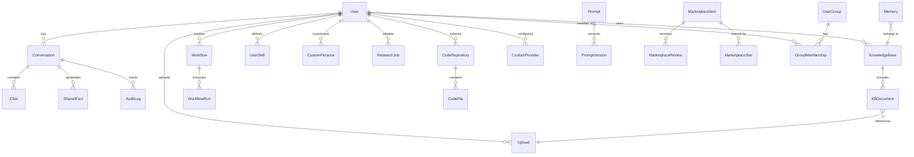
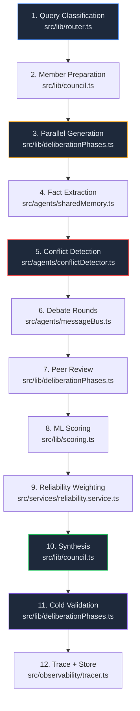
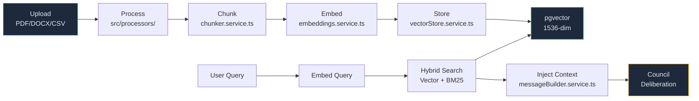

<div align="center">

# AIBYAI Documentation

### Complete Technical Reference

</div>

---

## Table of Contents

- [Setup & Installation](#setup--installation)
- [Environment Variables](#environment-variables)
- [API Reference](#api-reference)
- [Project Structure](#project-structure)
- [Database Schema](#database-schema)
- [Deployment](#deployment)
- [Provider Adapters](#provider-adapters)
- [Deliberation Engine](#deliberation-engine)
- [RAG Pipeline](#rag-pipeline)
- [Workflow Engine](#workflow-engine)
- [Queue System](#queue-system)
- [Security](#security)
- [Contributing](#contributing)

---

## Setup & Installation

### Prerequisites

- **Node.js** >= 20.0.0
- **PostgreSQL** 16 with the [pgvector](https://github.com/pgvector/pgvector) extension
- **Redis** 7+
- At least one AI provider API key (OpenAI, Anthropic, or Google)

### Local Development

```bash
# Clone the repository
git clone https://github.com/Yash-Awasthi/aibyai.git
cd aibyai

# Install backend dependencies
npm install

# Install frontend dependencies
cd frontend && npm install && cd ..

# Copy and configure environment
cp .env.example .env
# Edit .env — add your API keys, DATABASE_URL, and JWT_SECRET

# Generate Prisma client and run migrations
npx prisma generate
npx prisma migrate dev --name init

# Start both backend and frontend
npm run dev:all
```

The backend runs on **http://localhost:3000** and the frontend on **http://localhost:5173** (with Vite proxy to backend).

### Available Scripts

| Script | Description |
|---|---|
| `npm run dev` | Backend only (tsx with hot reload) |
| `npm run dev:all` | Backend + frontend concurrently |
| `npm run build` | Production build (frontend + TypeScript compile) |
| `npm start` | Run production build |
| `npm run typecheck` | TypeScript strict check (no emit) |
| `npm run lint` | ESLint on `src/**/*.ts` |
| `npm test` | Vitest single run |
| `npm run test:watch` | Vitest watch mode |
| `npm run benchmark` | Run performance benchmarks (autocannon) |
| `npm run db:migrate` | Prisma dev migration |
| `npm run db:migrate:prod` | Prisma production migration |
| `npm run db:generate` | Generate Prisma client |
| `npm run db:studio` | Open Prisma Studio GUI |

---

## Environment Variables

All environment variables are validated at startup using Zod (`src/config/env.ts`). The server will fail to start if required variables are missing or malformed.

### Required

| Variable | Type | Description |
|---|---|---|
| `DATABASE_URL` | `string` (URL) | PostgreSQL connection string with pgvector |
| `JWT_SECRET` | `string` (min 16 chars) | Secret key for JWT signing and verification |
| `MASTER_ENCRYPTION_KEY` | `string` (min 32 chars) | AES-256-GCM encryption key for secrets at rest |

### AI Provider Keys

At least one is required. The system logs a warning at startup if none are present.

| Variable | Provider | Models |
|---|---|---|
| `OPENAI_API_KEY` | OpenAI | GPT-4o, GPT-4o-mini, GPT-5, o1, o3, o4 |
| `ANTHROPIC_API_KEY` | Anthropic | Claude 3.5 Sonnet, Claude 4, Claude Opus |
| `GOOGLE_API_KEY` | Google Gemini | Gemini 2.0 Flash, Gemini 1.5 Pro |
| `GROQ_API_KEY` | Groq | Llama 3.x, Mixtral (fast inference) |
| `OPENROUTER_API_KEY` | OpenRouter | Multi-model gateway |
| `MISTRAL_API_KEY` | Mistral | Mistral Large, Codestral |
| `CEREBRAS_API_KEY` | Cerebras | Fast inference models |
| `NVIDIA_API_KEY` | NVIDIA NIM | NVIDIA-hosted models |
| `XIAOMI_MIMO_API_KEY` | Xiaomi MiMo | MiMo models |
| `COHERE_API_KEY` | Cohere | Reranking (optional enhancement) |

### Defaults

| Variable | Default | Description |
|---|---|---|
| `PORT` | `3000` | Server port |
| `NODE_ENV` | `development` | `development` / `production` / `test` |
| `REDIS_URL` | `redis://localhost:6379` | Redis connection URL |
| `OLLAMA_BASE_URL` | `http://localhost:11434` | Ollama local inference URL |
| `RATE_LIMIT_WINDOW_MS` | `60000` | Rate limit window (ms) |
| `RATE_LIMIT_MAX` | `10` | Max requests per window |
| `ENABLE_VECTOR_CACHE` | `false` | Enable semantic response caching |
| `CURRENT_ENCRYPTION_VERSION` | `1` | Encryption key version |

### OAuth2

| Variable | Default | Description |
|---|---|---|
| `GOOGLE_CLIENT_ID` | `""` | Google OAuth2 client ID |
| `GOOGLE_CLIENT_SECRET` | `""` | Google OAuth2 client secret |
| `GITHUB_CLIENT_ID` | `""` | GitHub OAuth2 client ID |
| `GITHUB_CLIENT_SECRET` | `""` | GitHub OAuth2 client secret |
| `OAUTH_CALLBACK_BASE_URL` | `http://localhost:3000` | Base URL for OAuth redirect callbacks |

### Tools & Observability

| Variable | Description |
|---|---|
| `TAVILY_API_KEY` | Web search via Tavily (primary) |
| `SERP_API_KEY` | Web search via SerpAPI (fallback) |
| `LANGFUSE_SECRET_KEY` | LangFuse trace export (secret) |
| `LANGFUSE_PUBLIC_KEY` | LangFuse trace export (public) |
| `SYSTEM_PROMPT` | Global system prompt override |
| `ALLOWED_ORIGINS` | Comma-separated CORS origins |
| `TRUST_PROXY` | Express trust proxy setting |
| `FRONTEND_URL` | Frontend URL for redirects |

---

## API Reference

All endpoints are prefixed with `/api/` unless noted. Authentication uses Bearer JWT tokens in the `Authorization` header. Endpoints marked `(auth)` require authentication; `(admin)` requires admin role.

### Authentication

```
POST /api/auth/register          # Create account { email, password, name }
POST /api/auth/login             # Login → { token, user }
GET  /api/auth/me                # Current user profile (auth)
GET  /api/auth/google            # Google OAuth2 redirect
GET  /api/auth/google/callback   # Google OAuth2 callback
GET  /api/auth/github            # GitHub OAuth2 redirect
GET  /api/auth/github/callback   # GitHub OAuth2 callback
```

### Council Deliberation

```
POST /api/ask                    # Start deliberation (SSE stream)
```

**Request body:**
```json
{
  "question": "What are the trade-offs of microservices?",
  "mode": "auto",
  "rounds": 2,
  "conversationId": null,
  "members": [],
  "upload_ids": [],
  "kb_id": null,
  "repo_id": null,
  "maxTokens": 2000
}
```

**SSE events:**
| Event | Data | Description |
|---|---|---|
| `status` | `{ message }` | Progress update |
| `member_chunk` | `{ name, chunk }` | Streaming token from agent |
| `opinion` | `{ name, opinion, confidence }` | Complete agent response |
| `peer_review` | `{ round, reviews }` | Structured critiques |
| `scored` | `{ opinions, scores }` | ML-ranked responses |
| `validator_result` | `{ valid, issues }` | Cold validation result |
| `metrics` | `{ tokens, cost, latency }` | Usage metrics |
| `done` | `{ verdict, confidence, opinions }` | Final synthesis |

### Conversation History

```
GET  /api/history                # List conversations (auth)
GET  /api/history/:id            # Get conversation messages (auth)
GET  /api/history/search?q=...   # Search conversations (auth)
```

### Knowledge Bases

```
GET  /api/kb                     # List knowledge bases (auth)
POST /api/kb                     # Create KB { name, description } (auth)
DELETE /api/kb/:id               # Delete KB + all chunks (auth)
POST /api/kb/:id/documents       # Add document { upload_id } (auth)
GET  /api/kb/:id/documents       # List documents in KB (auth)
DELETE /api/kb/:kbId/documents/:docId  # Remove document (auth)
```

### File Uploads

```
POST /api/uploads                # Upload files (multipart, auth)
GET  /api/uploads/:id/status     # Upload processing status (auth)
GET  /api/uploads/:id/raw        # Download file (auth, owner only)
```

Supported formats: PDF, DOCX, XLSX, CSV, TXT, PNG, JPG, GIF, WebP

### Research

```
POST /api/research               # Start research job { query } (auth)
GET  /api/research               # List research jobs (auth)
GET  /api/research/:id           # Get job status + report (auth)
DELETE /api/research/:id         # Delete research job (auth)
```

### Repositories

```
GET  /api/repos                  # List indexed repos (auth)
POST /api/repos/github           # Index repo { owner, repo } (auth)
GET  /api/repos/:id/status       # Indexing status (auth)
POST /api/repos/:id/search       # Search code { query } (auth)
DELETE /api/repos/:id            # Delete repo + files (auth)
```

### Workflows

```
GET  /api/workflows              # List workflows (auth)
POST /api/workflows              # Create workflow { name, definition } (auth)
GET  /api/workflows/:id          # Get workflow + definition (auth)
PUT  /api/workflows/:id          # Update workflow (auth)
DELETE /api/workflows/:id        # Delete workflow (auth)
POST /api/workflows/:id/run      # Execute { inputs } (auth)
GET  /api/workflows/:id/runs     # List runs (auth)
GET  /api/workflows/runs/:runId  # Run status + outputs (auth)
```

### Prompts

```
GET  /api/prompts                # List prompts (auth)
POST /api/prompts                # Create prompt + first version (auth)
GET  /api/prompts/:id/versions   # List versions (auth)
POST /api/prompts/:id/versions   # Save new version (auth)
POST /api/prompts/test           # Test prompt { content, model } (auth)
```

### Marketplace

```
GET  /api/marketplace            # List items (?type, ?tags, ?sort, ?search)
GET  /api/marketplace/:id        # Item detail
POST /api/marketplace            # Publish item (auth)
PUT  /api/marketplace/:id        # Update (author only, auth)
DELETE /api/marketplace/:id      # Delete (author/admin, auth)
POST /api/marketplace/:id/install  # Install to account (auth)
POST /api/marketplace/:id/star   # Toggle star (auth)
POST /api/marketplace/:id/reviews  # Add review { rating, comment } (auth)
GET  /api/marketplace/:id/reviews  # List reviews
```

### Skills

```
GET  /api/skills                 # List user skills (auth)
POST /api/skills                 # Create { name, description, code, parameters } (auth)
PUT  /api/skills/:id             # Update skill (auth)
DELETE /api/skills/:id           # Delete skill (auth)
POST /api/skills/:id/test        # Test with inputs (auth)
```

### Code Sandbox

```
POST /api/sandbox/execute        # Run code { language, code } (auth, rate-limited)
```

Languages: `javascript`, `python`

### Personas & Prompt DNA

```
GET  /api/personas               # List built-in + custom personas (auth)
POST /api/personas               # Create custom persona (auth)
PUT  /api/personas/:id           # Update persona (auth)
DELETE /api/personas/:id         # Delete persona (auth)
GET  /api/prompt-dna             # List prompt DNA profiles (auth)
POST /api/prompt-dna             # Create profile (auth)
PUT  /api/prompt-dna/:id         # Update profile (auth)
DELETE /api/prompt-dna/:id       # Delete profile (auth)
```

### Analytics & Traces

```
GET  /api/analytics/overview     # Usage analytics dashboard (auth)
GET  /api/traces                 # List execution traces (auth)
GET  /api/traces/:id             # Trace detail with steps (auth)
GET  /api/metrics                # System metrics
GET  /api/usage                  # Token usage stats (auth)
```

### Queue Management

```
GET  /api/queue/stats            # Queue statistics (auth)
GET  /api/queue/jobs/:queue/:id  # Job status (auth)
DELETE /api/queue/jobs/:queue/:id  # Cancel job (admin)
```

### Administration

```
GET  /api/admin/users            # List all users (admin)
PUT  /api/admin/users/:id/role   # Change role { role } (admin)
POST /api/admin/groups           # Create group (admin)
POST /api/admin/groups/:id/members  # Add member (admin)
DELETE /api/admin/groups/:id/members/:userId  # Remove member (admin)
GET  /api/admin/stats            # System stats (admin)
POST /api/admin/rotate-keys      # Rotate encryption keys (admin)
```

### Sharing

```
POST /api/share/conversation/:id  # Share conversation → { token } (auth)
GET  /api/share/:token            # View shared conversation (public)
DELETE /api/share/conversation/:id  # Remove share (auth)
```

### Exports

```
GET  /api/export/markdown/:id    # Export as Markdown (auth)
GET  /api/export/json/:id        # Export as JSON (auth)
```

### Health Check

```
GET  /health                     # System health (public)
```

**Response:**
```json
{
  "status": "ok",
  "uptime": 3600,
  "env": "production",
  "checks": { "database": "ok", "redis": "ok" },
  "providers": ["openai", "anthropic", "gemini", "ollama"],
  "version": "1.0.0"
}
```

### Example: Full Deliberation

```bash
curl -X POST http://localhost:3000/api/ask \
  -H "Content-Type: application/json" \
  -H "Authorization: Bearer <token>" \
  -d '{
    "question": "What are the trade-offs of microservices vs monolith?",
    "mode": "auto",
    "rounds": 2
  }'
```

**SSE Response stream:**
```
event: status
data: {"message": "Routing query..."}

event: opinion
data: {"name": "Empiricist", "opinion": "...", "confidence": 0.85}

event: opinion
data: {"name": "Strategist", "opinion": "...", "confidence": 0.78}

event: peer_review
data: {"round": 1, "reviews": [...]}

event: scored
data: {"opinions": [...], "scores": [...]}

event: done
data: {"verdict": "...", "confidence": 0.91, "opinions": [...]}
```

---

## Project Structure

```
aibyai/
├── src/
│   ├── adapters/              # LLM provider adapters
│   │   ├── types.ts           # IProviderAdapter interface + types
│   │   ├── registry.ts        # Auto-registration + model→provider resolution
│   │   ├── openai.adapter.ts  # OpenAI (GPT-4o, GPT-5, o-series)
│   │   ├── anthropic.adapter.ts # Anthropic (Claude family)
│   │   ├── gemini.adapter.ts  # Google Gemini
│   │   ├── groq.adapter.ts    # Groq (OpenAI-compatible)
│   │   ├── ollama.adapter.ts  # Ollama (local models)
│   │   ├── openrouter.adapter.ts # OpenRouter (multi-provider)
│   │   └── custom.adapter.ts  # Dynamic custom providers (EMOF)
│   │
│   ├── agents/                # Multi-agent orchestration
│   │   ├── orchestrator.ts    # Full deliberation DAG (16.8KB)
│   │   ├── conflictDetector.ts # Cross-agent contradiction detection
│   │   ├── messageBus.ts      # Inter-agent messaging
│   │   ├── sharedMemory.ts    # Shared fact graph
│   │   └── personas.ts        # Built-in + custom agent personas
│   │
│   ├── auth/                  # OAuth2 strategies
│   │   ├── google.strategy.ts
│   │   └── github.strategy.ts
│   │
│   ├── config/
│   │   └── env.ts             # Zod-validated environment schema
│   │
│   ├── lib/                   # Core engine (40+ files, 6100+ lines)
│   │   ├── council.ts         # Council deliberation orchestration
│   │   ├── deliberationPhases.ts # Debate mechanics
│   │   ├── scoring.ts         # ML-based opinion scoring
│   │   ├── router.ts          # Query classification + archetype selection
│   │   ├── validator.ts       # Input/output validation
│   │   ├── evaluation.ts      # Council performance evaluation
│   │   ├── realtimeCost.ts    # Live cost calculation
│   │   ├── cache.ts           # Semantic response caching
│   │   ├── redis.ts           # Redis client setup
│   │   ├── db.ts              # Prisma client + connection pool
│   │   ├── logger.ts          # Pino logger
│   │   ├── socket.ts          # WebSocket setup
│   │   ├── crypto.ts          # AES-256-GCM encryption
│   │   ├── pii.ts             # PII detection + masking
│   │   ├── sweeper.ts         # Background maintenance
│   │   ├── memoryCrons.ts     # Scheduled memory jobs
│   │   ├── tools/             # Tool registry + built-in tools
│   │   │   ├── index.ts       # registerTool / executeTool
│   │   │   ├── builtin.ts     # web_search, code execution
│   │   │   ├── skillExecutor.ts # User skill registration
│   │   │   ├── search.ts      # Tavily / SerpAPI
│   │   │   └── read_webpage.ts # Web scraping
│   │   └── ...                # breaker, retry, metrics, audit, etc.
│   │
│   ├── middleware/            # Express middleware (10 files)
│   │   ├── auth.ts            # JWT verification + optional auth
│   │   ├── rbac.ts            # Role-based access control
│   │   ├── rateLimit.ts       # Redis-backed rate limiting
│   │   ├── limiter.ts         # Per-user rate limiting
│   │   ├── errorHandler.ts    # Global error handling
│   │   ├── validate.ts        # Zod request validation
│   │   ├── upload.ts          # Multer file upload
│   │   ├── quota.ts           # User quota enforcement
│   │   ├── requestId.ts       # Request ID tracking
│   │   └── cspNonce.ts        # CSP nonce generation
│   │
│   ├── observability/
│   │   └── tracer.ts          # Execution tracing + LangFuse export
│   │
│   ├── processors/            # Document processing (9 files)
│   │   ├── router.processor.ts # MIME-type routing
│   │   ├── pdf.processor.ts   # PDF text extraction
│   │   ├── docx.processor.ts  # Word document extraction
│   │   ├── xlsx.processor.ts  # Excel parsing
│   │   ├── csv.processor.ts   # CSV parsing
│   │   ├── txt.processor.ts   # Plain text
│   │   └── image.processor.ts # Image handling
│   │
│   ├── queue/                 # BullMQ async jobs
│   │   ├── connection.ts      # IORedis connection
│   │   ├── queues.ts          # Queue definitions
│   │   └── workers.ts         # Workers (ingestion, research, repo, compaction)
│   │
│   ├── routes/                # Express route handlers (33 files)
│   │   ├── ask.ts             # Council deliberation endpoint
│   │   ├── auth.ts            # Authentication + OAuth
│   │   ├── history.ts         # Conversation history
│   │   ├── kb.ts              # Knowledge base management
│   │   ├── uploads.ts         # File uploads
│   │   ├── research.ts        # Deep research
│   │   ├── repos.ts           # GitHub repositories
│   │   ├── workflows.ts       # Workflow CRUD + execution
│   │   ├── prompts.ts         # Prompt templates + versioning
│   │   ├── marketplace.ts     # Community marketplace
│   │   ├── skills.ts          # User skills
│   │   ├── sandbox.ts         # Code execution
│   │   ├── personas.ts        # Custom personas
│   │   ├── promptDna.ts       # Prompt DNA steering
│   │   ├── analytics.ts       # Usage analytics
│   │   ├── traces.ts          # Execution traces
│   │   ├── admin.ts           # Admin management
│   │   ├── share.ts           # Sharing system
│   │   ├── queue.ts           # Queue management
│   │   ├── memory.ts          # Memory operations
│   │   ├── artifacts.ts       # Code artifacts
│   │   ├── voice.ts           # Voice input/output
│   │   ├── tts.ts             # Text-to-speech
│   │   ├── export.ts          # Data export
│   │   ├── metrics.ts         # System metrics
│   │   ├── providers.ts       # Provider listing
│   │   ├── customProviders.ts # EMOF custom providers
│   │   ├── usage.ts           # Usage tracking
│   │   ├── council.ts         # Council configuration
│   │   ├── pii.ts             # PII detection
│   │   └── ...
│   │
│   ├── sandbox/               # Code execution isolation
│   │   ├── jsSandbox.ts       # JavaScript (isolated-vm, V8 isolate)
│   │   └── pythonSandbox.ts   # Python (subprocess with timeout)
│   │
│   ├── services/              # Business logic (16 files)
│   │   ├── vectorStore.service.ts    # pgvector operations
│   │   ├── embeddings.service.ts     # Embedding generation
│   │   ├── chunker.service.ts        # Document chunking
│   │   ├── ingestion.service.ts      # Document ingestion pipeline
│   │   ├── memoryCompaction.service.ts # Memory cleanup
│   │   ├── memoryRouter.service.ts   # Distributed memory backends
│   │   ├── sessionSummary.service.ts # Conversation summarization
│   │   ├── research.service.ts       # Deep research engine
│   │   ├── repoIngestion.service.ts  # GitHub repo indexing
│   │   ├── repoSearch.service.ts     # Code search
│   │   ├── artifacts.service.ts      # Artifact detection
│   │   ├── reliability.service.ts    # Model reliability scoring
│   │   ├── conversationService.ts    # Conversation management
│   │   ├── councilService.ts         # Council composition
│   │   ├── messageBuilder.service.ts # RAG context + message formatting
│   │   └── usageService.ts           # Usage logging
│   │
│   └── workflow/              # Workflow execution
│       ├── executor.ts        # Topological execution engine (9.1KB)
│       ├── types.ts           # WorkflowDefinition types
│       └── nodes/             # 10 node handlers
│           ├── llm.handler.ts
│           ├── tool.handler.ts
│           ├── condition.handler.ts
│           ├── template.handler.ts
│           ├── code.handler.ts
│           ├── http.handler.ts
│           ├── loop.handler.ts
│           ├── merge.handler.ts
│           ├── split.handler.ts
│           └── index.ts
│
├── frontend/src/
│   ├── components/            # React components (19 files)
│   │   ├── ChatArea.tsx       # Chat message display
│   │   ├── MessageList.tsx    # Message rendering (markdown, artifacts)
│   │   ├── InputArea.tsx      # Message input
│   │   ├── Sidebar.tsx        # Navigation sidebar
│   │   ├── AuthScreen.tsx     # Login / signup UI
│   │   ├── CouncilConfigPanel.tsx # Council member configuration
│   │   ├── PersonaBuilder.tsx # Persona creation UI
│   │   ├── EnhancedSearch.tsx # Search UI
│   │   ├── Dashboard.tsx      # Main dashboard
│   │   ├── CostTracker.tsx    # Token cost display
│   │   ├── ShareModal.tsx     # Share dialog
│   │   ├── OfflineIndicator.tsx # Offline detection + IndexedDB cache
│   │   ├── tabs/MainTabs.tsx  # 5-tab results panel
│   │   └── workflow/          # Workflow editor components
│   │       ├── NodeConfigPanel.tsx
│   │       ├── NodePalette.tsx
│   │       ├── serialization.ts
│   │       └── nodes/         # 12 custom node UIs
│   │
│   ├── views/                 # Page views (13 files)
│   │   ├── ChatView.tsx       # Main chat interface
│   │   ├── DebateDashboardView.tsx # Council debate visualization (16.1KB)
│   │   ├── WorkflowEditorView.tsx  # Visual workflow builder (14.4KB)
│   │   ├── PromptIDEView.tsx  # Prompt IDE with versioning (15.9KB)
│   │   ├── MarketplaceView.tsx # Marketplace browser (23.2KB)
│   │   ├── SkillsView.tsx     # User skill editor (15.1KB)
│   │   ├── AnalyticsView.tsx  # Analytics dashboard (10.1KB)
│   │   ├── MemorySettingsView.tsx # Memory backend config (9.6KB)
│   │   ├── ReposView.tsx      # Repository management (8KB)
│   │   ├── AdminView.tsx      # Admin dashboard (7.3KB)
│   │   ├── MetricsView.tsx    # System metrics
│   │   ├── WorkflowsView.tsx  # Workflows list
│   │   └── DashboardView.tsx  # Home redirect
│   │
│   ├── hooks/                 # Custom React hooks
│   │   ├── useDeliberation.ts # Deliberation state management
│   │   ├── useCouncilStream.ts # SSE streaming
│   │   └── useCouncilMembers.ts # Council member state
│   │
│   ├── context/               # React context providers
│   ├── types/                 # TypeScript definitions
│   ├── router.tsx             # React Router setup
│   └── main.tsx               # Entry point
│
├── prisma/
│   └── schema.prisma          # 39 database models
│
├── docker-compose.yml         # PostgreSQL + Redis + App
├── Dockerfile                 # Multi-stage production build
├── ecosystem.config.cjs       # PM2 cluster mode
├── .github/workflows/ci.yml   # GitHub Actions CI
├── .env.example               # Environment template
├── tsconfig.json              # TypeScript (strict, ES2022)
└── package.json               # Dependencies + scripts
```

**By the numbers:** 178 backend TypeScript files, 57 frontend React files, 39 Prisma models, 33 API routes, 16 services, 10 middleware, 9 document processors, 9 LLM provider adapters, 10 workflow node types.

---

## Database Schema

39 Prisma models across these domains:



### Key Models

| Model | Purpose | Notable Columns |
|---|---|---|
| `User` | Accounts | role (admin/member/viewer), hashed password |
| `Conversation` | Multi-turn sessions | title, userId, summon type |
| `Chat` | Individual responses | question, verdict, opinions (JSON), embedding (vector 1536) |
| `Memory` | RAG chunks | content, embedding (vector 1536), kbId, sourceUrl |
| `SemanticCache` | Response cache | queryEmbedding (vector 1536), response, ttl |
| `CustomProvider` | EMOF providers | baseUrl, authKey (encrypted), capabilities (JSON) |
| `MarketplaceItem` | Marketplace | type, content (JSON), downloads, stars |
| `UserSkill` | Python tools | code, parameters (JSON schema) |
| `Trace` | Observability | steps (JSON), totalLatencyMs, totalCostUsd |
| `ModelReliability` | AI scoring | agreedWith, contradicted, toolErrors |
| `CodeFile` | Repo index | path, language, embedding (vector 1536) |

---

## Deployment

### Docker Compose (Recommended)

```bash
docker compose up -d
```

This starts three services:

| Service | Image | Port | Purpose |
|---|---|---|---|
| `app` | Custom (Dockerfile) | 3000 | AIBYAI server |
| `db` | `pgvector/pgvector:pg16` | 5433 | PostgreSQL + pgvector |
| `redis` | `redis:7-alpine` | 6379 | Cache, queues, rate limits |

Database migrations run automatically on boot. Data persists in Docker volumes (`postgres_data`, `redis_data`).

### PM2 Cluster Mode

```bash
npm run build
pm2 start ecosystem.config.cjs --env production
```

Configuration (`ecosystem.config.cjs`):
- **instances:** `max` (all CPU cores)
- **exec_mode:** `cluster` (load balanced)
- **max_memory_restart:** `512M`

### Manual Production

```bash
npm run build
npx prisma migrate deploy
NODE_ENV=production node dist/index.js
```

### Dockerfile

Multi-stage build:
1. **Builder:** Installs deps, generates Prisma, compiles TypeScript + React
2. **Runner:** Production deps only, non-root user, exposes port 3000

### Nginx + SSL Reverse Proxy

For production, place Nginx in front of the app:

```nginx
server {
    listen 443 ssl http2;
    server_name your-domain.com;

    ssl_certificate /etc/nginx/ssl/cert.pem;
    ssl_certificate_key /etc/nginx/ssl/key.pem;

    location / {
        proxy_pass http://app:3000;
        proxy_set_header Host $host;
        proxy_set_header X-Real-IP $remote_addr;
        proxy_set_header X-Forwarded-For $proxy_add_x_forwarded_for;
        proxy_set_header X-Forwarded-Proto $scheme;
    }
}

server {
    listen 80;
    server_name your-domain.com;
    return 301 https://$server_name$request_uri;
}
```

For load balancing across multiple instances:

```nginx
upstream aibyai {
    server app1:3000;
    server app2:3000;
    server app3:3000;
}

server {
    location / {
        proxy_pass http://aibyai;
    }

    location /static/ {
        expires 1y;
        add_header Cache-Control "public, immutable";
    }
}
```

### Kubernetes Deployment

```yaml
apiVersion: apps/v1
kind: Deployment
metadata:
  name: aibyai
spec:
  replicas: 3
  selector:
    matchLabels:
      app: aibyai
  template:
    metadata:
      labels:
        app: aibyai
    spec:
      containers:
      - name: aibyai
        image: aibyai:latest
        ports:
        - containerPort: 3000
        env:
        - name: NODE_ENV
          value: "production"
        resources:
          requests:
            memory: "512Mi"
            cpu: "250m"
          limits:
            memory: "1Gi"
            cpu: "500m"
---
apiVersion: autoscaling/v2
kind: HorizontalPodAutoscaler
metadata:
  name: aibyai-hpa
spec:
  scaleTargetRef:
    apiVersion: apps/v1
    kind: Deployment
    name: aibyai
  minReplicas: 2
  maxReplicas: 10
  metrics:
  - type: Resource
    resource:
      name: cpu
      target:
        type: Utilization
        averageUtilization: 70
  - type: Resource
    resource:
      name: memory
      target:
        type: Utilization
        averageUtilization: 80
```

### Local AI Setup

#### Ollama

```bash
curl -fsSL https://ollama.ai/install.sh | sh
ollama pull llama2 && ollama pull codellama && ollama pull mistral
ollama serve
```

Set `OLLAMA_BASE_URL=http://localhost:11434` in `.env`.

#### LM Studio

1. Download [LM Studio](https://lmstudio.ai/), load a model, start the server on port 1234
2. Set `LM_STUDIO_ENDPOINT=http://localhost:1234` in `.env`

#### llama.cpp

```bash
git clone https://github.com/ggerganov/llama.cpp && cd llama.cpp && make
./main -m model.gguf --host 0.0.0.0 --port 8080
```

### Database Optimization

```sql
-- Recommended indexes for performance
CREATE INDEX CONCURRENTLY "chat_created_at_idx" ON "Chat"("createdAt");
CREATE INDEX CONCURRENTLY "audit_log_user_created_idx" ON "AuditLog"("userId", "createdAt");
CREATE INDEX CONCURRENTLY "evaluation_session_idx" ON "Evaluation"("sessionId");

-- Run periodically
VACUUM ANALYZE;
```

### Redis Tuning

```bash
redis-cli CONFIG SET maxmemory 2gb
redis-cli CONFIG SET maxmemory-policy allkeys-lru
```

### Backup & Recovery

**Database:**

```bash
#!/bin/bash
BACKUP_DIR="/backups/aibyai"
DATE=$(date +%Y%m%d_%H%M%S)
mkdir -p $BACKUP_DIR
pg_dump ai_council | gzip > "$BACKUP_DIR/backup_$DATE.sql.gz"
find $BACKUP_DIR -name "*.sql.gz" -mtime +7 -delete
```

Schedule with `crontab -e`: `0 2 * * * /path/to/backup-db.sh`

**Redis:**

```bash
redis-cli CONFIG SET save "900 1 300 10 60 10000"
redis-cli BGSAVE
cp /var/lib/redis/dump.rdb /backups/redis_$(date +%Y%m%d_%H%M%S).rdb
```

### Troubleshooting

| Issue | Check |
|---|---|
| Database won't connect | `sudo systemctl status postgresql` / `psql -h localhost -U username -d ai_council` |
| Redis won't connect | `redis-cli ping` / `redis-cli monitor` |
| High memory usage | `docker stats` / `export NODE_OPTIONS="--max-old-space-size=4096"` |
| Slow queries | `npx prisma studio` / `EXPLAIN ANALYZE` on slow queries |
| Migration issues | `npx prisma migrate reset` (development only) |

---

## Provider Adapters

All adapters implement the `IProviderAdapter` interface:

```typescript
interface IProviderAdapter {
  generate(req: AdapterRequest): Promise<AsyncGenerator<AdapterChunk>>;
  listModels(): Promise<string[]>;
  isAvailable(): Promise<boolean>;
}
```

### Auto-Registration

On startup, `src/adapters/registry.ts` checks which API keys are present and registers adapters:

| Provider | API Key Required | Notes |
|---|---|---|
| OpenAI | `OPENAI_API_KEY` | GPT models, o-series |
| Anthropic | `ANTHROPIC_API_KEY` | Claude models |
| Gemini | `GOOGLE_API_KEY` | Gemini models |
| Groq | `GROQ_API_KEY` | OpenAI-compatible, fast inference |
| OpenRouter | `OPENROUTER_API_KEY` | OpenAI-compatible, multi-model |
| Ollama | None (always) | Local inference, default `localhost:11434` |
| Mistral | `MISTRAL_API_KEY` | OpenAI-compatible |
| Cerebras | `CEREBRAS_API_KEY` | OpenAI-compatible |
| NVIDIA NIM | `NVIDIA_API_KEY` | OpenAI-compatible |

### Custom Providers (EMOF)

Users can add any OpenAI-compatible provider via the UI:
1. Navigate to Providers page
2. Click "Add Provider"
3. Enter base URL, auth type, API key, model list
4. Test connection
5. Provider is immediately available for council members

Custom providers are stored encrypted in the database (`CustomProvider` model) and registered dynamically.

---

## Deliberation Engine

### Pipeline Phases



### Scoring

```
Final Score = 0.6 × Agreement + 0.4 × PeerRanking
```

**Consensus** is measured as average pairwise cosine similarity across agent responses. The system targets `≥ 0.85` (85%).

**Reliability** per model is tracked across sessions:
```
Reliability = (Agreed / (Agreed + Contradicted + 1)) × 0.7 + (1 - ToolErrors / (TotalResponses + 1)) × 0.3
```

High-reliability models are weighted more heavily during synthesis.

### Bloom Gate

A quality control mechanism that prevents round degradation. If a debate round produces lower consensus than the previous round, the system halts further refinement and proceeds to synthesis.

---

## RAG Pipeline



### Hybrid Search

Combines vector similarity (cosine distance in pgvector) with BM25 keyword search (PostgreSQL full-text search), merged using Reciprocal Rank Fusion:

```
score_rrf = 1/(rank_vector + 60) + 1/(rank_keyword + 60)
```

### Embedding Providers

Primary: OpenAI `text-embedding-3-small` (1536 dimensions)
Fallback: Google `text-embedding-004`
Cache: LRU cache (1000 entries) keyed by SHA256 of input text

---

## Workflow Engine

### Node Types

| Node | Input | Output | Description |
|---|---|---|---|
| `input` | — | User-provided value | Workflow input declaration |
| `output` | Any value | — | Workflow output declaration |
| `llm` | System prompt, user prompt, model | Generated text | LLM call via smart router |
| `tool` | Tool name, parameters | Tool result | Execute registered tool |
| `condition` | Value, operator, compare_to | `true` / `false` branch | Conditional branching |
| `template` | Template string, variables | Rendered text | `{{placeholder}}` substitution |
| `code` | Language, source code | Stdout / stderr | Sandbox execution |
| `http` | URL, method, headers, body | Response data | HTTP request |
| `loop` | Items array, inner graph | Results array | Execute sub-graph per item |
| `merge` | Multiple inputs | Combined output | Merge parallel branches |
| `split` | Single input | Multiple outputs | Split into parallel branches |
| `human_gate` | Prompt, options | User choice | Pause for human input |

### Execution

The executor (`src/workflow/executor.ts`) performs topological sort (Kahn's algorithm) on the node graph, then executes nodes in dependency order. Parallel-safe nodes run concurrently.

---

## Queue System

Four BullMQ queues process long-running tasks asynchronously:

| Queue | Worker | Concurrency | Triggered By |
|---|---|---|---|
| `ingestion` | KB document ingestion | 5 | `POST /api/kb/:id/documents` |
| `research` | Deep research jobs | 2 | `POST /api/research` |
| `repo-ingestion` | GitHub repo indexing | 2 | `POST /api/repos/github` |
| `compaction` | Memory compaction | 1 | Cron job (weekly) / manual |

Workers are defined in `src/queue/workers.ts` and started automatically with the server. In development mode, BullMQ Board is mounted at `/admin/queues` for monitoring.

---

## Security

| Layer | Implementation |
|---|---|
| **Authentication** | JWT (HS256) with configurable expiry. OAuth2 via Passport (Google, GitHub). |
| **Authorization** | RBAC middleware: `admin`, `member`, `viewer` roles. Ownership checks on mutations. |
| **Encryption** | AES-256-GCM for secrets at rest (provider keys, memory backend configs). scryptSync key derivation. |
| **Rate Limiting** | Redis-backed sliding window. Per-user and per-endpoint limits. |
| **Input Validation** | Zod schemas for all request bodies (`src/middleware/validate.ts`). |
| **Headers** | Helmet.js (CSP with nonce, HSTS, X-Frame-Options, etc.) |
| **PII** | Automatic PII detection before sending to AI providers. |
| **CORS** | Whitelist-based origin validation. |
| **SSRF** | URL validation preventing internal network access (`src/lib/ssrf.ts`). |
| **Secrets** | No API keys in logs or responses. All encrypted in database. |

---

## Contributing

```bash
# Run linting
npm run lint

# Run type checking
npm run typecheck

# Run tests
npm test

# Run tests in watch mode
npm run test:watch

# Run benchmarks
npm run benchmark

# Open Prisma Studio (database GUI)
npm run db:studio
```

### CI Pipeline

GitHub Actions runs on every push to `main` and `sidecamel`:

1. **Lint** — ESLint
2. **Typecheck** — `tsc --noEmit`
3. **Test** — Vitest
4. **Build** — Full production build (requires all 3 above to pass)

---

<div align="center">

**[Back to README](../README.md)** · **[Roadmap](../ROADMAP.md)** · **[API Reference](./API.md)**

</div>
